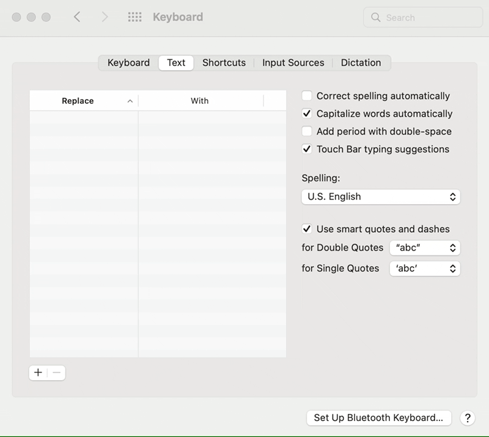
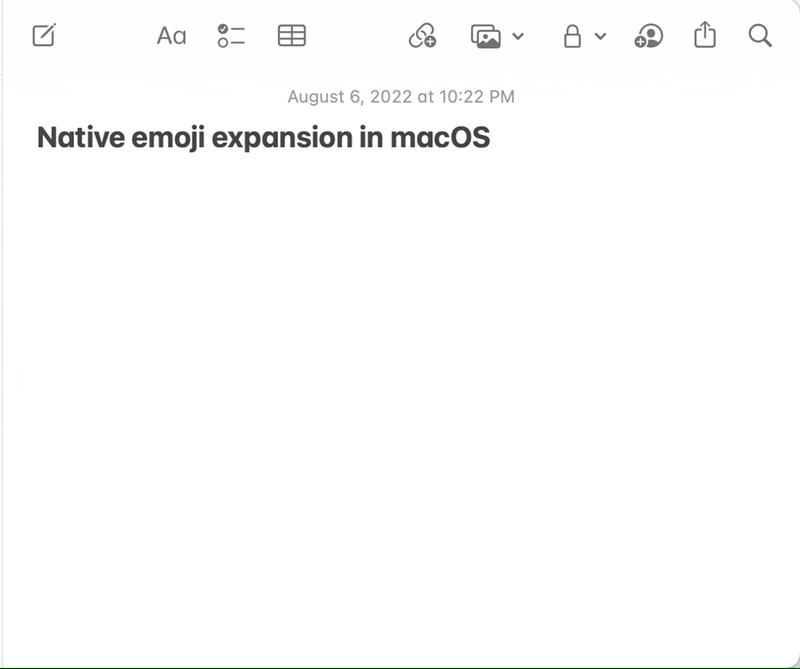

My preferred way of typing emoji is using the `:emoji_name:` [shortcode syntax](https://emojipedia.org/shortcodes/). This is great if I'm using Slack or GitHub, but doesn't translate as well to other applications.

There are apps like [Rocket](https://matthewpalmer.net/rocket/) that bring shortcodes to all inputs and more general text expansion apps like [Espanso](https://espanso.org) that have [support for emoji shortcodes](https://hub.espanso.org/all-emojis), but I didn't really want to install an app to do this. After all, text expansion is [built in to macOS](https://support.apple.com/guide/mac-help/replace-text-punctuation-documents-mac-mh35735/mac).

There are a lot of emoji and manually entering all of them via System Preferences was definitely too tedious to be feasible, so I started to look for a programmatic solution. GitHub maintains a library called [gemoji](https://github.com/github/gemoji) with information about every emoji and its shortcodes, which would be how I could enumerate all the snippets to add and what emoji they'd map to.

On the macOS side, I came across a [couple](https://apple.stackexchange.com/questions/124048/where-is-the-replace-with-list-stored/127850#127850) [different](https://apple.stackexchange.com/questions/114222/how-can-i-add-autocorrect-shortcuts-programmatically) StackExchange posts about how I could set these snippets programmatically. I found working with `UserDictionary.db` and `.GlobalPreferences.plist` to be unreliable, the options would be unset a few minutes after I set them. But what did work was to drag a plist file with my snippets into System Preferences itself.

And boom, emoji everywhere!

You can [download the plist](https://github.com/nathanmsmith/macos-emoji-snippets/releases) I generated of all emoji snippets for your own use! And if you're curious, you can also check out the script that generates the plist on [GitHub](https://github.com/nathanmsmith/macos-emoji-snippets).

Note: Apple syncs your snippets between your devices. Importing these snippets on your computer will make them available on your iPhone and/or iPad as well!


