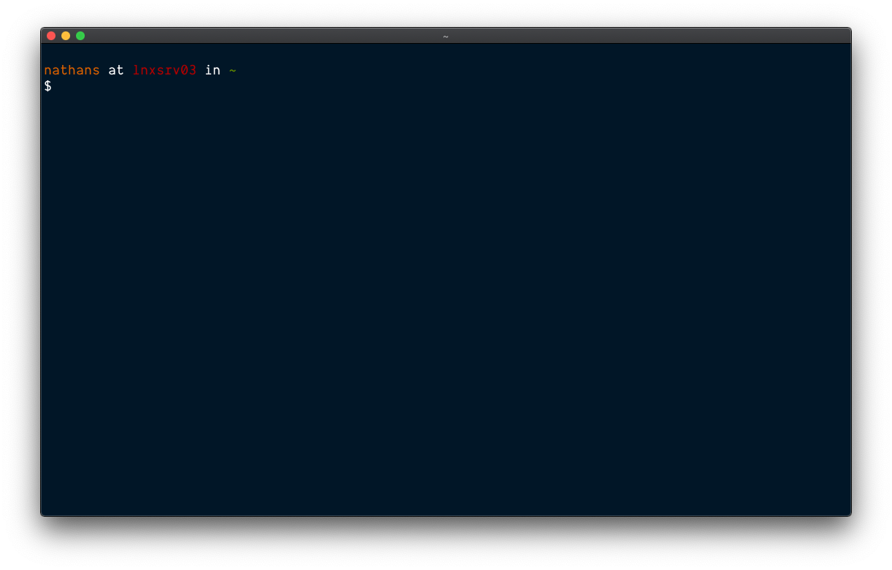

Every UCLA CS student will at some point encounter SEASnet's [lnxsrv](https://www.seasnet.ucla.edu/lnxsrv/) servers, which are required for many computer science classes. These lnxsrv servers are notorious for being hard to access[^1], running limited and outdated software[^2], triggering flashbacks to CS 35L, and generally not providing a nice development experience.

However, I don't know many people who realize that for all of lnxsrv's limitations, there are a few easy tweaks one can make to obtain a nicer development experience.

## SSH Host Aliasing

This first tip isn't technically a SEASnet hack, but a local computer hack that makes connecting to SEASnet quicker.

The canonical way to establish a lnxsrv connection is via a command like[^3]:

```
ssh -Y nathan@lnxsrv.seas.ucla.edu
```

While this is fine, it requires a lot of typing. SSH allows for creating aliases to frequently accessed servers so that we can easily type this out. We simply have to create a `~/.ssh/config` file and put in:

```
Host seas
    HostName lnxsrv.seas.ucla.edu
    User nathan
    ForwardX11Trusted yes
```

Now we can connect to lnxsrv with:

```
ssh seas
```

## A Better Prompt

The default bash prompt that you get once logged into lnxsrv isn't that helpful. There aren't any colors or version control information, and reading the current directory path is tough. Luckily, we can change it! Bash's prompt is controlled via a `PS1` variable that is set in `.bash_profile`.

Personally, I'm a big fan of [Mathias Bynens' prompt](https://github.com/mathiasbynens/dotfiles), which is what I use both on my local machine and lnxsrv.



Feel free to steal [my .bash_profile](https://gist.github.com/nathunsmitty/3fc3eb7b7fe2eb90fe6d49dbf67e5bcd)! On lnxsrv, in your home directory, run:

```
wget https://gist.githubusercontent.com/nathunsmitty/3fc3eb7b7fe2eb90fe6d49dbf67e5bcd/raw/904b78e0e38881e269d42d75401822ad38d0031e/.bash_profile
```

If you don't like this prompt, I'd recommend finding a prompt you do like and copying it over, then tweaking it as necessary. [Dotfiles are meant to be forked](https://zachholman.com/2010/08/dotfiles-are-meant-to-be-forked/). GitHub maintains a [good list](http://dotfiles.github.io/inspiration/) of people with interesting dotfiles.

## Alias Common Commands

Typing `ssh seas` isn't the only place where you can save keystrokes. If you find yourself typing a command frequently, it may make sense to alias it. For example, I often checkout various git branches. Instead of typing,

```
git checkout my-feature
```

I type:

```
gco my-feature
```

Once you start doing this, it'll be tough to type out full commands again.

How do you set this up? In your `.bash_profile`, add the following line:

```
alias gco="git checkout"
```

Repeat for each alias you'd like to make! If you need help thinking of aliases, I like [oh-my-zsh](https://github.com/ohmyzsh/ohmyzsh/wiki/Cheatsheet)'s.

## Easy Git Cloning

It's not totally obvious how you can push and pull code from GitHub on lnxsrv. The easiest way to do so is to generate a new SSH key-pair on the server and link it to your GitHub account.[^4]

```
ssh-keygen -t rsa -b 4096
cat ~/.ssh/id_rsa.pub # copy output
```

Paste the output you copied to GitHub by following [these directions](https://docs.github.com/en/free-pro-team@latest/github/authenticating-to-github/adding-a-new-ssh-key-to-your-github-account).

## Develop locally, run on Linux

The lnxsrv environment is ultimately fairly limited, and really best only for running code, not actually developing it. Luckily, there are multiple ways you can easily sync your from your computer to lnxsrv!

### Git

The simplest solution (and one I use) is simply to track my classwork in a Git repo.[^5] I commit my changes locally, then pull them and run them on lnxsrv. All you need is knowledge of Git. The downside is that you have to commit often and then manually pull your changes on lnxsrv.

### Syncing files with RSync

It's also possible to copy files from one computer to another over ssh using a nifty program called [rsync](https://rsync.samba.org/). Here's an example of me copying over a `homework/` directory with rsync. Note it works with our ssh alias!

```
rsync -zaP homework seas:homework
```

Note that you have to rerun rsync every time you want to copy your files over, though.

### Mounting lnxsrv

It's possible mount your home lnxsrv directory on your local machine using a very cool piece of technology called [sshfs](https://en.wikipedia.org/wiki/SSHFS). No more manual copying! My friend Ari has a [detailed write-up](https://medium.com/@arisweedler/connecting-to-uclas-seasnet-servers-using-sshfs-14ee3285287a) on how to make this work.

### VS Code Remote

Although I've never used it, I know a lot of people who swear by VS Code's SSH extension. All you need is SSH and VS Code. Microsoft has a [great tutorial](https://code.visualstudio.com/docs/remote/ssh) on how to set it up.

## Conclusion

Hopefully these tips will help remove some of the stress and friction around lnxsrv so you can focus on doing your assignments. If you have any more tips, please [let me know](mailto:nathan.smith@ucla.edu)!

[^1]: They require a campus VPN to access.
[^2]: REHL 6. Packages such as vim have not been updated since then. Applications like screen or tmux are nowhere to be found.
[^3]: The `-Y` option enables trusted X11 forwarding, which is useful for some classes such as CS 35L/97 where you need to run gitk graphically. It's technically optional, though.
[^4]: lnxsrv doesn't seem to support SSH agent forwarding.
[^5]: You can have a single repo for all work, or a repo per class.
