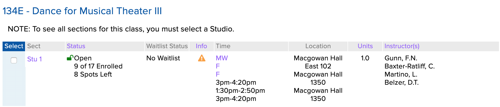
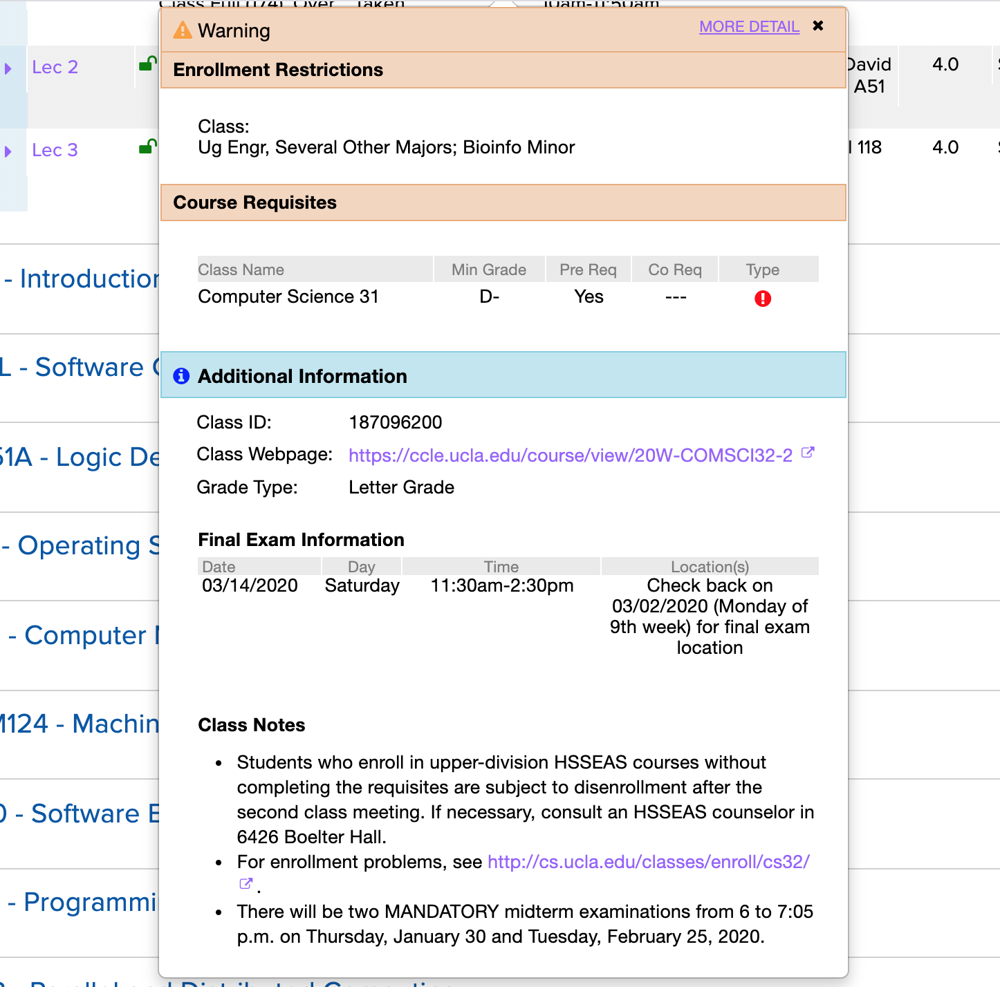

<span class="dropcap">I</span>n [part one](/posts/scraping-enrollment-data-from-the-ucla-registrar-part-one) of this series, I discussed my initial exploration into scraping the various pages and APIs of the UCLA Registrar's online [Schedule of Classes](https://sa.ucla.edu/ro/public/soc) in order to extract enrollment data on classes at UCLA. After experimenting with a couple of different languages and libraries, I settled on writing the scraper in Go. I finished part one by writing the code to scrape all of the subject areas offered for a term and all of the courses for a given subject area, but did not finish the code to scrape a section, as I realized that scraping sections meant I'd have to store the courses I previously scraped somewhere.

Part two of the post will finish up the discussion of the development of the scraper by covering how I stored the data I scraped – and finished up scraping all sections. I'll then discuss how I deployed the scraper onto AWS Lambda, various post-deployment bugs I encountered, and future improvements that could be made to the scraper. That's a lot, so let's hop right on in!

## Storing the data and designing the schema

It was finally time to put the data I was scraping into a database. I had heard a lot of great things about [PostgreSQL](https://www.postgresql.org/), so I decided to try it.

Although I was initially only interested in the data of individual sections, I realized that'd it'd make sense to have three tables: one for subject areas, one for courses, and one for sections. This way, I could use the information from one table in scraping the data for another, reducing the number of network requests to the site I'd have to make.

My initial stab at writing the schema looked like this:

```sql
CREATE TABLE subject_areas (
  id SERIAL PRIMARY KEY,
  label TEXT,
  value TEXT,
  created_at TIMESTAMPTZ NOT NULL DEFAULT NOW(),
  updated_at TIMESTAMPTZ NOT NULL DEFAULT NOW()
);

CREATE TABLE courses (
  id SERIAL PRIMARY KEY,
  subject_area_id INTEGER REFERENCES subject_areas(id),
  title TEXT,
  number TEXT,
  model TEXT UNIQUE,
  created_at TIMESTAMPTZ NOT NULL DEFAULT NOW(),
  updated_at TIMESTAMPTZ NOT NULL DEFAULT NOW()
);

CREATE TABLE sections (
  id SERIAL PRIMARY KEY,
  -- section_id is a unique id assigned by the registrar, different from the autogenerated postgres id
  section_id TEXT UNIQUE,
  course_id INTEGER REFERENCES courses(id),
  days TEXT,
  time TEXT,
  location TEXT,
  units TEXT,
  instructor TEXT,
  enrollment_status TEXT,
  enrollment_count INT,
  enrollment_capacity INT,
  waitlist_status TEXT,
  waitlist_count INT,
  waitlist_capacity INT,
  created_at TIMESTAMPTZ NOT NULL DEFAULT NOW()
);
```

An early issue I ran into was the size of the `sections` table: because I was scraping sections every hour, I had millions of rows in the table after a couple weeks. On the advice of [Alex](https://alexgessner.com/), a coworker at Keybase and SQL wizard, I ended up splitting the `sections` table into two tables: one of section information (titled `sections`) and one of just enrollment data (titled `enrollment_data`). `sections` would contain information about a section's time, location, instructor, etc. – things that don't change frequently – while `enrollment_data` would track the ever-changing enrollment data. The split gave me:

```sql
CREATE TABLE sections (
  id SERIAL PRIMARY KEY,
  -- section_id is unique per term
  section_id TEXT UNIQUE,
  course_id INTEGER REFERENCES courses(id),
  days TEXT,
  time TEXT,
  location TEXT,
  units TEXT,
  instructor TEXT,
  created_at TIMESTAMPTZ NOT NULL DEFAULT NOW(),
  updated_at TIMESTAMPTZ NOT NULL DEFAULT NOW()
);

CREATE TABLE enrollment_data (
  id SERIAL PRIMARY KEY,
  section_id TEXT REFERENCES sections(section_id),
  enrollment_status TEXT,
  enrollment_count INT,
  enrollment_capacity INT,
  waitlist_status TEXT,
  waitlist_count INT,
  waitlist_capacity INT,
  created_at TIMESTAMPTZ NOT NULL DEFAULT NOW()
);
```

Actually using Postgres with Go turned out to be very simple; there's a popular [pq driver](https://github.com/lib/pq) for Go's built-in [sql package](https://golang.org/pkg/database/sql/). Jon Calhoun has a [great tutorial series](https://www.calhoun.io/using-postgresql-with-go/) on how to get it set up.

Most of my database logic is encapsulated in a couple of functions. The `ConnectToDatabase` function is shared across the various scraping functions.

```go
func ConnectToDatabase() (*sql.DB, error) {
	host := os.Getenv("DB_HOST")
	port := 5432
	user := os.Getenv("DB_USER")
	password := os.Getenv("DB_PASS")
	dbname := os.Getenv("DB_NAME")
	var psqlInfo string
	if password != "" {
		psqlInfo = fmt.Sprintf("host=%s port=%d user=%s password=%s dbname=%s sslmode=disable",
			host, port, user, password, dbname)
	} else {
		psqlInfo = fmt.Sprintf("host=%s port=%d user=%s dbname=%s sslmode=disable",
			host, port, user, dbname)
	}
	db, err := sql.Open("postgres", psqlInfo)
	if err != nil {
		return nil, err
	}
	err = db.Ping()
	if err != nil {
		return nil, err
	}
	return db, nil
}

```

### Saving subject areas and courses

Armed with a way to persistently save data, I went back to `ScrapeSubjectAreas` and `ScrapeCourses` to save their data.

The result was two new functions, `SaveSubjectAreas` and `SaveCourses`. The code for `SaveCourses` is below, `SaveSubjectAreas` is pretty similar.

```go
func SaveCourses(db *sql.DB, courses []Courses) {
    insertCourse := `
    INSERT INTO courses (subject_area_id, title, number)
    VALUES ($1, $2, $3)
    ON CONFLICT (subject_area_id, title, number)
    DO UPDATE
    SET updated_at = NOW()
    RETURNING id
    `
    for _, course := range courses {
    var id int
    err := db.QueryRow(insertCourse, course.SubjectAreaID, course.Title, course.Numbe
r).Scan(&id)
    if err != nil {
        log.Error(err)
    }
    _, err = db.Exec(insertTerm, id, term)
    if err != nil {
        log.Error(err)
    }
}
```

### Retrieving subject areas

Previously, in the `ScrapeCourses` function, there was the following line used to get all of the subject areas to scrape courses from:

```go
var subjectAreas = ScrapeSubjectAreas()
```

Now that subject areas were stored in the database, I went back and replaced this line with a function to actually retrieve the subject areas from the database instead of rescraping the subject areas.

```go
func RetrieveSubjectAreas(db *sql.DB) (subjectAreas []SubjectArea, err error) {
	rows, err := db.Query("SELECT id, name, code FROM subject_areas")
	if err != nil {
		log.Error(err)
		return subjectAreas, err
	}
	defer rows.Close()
	for rows.Next() {
		var id string
		var name string
		var code string
		err = rows.Scan(&id, &name, &code)
		if err != nil {
			log.Error(err)
		}
		subjectAreas = append(subjectAreas, SubjectArea{
			ID:    id,
			Label: name,
			Value: code,
		})
	}
	err = rows.Err()
	if err != nil {
		log.Error(err)
		return subjectAreas, err
	}
	return subjectAreas, nil
}

db, err := ConnectToDatabase()
if err != nil {
  return err
}
var subjectAreas = RetrieveSubjectAreas(db)
```

Note that the functions reads out the unique ID that Postgres creates for each subject area, which can then be used to relate courses and subject areas when `SaveCourses` is called.

## Finally scraping sections

Now that courses were being saved by `ScrapeCourses`, I could retrieve them in a `RetrieveCourses` function that queried the database and returned a Go slice, similar to the previous `RetrieveSubjectAreas`.

Once I had the courses, scraping sections would be similar to how I [scraped courses](https://nathansmith.io/posts/scraping-enrollment-data-from-the-ucla-registrar-part-one/#scraping-courses) last time.

The top-level `ScrapeSections` function established the same parallel scraping that was in `ScrapeCourses`.

```go
func ScrapeSections() {
	db, err := ConnectToDatabase()
	if err != nil {
		return err
	}

  courses = RetrieveCourses()

	for _, course := range courses {
		wg.Add(1)
		go func(course Course) {
			sem <- struct{}{}
			defer func() { <-sem }()
			defer wg.Done()
			err := FetchAndSaveSections(course, db)
			if err != nil {
				log.Error(err)
			}
		}(course)
	}
	wg.Wait()
}
```

I'm not going to go over `RetrieveCourses`, since `RetrieveSubjectAreas` is pretty similar. Besides, the interesting stuff is in `FetchAndSaveSections`. In `FetchAndSaveSections`, I:

1. Make a HTTP request to the endpoint with the relevant section information
1. Parse the response
1. Iterate through each row of the section table
1. For each row, extract the relevant section information
1. Store the extracted info into the database

```go
func FetchAndSaveSections(course Course, db *sql.DB) error {
	// Step 1: make HTTP request to /GetCourseSummary endpoint
	const queryURL = "https://sa.ucla.edu/ro/Public/SOC/Results/GetCourseSummary"
	req, err := http.NewRequest("GET", queryURL, nil)
	if err != nil {
		return err
	}
	params := req.URL.Query()
	params.Add("model", course.Model)
	params.Add("FilterFlags", FilterFlags)
	req.URL.RawQuery = params.Encode()
	response, err := client.Do(req)
	if err != nil {
		return err
	}
	defer response.Body.Close()

	// Step 2: parse the response into a goquery object
	doc, err := goquery.NewDocumentFromReader(response.Body)
	if err != nil {
		return err
	}

	// Step 3: iterate through each row of the section table
	table := doc.Find("div[id$=-children]")
	rows := table.ChildrenFiltered("div")
	for i := range rows.Nodes {
		row := rows.Eq(i)
		rowID, exists := row.Attr("id")
		if !exists {
			return errors.New("could not find row id")
		}
		idRegex := regexp.MustCompile(`([0-9]+)_`)
		matches := idRegex.FindStringSubmatch(rowID)

		// Step 4: extract the section information
		sectionID := matches[1]
		enrollmentData := strings.TrimSpace(row.Find("div[id$=-status_data]").Text())
		enrollmentStatus, enrollmentCount := ParseEnrollmentData(sectionID, enrollmentData)
		days := strings.TrimSpace(row.Find("div[id$=-days_data]").First().Text())
		// ...

		// Step 5: save section to database
		section := Section{
			SectionID:        sectionID,
			CourseID:         course.ID,
			EnrollmentStatus: enrollmentStatus,
			EnrollmentCount:  enrollmentCount,
			Days:             days,
			// ...
		}
		SaveSection(section, db)
	}
	return nil
}
```

`ParseEnrollmentData` employs a lot of conditional logic and regexes to properly parse the numbers and status of a class.[^1] I'll get to it in a bit, but just pretend it works for now.

The final bit was to define `SaveSection`, which both [upserts](https://wiki.postgresql.org/wiki/UPSERT) a row in the `sections` table as well as creates a new `enrollment_data` row.

```go
func SaveSection(section Section, db *sql.DB) error {
	insertSection := `
	INSERT INTO sections (
		section_id,
		course_id,
		days,
		times,
		...
	)
	VALUES (...)
	ON CONFLICT (section_id)
	DO UPDATE SET
	updated_at = NOW(),
	days = EXCLUDED.days,
	time = EXCLUDED.time,
	...
	`

insertEnrollmentData := `
INSERT INTO enrollment_data (
		section_id,
		enrollment_count,
		waitlist_count,
		...
	)
	VALUES (...)
	`

	var id int
	err := db.QueryRow(insertSection,
		section.SectionID,
		section.CourseID,
		...
	).Scan(&id)
	if err != nil {
		log.Error(err)
		return err
	}

	_, err = db.Exec(insertEnrollmentData,
		id,
		section.EnrollmentCount,
		section.WaitlistCount,
		...
	)
	if err != nil {
		log.Error(err)
		return err
	}

	return nil
}
```

And with that, the scraper was complete. It locally could scrape subjects, courses, and sections and save them all in a local Postgres database. I tried running it locally and it worked!

It just now needed to be run every hour.

## Going serverless

Running the scraper every hour meant I'd need to do some kind of job scheduling on a remote server – it wasn't practical to keep my laptop running every hour and scrape from my home network. My initial thought was to use [cron](https://en.wikipedia.org/wiki/Cron) on a Digital Ocean droplet or similar, but I didn't like the idea of paying for a server to run 24/7 just so it could execute a ~5 minute script every hour. JavaScript Twitter loves to talk about the magic of running semi-occasional jobs in a serverless manner, so I decided to look into it as a cheaper and simpler option.

There are a lot of different "Functions as a Service" providers out there, but I figured I'd go with [AWS Lambda](https://aws.amazon.com/lambda/) since they had a generous free plan, supported Go, and seemed to be pretty popular. The AWS console is a daunting webpage, so I was also looking for a tool that could allow me to write my infrastructure as code. There are a ton of different options in this space: [Serverless](https://serverless.com/), [Terraform](https://www.terraform.io/), and [CloudFormation](https://aws.amazon.com/cloudformation/) were just some of the options I looked at.

Ultimately, I went with [AWS SAM](https://aws.amazon.com/serverless/sam/) because it came with good examples, was easy to set up, was highly integrated with AWS services, and had support for offline testing. This was my first foray into working with AWS and I found it immensely helpful to use a simpler tool that shared all its terminology with AWS. The biggest con of SAM I found was that it's less popular than some of the bigger tools, and it was tough to figure out how to utilize some of its lesser known features.

Setting up a lambda function is pretty easy, once you have a solid grasp on various components of AWS. There are AWS-provided libraries for all the supported lambda languages/runtimes that allow you to the define the logical start function, which AWS calls a "handler function". In Go, you have to call `lambda.Start` in your `main` function with the handler function as an argument. Here's what `ScrapeSections` looked like, once lambda-ized:

```go
import "github.com/aws/aws-lambda-go/lambda"

func ScrapeSections() {
	db, err := ConnectToDatabase()
	if err != nil {
		return err
	}
	courses = RetrieveCourses(db)

	// Set up semaphore
	maxConnections, err := strconv.Atoi(os.Getenv("DB_MAX_CONNECTIONS"))
	if err != nil {
		return err
	}
	sem := make(chan struct{}, maxConnections)

	for _, course := range courses {
		wg.Add(1)
		go func(course Course) {
			sem <- struct{}{}
			defer func() { <-sem }()
			defer wg.Done()
			err := FetchAndSaveSections(course, db)
			if err != nil {
				log.Error(err)
			}
		}(course)
	}
	wg.Wait()
}

func main() {
	lambda.Start(ScrapeSections)
}


```

From a design perspective, I decided it made sense to make my three main functions: `ScrapeSubjectAreas`, `ScrapeCourses`, and `ScrapeSections` each their own lambda function. This allowed me to set a different schedule for each function: sections would be scraped hourly, but course and subject area updates could be scraped less frequently.[^2] In addition to scheduling, this distinction helped distinguish each lambda's role and prevented the scraper from becoming too monolithic.

Once your function is written, SAM requires a `template.yaml` file. This file defines your function, any other AWS resources it needs, environment variables, etc. SAM uses this file locally in order to create a Docker environment so that you can test your function, as well as to simplify production deployments.

Here's what the `template.yaml` looks like for `ScrapeSections`:

```yaml
AWSTemplateFormatVersion: '2010-09-09'
Transform: AWS::Serverless-2016-10-31

Globals:
  Function:
    Timeout: 360
Resources:
  ScrapeSectionsFunction:
    Type: AWS::Serverless::Function
    Properties:
      CodeUri: s3://ucla-registrar-scraper/5338dd93d471ce67be27b01475911bd2
      Handler: scrape-sections
      Runtime: go1.x
      Tracing: Active
      Events:
        ScrapeWebsiteHourly:
          Type: Schedule
          Properties:
            Schedule: cron(0 * * * ? *)
            Name: Houly
            Description: Top of every hour
            Enabled: True
      Environment:
        Variables:
          DB_MAX_CONNECTIONS: 75
          DB_USER: nathan
          DB_PASS: password
          DB_HOST: my-db.example.com
          DB_NAME: registrar_data
Outputs:
  ScrapeSectionsFunction:
    Description: 'ScrapeSections ARN'
    Value: !GetAtt ScrapeSectionsFunction.Arn
  ScrapeSectionsFunctionIamRole:
    Description: 'Implicit IAM Role created for ScrapeSections function'
    Value: !GetAtt ScrapeSectionsFunctionRole.Arn
```

A lot of this is boilerplate that I generated from the AWS Go [example template.yaml](https://github.com/awslabs/aws-sam-cli-app-templates/blob/master/go1.x/cookiecutter-aws-sam-hello-golang/%7B%7Bcookiecutter.project_name%7D%7D/template.yaml). The interesting bits are:

- I set environment variables via the `Environment.Variables` property on the resource. Environment variables include the max connection limit and DB login info.
- The `Events` section is where I schedule the scraping, which happens hourly for sections.[^2] AWS [supports cron syntax](https://docs.aws.amazon.com/lambda/latest/dg/tutorial-scheduled-events-schedule-expressions.html).

From that, I was ready to test locally (and then deploy!). To locally test your code, SAM provides a command, [`sam local invoke`](https://docs.aws.amazon.com/serverless-application-model/latest/developerguide/sam-cli-command-reference-sam-local-invoke.html). `invoke` takes a `--event` argument that is a path to a JSON file representing event data passed into the lambda. Since I don't pass any data into the lambdas, I just made a simple empty JSON file to test with.

For Go, you also need to compile your changes before you can `invoke` them. I found myself using `go build` and `sam local invoke` a lot, so I started a simple makefile.

```makefile
build:
	GOOS=linux GOARCH=amd64 go build -o scrape-sections ./main.go

local: build
	sam local invoke --event event.json
```

Now I could just type `make local` and run the scraper locally.

The makefile also ended up being useful for deployment, where you have to first [package](https://docs.aws.amazon.com/serverless-application-model/latest/developerguide/sam-cli-command-reference-sam-package.html) the build, then [deploy](https://docs.aws.amazon.com/serverless-application-model/latest/developerguide/sam-cli-command-reference-sam-deploy.html) it.[^3]

```makefile
S3_BUCKET=my-s3-bucket-url

package: build
	sam package \
		--output-template-file packaged.yaml \
		--s3-bucket $(S3_BUCKET)

deploy: package
	sam deploy \
		--template-file packaged.yaml \
		--stack-name fetch-sections \
		--capabilities CAPABILITY_IAM \
		--region us-west-1

```

I chose `us-west-1` as my availability zone, as it was the closest to the UCLA servers which are in Southern California.

## Deploying the database

If my scrapers would be running every hour, I needed to have a database that would always be available. [Amazon RDS for PostgreSQL](https://aws.amazon.com/rds/postgresql/) was perfect for my needs. The database runs `db.t2.micro` instance because it's free and works well enough.

## Logging and error detection

After deploying the functions and letting them run for a couple of days, I soon realized that there was no error detection for the functions.

Since I'm pretty familiar with Datadog and they offer a great [free student plan](https://www.datadoghq.com/blog/datadog-github-student-developer-pack/), it was a no-brainer that I'd use Datadog. For Go logging, they [recommend](https://www.datadoghq.com/blog/go-logging/) [Logrus](https://github.com/Sirupsen/logrus), which was super easy to set up.

An interesting quirk I found is that Logrus seems to only be initializable in Go's [init](https://golang.org/doc/effective_go.html#init) function, not `main`. So every lambda function has an `init` that looks like:

```go
func init() {
	InitializeLogging()
}

```

`InitializeLogging` is pretty straightforward. I use `LOGGING` environment variable to distinguish between environments I'm testing in vs production. In production, I want to log in JSON because it is sent and parsed by Datadog. Locally, it's easier to see log output as text on my screen.

```go
func InitializeLogging() {
	if os.Getenv("LOGGING") == "json" {
		log.SetFormatter(&log.JSONFormatter{})
	}

	log.SetOutput(os.Stdout)

	if os.Getenv("LOGGING") == "json" {
		log.SetLevel(log.WarnLevel)
	} else {
		log.SetLevel(log.InfoLevel)
	}

	log.Info("Logging Initialized")
}
```

## Fine tuning the regular expressions

Over the first few months of scraping the Registrar, I ran into some edge cases that my original regular expressions couldn't handle. For example: a class that is closed by a department but has enrolled students.


Originally, my scraper was just marking this section as closed with an enrollment count of 0! That wouldn't work at all.

After many tweaks, I've settled on the following regular expressions for enrollment and waitlist statuses.

```go
// Enrollment regexes
var tenativeRegex = regexp.MustCompile(`^Tenative`)
var canceledRegex = regexp.MustCompile(`^Cancelled`)
var closedByDeptRegex = regexp.MustCompile(`^Closed by Dept[a-zA-Z,/ ]*(\((?P<Capacity>\d+) capacity, (?P<EnrolledCount>\d+) enrolled, (?P<WaitlistedCount>\d+) waitlisted\))?`)
var classFullRegex = regexp.MustCompile(`ClosedClass Full \((?P<Capacity>\d+)\)(, Over Enrolled By (?P<OverenrolledCount>\d+))?`)
var classOpenRegex = regexp.MustCompile(`Open(\d+) of (\d+) Enrolled(\d+) Spots? Left`)
var waitlistOnlyRegex = regexp.MustCompile(`^Waitlist$`)
var waitlistFullRegex = regexp.MustCompile(`^WaitlistClass Full \((?P<Capacity>\d+)\)(, Over Enrolled By (?P<OverenrolledCount>\d+))?`)
// Waitlist regexes
var waitlistOpenRegex = regexp.MustCompile(`(\d+) of (\d+) Taken`)
var noWaitlistRegex = regexp.MustCompile(`No Waitlist`)
var waitlistClosedRegex = regexp.MustCompile(`Waitlist Full \((\d+)\)`)
```

Like most regular expressions, these can seem daunting at first but actually don't use many regular expression features.

- Beginning of line `^` and end of line `$`
- Character ranges `[]`
- Match 0 or 1 `?`
- Match 1 or more `*`
- Match digits `\d`
- Capturing groups `()` and named capturing groups `(?P<name>...)`

The named capturing groups are especially useful, as I use a function that extracts all named matches out of a string into a map:

```go
func CreateRegexMatchMap(re *regexp.Regexp, str string) (matchMap map[string]string) {
	match := re.FindStringSubmatch(str)
	matchMap = make(map[string]string)
	for i, name := range re.SubexpNames() {
		if i > 0 && i <= len(match) {
			matchMap[name] = match[i]
		}
	}
	return matchMap
}
```

This makes parsing the info from one of the above regexes much easier to understand. For example, here's the code for a function that parses and returns the numbers from a section that is closed, like Comm 171.

```go
func ParseClosedStatus(enrollmentData string) (enrollmentStatus string, enrollmentCount, enrollmentCapacity int) {
	enrollmentStatus = "Closed"
	matchMap := CreateRegexMatchMap(closedByDeptRegex, enrollmentData)

	enrollmentCount, err := strconv.Atoi(matchMap["Capacity"])
	if err != nil {
		log.Error("cannot parse capacity")
	}

	count, err := strconv.Atoi(matchMap["EnrolledCount"])
	if err != nil {
		log.Error("cannot parse enrollment count")
	}

	return enrollmentStatus, enrollmentCount, enrollmentCapacity
}
```

Remember the `ParseEnrollmentData` function that appeared earlier? It basically just determines which `ParseXStatus` to run.

```go
func ParseEnrollmentData(sectionID, enrollmentData string) (enrollmentStatus string, enrollmentCount, enrollmentCapacity int) {
	if tenativeRegex.MatchString(enrollmentData) {
		enrollmentStatus = "Tenative"
	} else if canceledRegex.MatchString(enrollmentData) {
		enrollmentStatus = "Cancelled"
	} else if closedByDeptRegex.MatchString(enrollmentData) {
		return ParseClosedStatus(sectionID, enrollmentData)
	} else if classFullRegex.MatchString(enrollmentData) {
		return ParseFullStatus(sectionID, enrollmentData)
	} else if classOpenRegex.MatchString(enrollmentData) {
		return ParseOpenStatus(sectionID, enrollmentData)
	} else if waitlistFullRegex.MatchString(enrollmentData) {
		return ParseWaitlistStatus(sectionID, enrollmentData)
	} else if waitlistOnlyRegex.MatchString(enrollmentData) {
		enrollmentStatus = "Waitlist"
	} else {
		log.WithFields(log.Fields{"enrollmentData": enrollmentData}).Error("unrecognized string")
	}
	return enrollmentStatus, enrollmentCount, enrollmentCapacity
}
```

I've found parsing info from regexes like this to be pretty robust.

### Handling multiple locations/times/professors

I initially assumed that a section could only have one location, time, or professor. Not true. For example, take Theater 134E: Dance for Musical Theater III.


Yikes! How would the scraper handle that?

It turns out each new line was created by a `<br>` tag in the HTML. So, if I [split](https://golang.org/pkg/strings/#Split) on `<br>`, then I'd get an array of the times/locations/days/instructors. Since the same logic is reused in four places, I ended up extracting it into a function.

```go
func ParseEntryToArray(rawText string) []string {
	tagMatcher := regexp.MustCompile(`<wbr/>|<(/)?p>|<(/)?a[^>]*>`)
	text := tagMatcher.ReplaceAllString(rawText, "")
	text = strings.TrimSpace(text)
	text = html.UnescapeString(text)
	arr := strings.Split(text, "<br/>")
	log.WithFields(log.Fields{"array": arr, "length": len(arr)}).Info("Parsed array")
	return arr
}
```

The first few lines clean up the text by stripping extraneous HTML tags, removing whitespace, and unescaping any raw HTML characters. Then the array is created and returned.

Postgres has [support for arrays](https://www.postgresql.org/docs/current/arrays.html), so all I needed to do then was update the database schema and wrap the arrays in [pq.Array()](https://godoc.org/github.com/lib/pq#Array) when inserting them.

The database migration ended up looking like this; it uses Postgres' [`string_to_array`](https://www.postgresql.org/docs/current/functions-array.html) function.

```sql
BEGIN;
  ALTER TABLE sections
  RENAME COLUMN time TO times;

  ALTER TABLE sections
  RENAME COLUMN location TO locations;

  ALTER TABLE sections
  ALTER COLUMN times TYPE TEXT[] USING string_to_array(times, '');

  ALTER TABLE sections
  ALTER COLUMN locations TYPE TEXT[] USING string_to_array(locations, '');

  ALTER TABLE sections
  ALTER COLUMN days TYPE TEXT[] USING string_to_array(days, '');
END;
```

The corresponding code change was simple after the migration.

```go
err := db.QueryRow(insertSection,
	section.SectionID,
	section.Term,
	section.CourseID,
	pq.Array(section.Days),
	pq.Array(section.Times),
	pq.Array(section.Locations),
	section.Units,
	pq.Array(section.Instructors),
)
```

## Scraping multiple terms

I originally wrote the scraper last summer, to scrape Fall 2019 classes at UCLA. As winter rolled around, I realized I needed to update the scraper and database to accommodate multiple terms.

My initial approach to multiple terms was to create a new database for each term. My original database was named to `fall2019` and the new database was renamed to `winter2020`. However, this didn't seem like a sustainable option, especially if I wanted to compare data across terms.

Around this time, my friend [Richard](http://ryang72.com/) also pointed out an interesting tidbit to me: even though they weren't listed on the main Schedule of Classes page, you can create course search page urls for any term back to 1999 by modifying the `t` variable.[^4] The webpages were all in the same format as the current page, so I could scrape 20 years of course enrollment data. This was exciting.

### Subject area changes

I set out to think about how multiple terms would affect my current data, and how the schema could grow to handle more courses/sections. I figured the easiest place to start would be with subject areas, which should be constant throughout terms.

Remember that very first footnote where I hint at that not being the case?
It turns out, not all of the subject areas were the same – some subject areas offered in fall, like African Studies, were not offered in winter. Furthermore, I had no idea how to get subject areas for previous terms, which proved to be a problem as subject area names can change over time: a good example of this is the Electrical Engineering department [changing their name](https://dailybruin.com/2017/08/13/ucla-to-offer-new-undergrad-degree-in-computer-engineering-in-the-fall/) to Electrical and Computer Engineering.

I was pretty stumped on this, so I sent an email over to the Registrar asking if they had a list of subject areas. I got a very nice response from them and they sent me an Excel spreadsheet of all the subject areas UCLA has ever offered.


After converting the spreadsheet into a csv and writing a quick Python script to parse the csv and insert it into the database[^5], I was ready to scrape courses.

### Course changes

I figured it made sense to have courses be independent of terms, as course titles, numbers, and curriculum don't change that often. Each section row would point to the correct course via the `course_id` column, similar to how multiple sections were handled now, except now sections could be across terms.

However, I quickly ran into an issue: `model`s were term dependent. Let's look at the example from earlier, for CS 111.

```json
{
  "Term": "19F",
  "SubjectAreaCode": "COM SCI",
  "CatalogNumber": "0111    ",
  "IsRoot": true,
  "SessionGroup": "%",
  "ClassNumber": "%",
  "SequenceNumber": null,
  "Path": "COMSCI0111",
  "MultiListedClassFlag": "n",
  "Token": "MDExMSAgICBDT01TQ0kwMTEx"
}
```

I'd need to generate this blob dynamically to fetch across sections and relate them all to the same course. For the most part, this didn't seem too bad. `Term` would obviously change, and I knew what the possible values would be. `SubjectAreaCode`, `CatalogNumber`, and `Path` were just strings that needed to be formatted from a subject area/course number. `IsRoot` seemed to always be true across the requests I tested; similarly, `SequenceNumber` was always null and `SessionGroup` was always `%`. `MultiListedClassFlag` just limited the result to being a multi-listed class, but multi-listed classes were still listed when it was `"n"`, so I could always keep it at `"n"`.

The tricky properties would be `model` and `ClassNumber`.

For `model`, the challenge was that every value was unique among the requests I tested and I had no idea how it was created. It took me a lot of time playing with strings and formatting before I discovered that the token was just a [Base64](https://en.wikipedia.org/wiki/Base64) encoding of the course subject area and number. (`MDExMSAgICBDT01TQ0kwMTEx` decodes to `0111 COMSCI0111`.)

For `ClassNumber`, there was a more subtle issue. There are some courses in UCLA that have variable topics. In the Computer Science department, these courses are usually numbered 188; the number varies by department. In the Management department, I found something interesting:


There were multiple sections of the same course, listed as if they were different courses. The two sections of "Applying Science of Happiness to Life Desgin" had ever so slightly different models:

```json
{
  "Term": "20W",
  "SubjectAreaCode": "MGMT   ",
  "CatalogNumber": "0298D   ",
  "IsRoot": true,
  "SessionGroup": "%",
  "ClassNumber": " 010  ",
  "SequenceNumber": null,
  "Path": "MGMT0298D010",
  "MultiListedClassFlag": "n",
  "Token": "MDI5OEQgICBNR01UMDI5OEQwMTA="
}
```

```json
{
  "Term": "20W",
  "SubjectAreaCode": "MGMT   ",
  "CatalogNumber": "0298D   ",
  "IsRoot": true,
  "SessionGroup": "%",
  "ClassNumber": " 009  ",
  "SequenceNumber": null,
  "Path": "MGMT0298D009",
  "MultiListedClassFlag": "n",
  "Token": "MDI5OEQgICBNR01UMDI5OEQwMDk="
}
```

I wondered what would happen if I set `ClassNumber` to `%` instead of a number. Initially, I got a 404 error, but with some updating of `Path` and `Token` so that they didn't refer to a specific section number, I got a response. It was the markup for all sections of MGMT 298D. Unfortunately, however, there was no title or distinguishing features for each row, just the section's number. When scraping courses, I'd need to associate each course title listed with a section number, then, when scraping sections, recall these numbers to parse out which section belongs to which course.

So I made a new table in the database, `course_section_indices`, specifically for this. It keeps track of which courses are offered under which section number for a term. Note that only courses with variable titles, like MGMT 298D, end up in this table.

```sql
CREATE TABLE course_section_indices (
  id SERIAL PRIMARY KEY,
  course_id INTEGER REFERENCES courses(id) NOT NULL,
  term TEXT NOT NULL,
  indices TEXT[] NOT NULL,
  created_at TIMESTAMPTZ NOT NULL DEFAULT NOW(),
  updated_at TIMESTAMPTZ NOT NULL DEFAULT NOW(),
  UNIQUE (course_id, term)
);
```

### Section changes

After all of these course changes, updating the section scraping was pretty easy. Since sections are concrete offerings of a course, it made sense to add a `term` column. The `section_id` is the id given to the section by the Registrar. That id is unique only for a term, so the uniqueness constraint on `sections` had to be updated.

```sql
ALTER TABLE sections DROP CONSTRAINT sections_section_id_key;
ALTER TABLE sections ADD UNIQUE (section_id, term);
```

### Scraping 20 years of data

Even though my scraper was pretty fast compared to the other solutions I knew of, it took me just over an hour to scrape all of the courses from 1999 to present. (I did all the scraping locally, and not on AWS, because I only needed to scrape this data once and not every hour.) I ended up scraping all the sections in batches over the period of a few days.

## What are you doing with this data?

As I mentioned in part one, I'm currently doing a digital humanities project exploring enrollments trends over the past 20 years. I'll be publishing my dataset (this data) as part of that project.

I've also heard from my friends who run services such as [Bruinwalk](https://bruinwalk.com/) or [Radius](https://tinyurl.com/radius-app) that they'd be interested in using this data to integrate more accurate section offerings into a given quarter. I'm exploring creating an API service so that they and other UCLA student developers can create awesome new things.

My original plan with this data was to create a course alert notification service, so that users are notified if a spot in a course or waitlist opens up. Stay tuned for updates on that.

## Future improvements

There is still a lot of interesting work that could be done to improve the scraper. Here are some ideas for what I'll work on next.

### More data

Even though I'm currently scraping a lot of data from the Registrar, there's still more that could be obtained.

For instance, there's an endpoint, `/ClassDetailTooltip`, that's triggered every time a detail tooltip is opened on a course. This tooltip provides info about prerequisites, enrollment restrictions, grading type, the class webpage, and final exam time.



I also would love to have more professor information than just the provided "LastName, FirstInitial", but I'm not sure where this data would be available.

I'm currently working on some improvements to scrape data about departments, divisions, schools, buildings, and classrooms. Stay tuned – there may be another blog post about that.

### Summer courses

Another source of data that the scraper doesn't collect is data on summer courses at UCLA. This is mainly because summer courses vary in length and duration, which makes it hard to classify what a summer term is. Is it all the same term? Are A and C session different terms? What about 6 vs 8 vs 10 week courses?

### Multi-listed courses

The same section at UCLA can be listed under two different departments. Right now, the scraper can discern this only by the fact that multi-listed courses share the same name and have a course number prefixed with an "M". It'd be nice to have a better way to denote which multi-listed courses are related in the database.

### Better storage of values

There are also probably better ways the current data could be stored in the database. Days are stored as an array of string, although since there are only seven days (and a couple of other values, such as "Varies", "Tentative", "Not Scheduled", etc.), I've wondered if this could become an [enum](https://www.postgresql.org/docs/current/datatype-enum.html). The tricky part about converting it to an enum would be handling courses that have multiple days/times.

I also wonder if course times could be better stored – as an array of [ranges](https://www.postgresql.org/docs/current/rangetypes.html) of [times](https://www.postgresql.org/docs/current/datatype-datetime.html), perhaps, instead of as a string array.

### Concurrency through lambda functions instead of goroutines

I spent a good amount of time in part one of this series talking about how Go appealed to me as a language because of its accessible concurrency features, which allowed me to scrape endpoints in parallel. While this is true for local runs, it turns out that lambda functions generally only have one CPU core. As Luc Hendriks [put it](https://stackoverflow.com/a/34257238),

> Instead of having 1 100-core computer, you have 100 1-core computers.

I think a much better way of lambda-izing my scraper would be to have a lambda function that is given a specific course and just scrapes the sections for that particular course, rather than retrieve and scrape all courses. Of course, this design presents its own problems, such as requiring some type of connection pooling[^6] to ensure the database is overwhelmed. However, this would mean I could get rid of the `maxConnections` code I use to ensure that the database isn't overwhelmed.

## Conclusion

Overall, this has been one of my favorite technical projects I've worked on. I'm super excited to continue developing it and I hope you found this writeup of it interesting and that it inspires you to go out and scrape a dataset of your own.

[^1]: There's also a `ParseWaitlistData` function that functions similarly. I omitted it from the code sample from brevity.
[^2]: Courses are updated every 24 hours. Subject areas are scraped on a pretty ad-hoc basis.
[^3]: In newer versions of SAM, you actually don't need to package – `deploy` implicitly does it for you.
[^4]: E.g., computer science courses from Spring 2002: https://sa.ucla.edu/ro/Public/SOC/Results?t=02S&sBy=subject&subj=COM+SCI
[^5]: I realize there's probably a better way to get a CSV into a Postgres table, but it was the first way that occurred to me.
[^6]: I've been told [PgBouncer](https://www.pgbouncer.org/) is the connection pooler to use for Postgres.
