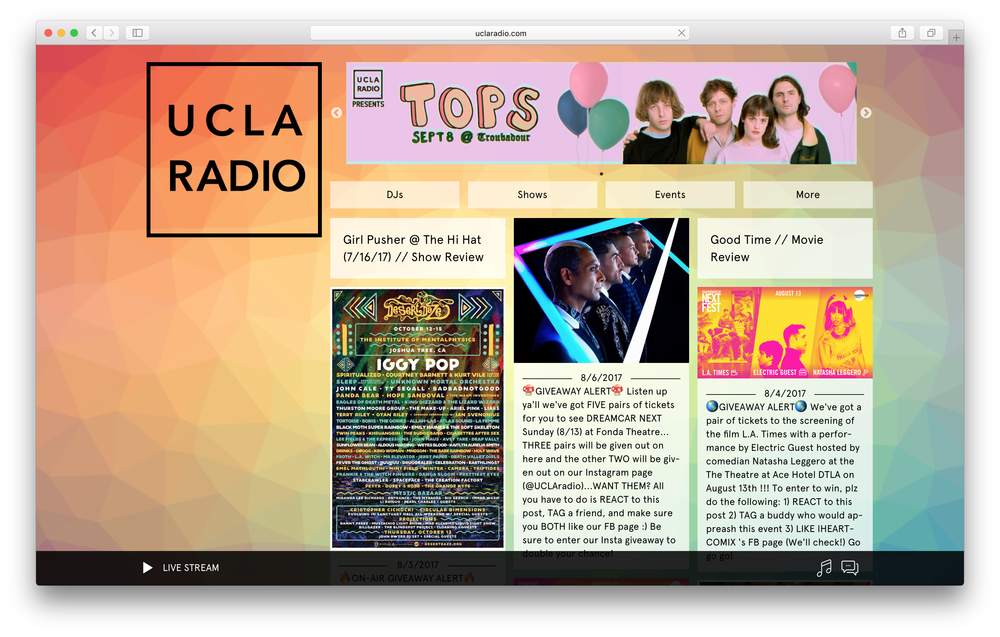
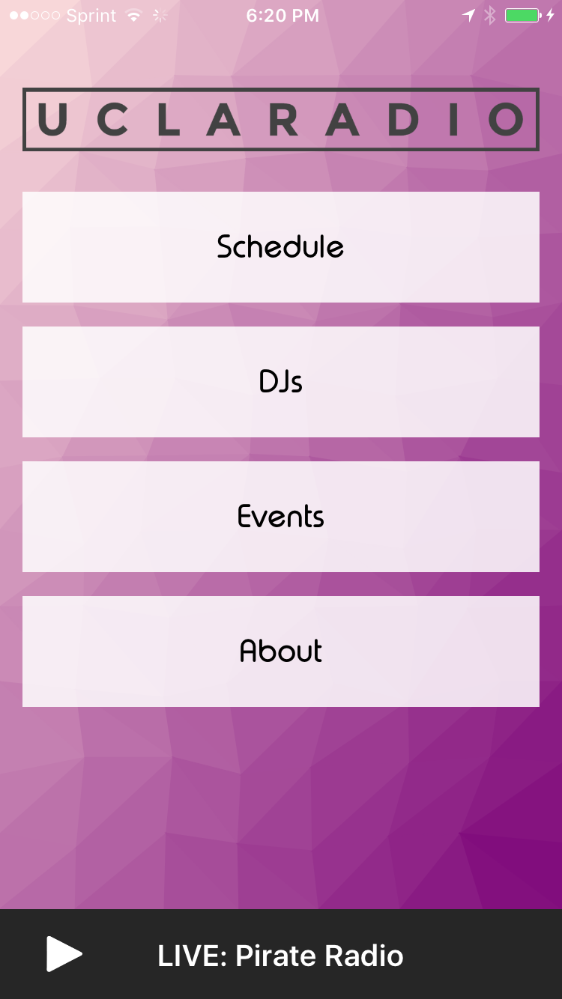
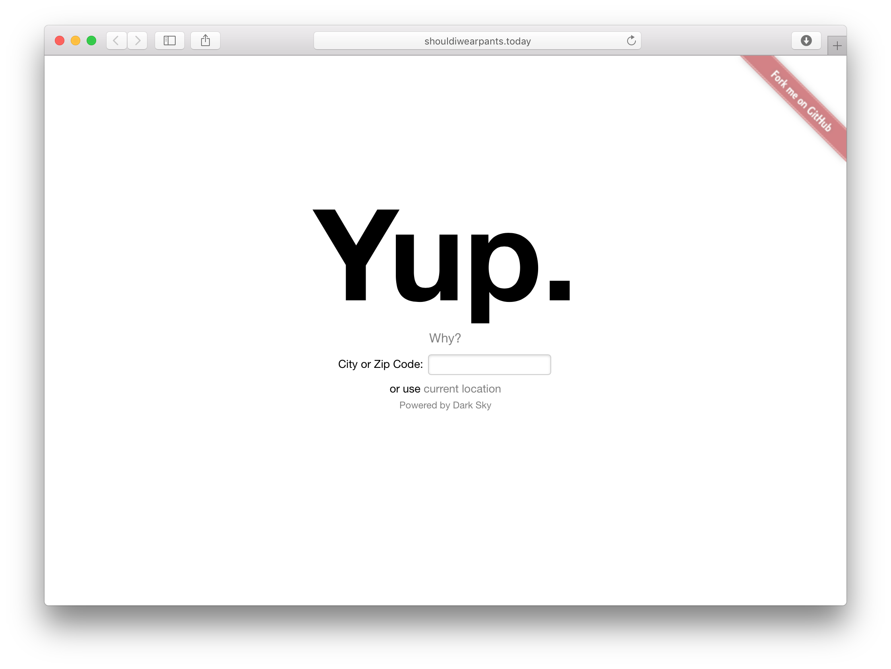

I enjoy building things, especially when those things can be used by everyone to solve problems I've had. Here are a few things I've built, both on my own time and for other people:

### UCLA Radio: [uclaradio.com](https://uclaradio.com) (February 2017 – Present)

I started working on UCLA Radio's website in my second quarter both in radio and at UCLA. Features I've implemented include social links on every show page as well as a modal popup notifying listeners about our pledge drive during the month of May. More recently, as co-manager of UCLA Radio's web department, I've been working on bringing good software engineering practices to our site by way of establishing a linter configuration, improving our build process, automating our builds with continuous integration and deployment, writing documentation and contributing guidelines, and supporting development on Windows platforms. ([Source](https://github.com/uclaradio/uclaradio))

### UCLA Radio: [UCLA Radio for iOS](https://itunes.apple.com/us/app/ucla-radio/id420784130) (October 2016 – Present)

I also maintain the UCLA Radio's iOS app written in [Swift](https://swift.org), which accounts for a good portion of our mobile traffic. I initially worked on localizing show times across timezones and implementing reminder push notifications for specific shows; lately I've been focused on refactoring our codebase and integrating new interns on the project. ([Source](https://github.com/uclaradio/uclaradio-iOS))

### Daily Bruin: [Registration Issue 2017](https://features.dailybruin.com/regissue-2017/) (September 2017)
Registration Issue is the Daily Bruin's first issue of the new school year. Similar to our work for Graduation Issue, I and my other Online Editors created a centerpiece page to showcase all of the content written by the Bruin's staff. We also took this oppurtunity to create a tooling template for DB Online static projects. 

### Daily Bruin: [Graduation Issue 2017](http://gradissue2017.dailybruin.com) (June 2017)

Traditionally, the Daily Bruin's Graduation Issue is written by next year's incoming staff. As an incoming Assistant Online Editor, I worked with my other Online Editors to create a digital homepage for the last Daily Bruin issue of the 2016–2017 school year. During the tight deadline, I learned a lot about npm build scripts, Javascript templating engines, CSS post-processors, and just how little sleep on I could run on. ([Source](https://github.com/daily-bruin/gradissue-2017))

### [lonesierra.com](http://lonesierra.com) (February 2017)
A small website made for a friend to help promote his music. ([Source](https://github.com/nathunsmitty/lonesierra.com))

### Daily Bruin: [Women's Volleyball Rides the Wave of United Longtime Companionship](http://graphics.dailybruin.com/womens-volleyball-2016/) (November 2016)

My first assignment for the Daily Bruin was to create a custom responsive article to enhance the content of a story on UCLA’s Women’s Volleyball team. The page utilizes [Bootstrap](http://getbootstrap.com) and [parallax.js](http://pixelcog.github.io/parallax.js/). ([Source](https://github.com/daily-bruin/wvolleyball_f16wk6))

### [shouldiwearpants.today](http://shouldiwearpants.today) (September 2016)

Weather, as I’ve learned, is a fickle beast, making hard to always know what to wear. This website attempts to know the answer so you don’t have to.

Shouldiwearpants.today was originally released as a client side Javascript application, before I realize a server was necessary to handle some of the more advanced features I wanted to add such as geocoding. The site now runs as a [Flask](http://flask.pocoo.org) application and is hosted with [Heroku](https://www.heroku.com/). ([Source](https://github.com/nathunsmitty/shouldiwearpants.today))

### Mirror\++ (December 2015)

A minimalist mirror app I wrote in a weekend for iOS, using Swift and AVFoundation. As far as I know, it’s the only [non-reversing mirror](https://en.wikipedia.org/wiki/Non-reversing_mirror) app. I attempted to publish it on the App Store, although it was blocked by Apple 😢. However, the code is open source and can be compiled onto any iOS device. ([Source](https://github.com/nathunsmitty/MirrorPlusPlus))
