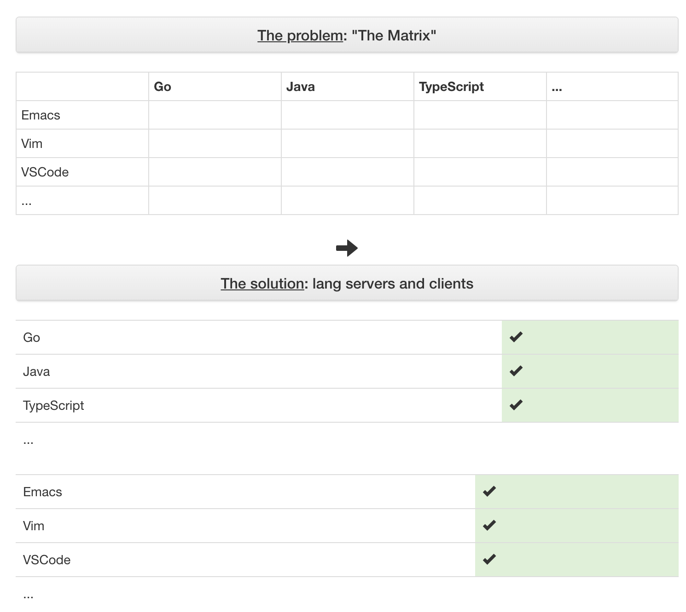

The next major release of Neovim, 0.5.0, is currently in development and has five promised features:

> - Lua remote plugin host
> - Lua user-config: init.lua
> - Treesitter syntax engine
> - LSP client for code navigation, refactoring
> - Extended marks (text properties, decorations, virtual text)

Enticed by offerings of the Neovim roadmap, I decided to install the nightly builds of Neovim and try them for myself. This post will be the first in a series where we focus on the features of Neovim 0.5.0. Today, we'll look at Neovim's Language Server Protocol.

## What is Language Server Protocol?

The Language Server Protocol, or LSP, is a JSON RPC protocol introduced in 2016 by Microsoft that defines how an editor should talk to a language server. What is a language server? It's a small program that runs locally on your computer that can provide information about the code you're writing. The idea is that you tell the LSP where your project is, it scans all your files, and then has an understanding about your project. It can then provide go-to-definition, type info, compiler errors, completion suggestions, and more back to your editor. As the name implies, each language server generally supports only one language. Sourcegraph maintains [a list](https://langserver.org/) of major LSP implementations.

That's cool, you say, but my editor already supports these features. Why should I start using a language server?

That's a good question. If your editor already supports typo info, auto-completion, and everything else, you likely don't need an LSP. In fact, an LSP might slow you down – it's likely a built-in editor feature would be faster than your editor making an RPC request to a server running on your computer.

However, the main advantage of the LSP is that it brings together developers who use different editors. The LSP is editor agnostic – if your editor speaks the protocol, it can talk to the server running. That is, instead of developers having to create an Emacs JavaScript plugin, and a Vim JavaScript plugin, and a VS Code JavaScript plugin, they need only create a single JavaScript language server and language server plugins for each editor.

[Langserver.org](https://langserver.org) calls this problem "the matrix", and it's easy to see why. If we have $n$ languages and $m$ editors, instead of making $n \times m$ integrations we only have to create $n$ language servers plus $m$ editor LSP plugins.



Okay, you tell me, so now you've just proved [Conway's law](https://en.wikipedia.org/wiki/Conway%27s_law) also applies to open source. But you didn't answer my original question: why should I use a language server?

Since the community of all JavaScript developers is a superset of all JavaScript Vim developers, this means a better language server. Since the community of all Vim developers is also better than all JavaScript Vim developers, this means better LSP integration support.

While this may not necessarily be true for all editor plugins, it certainly is for Vim. Vim completion can be done for already existing keywords, dictionary words, ctags results, or omnicomplete. Of these, ctags and omnicomplete are the most IDE-like. In my experience, while ctags is pretty good, it can often give inaccurate results if the same name is used in different contexts across a codebase. And omnicomplete is often left neglected: JavaScript omnicomplete hasn't been [updated since 2017](https://github.com/vim/vim/blob/5be4ceecea5520265066eac972460ebb1cdf05e7/runtime/autoload/javascriptcomplete.vim), a sign of the matrix problem.

## Upgrading to Neovim Nightly

Okay, so I've convinced you to try out an LSP. How does it work in Neovim?

Neovim has [great install instructions](https://github.com/neovim/neovim/wiki/Installing-Neovim) for most systems (macOS, Windows, popular Linux distros). I'm on macOS, so I ran:

```
brew install --HEAD neovim
```

From there, you can confirm that the installed version of Neovim has LSP support with `:h lsp`.

## A note on Lua

Recall the first two features of 0.5.0:

> - Lua remote plugin host
> - Lua user-config: init.lua

Vimscript, or VimL, is the de facto configuration of Vim. However, it's also [not that great of a language](https://www.reddit.com/r/vim/comments/1bf672/why_does_viml_suck/): there are lots of odd quirks and performance issues that come with it. As a result, the Neovim core developers decided to add support for Lua in Neovim. Justin M. Keyes goes over the rationale for this decision in a [great VimConf presentation](https://youtu.be/Bt-vmPC_-Ho). The tl;dr is that Lua is a fast language that already exists and is simpler to learn than Vimscript.

Why does this matter? We were going to go over the LSP today, not Lua, right?

Yes and no. Just as Vimscript is the language for which Vim apis are exposed, Lua is becoming the preferred language for which Neovim apis are being exposed. The LSP api is in Lua, meaning we'll have to write a little bit of Lua to set it up.

If you haven't written any Lua, don't fear! Ample code examples will be provided for your copy/pasting pleasure. Lua is a fairly easy language to read if you know any programming language already. If you're interested in more Lua, [Learn X in Y minutes](https://learnxinyminutes.com/docs/lua/) is a great place to start.

However, most Vimmers don't currently have any lua configuration files lying around, so we need to cover the basics of going from an `init.vim` Vimscript file into triggering Lua code. There are a couple ways to do this.

### Lua in your vim

You can put Lua code directly in vimscript files, like so:

```vim
lua << EOF
print("hello world")
EOF
```

This is great for small to medium snippets of Lua code.

### Lua in a file

You can also tell Neovim to source lua files, given that that fit a directory structure. In Vimscript:

```vim
lua require("lsp")
```

This will look for the file: `nvim/lua/lsp/init.lua`. This is great for larger, self-contained chunks of Lua code. I prefer this approach and use it in [my dotfiles](https://github.com/nathunsmitty/.config), since it gives me access to Lua syntax highlighting, linters, etc. while editing.

## Configuring Support for Servers

Neovim provides the LSP client built-in, but it needs to which language servers to run and where on your machine they're located. There's a [Lua api](https://neovim.io/doc/user/lsp.html#lsp-core) provided that allows you to do this; the following will trigger JavaScript LSP:

```lua
local root_dir = buffer_find_root_dir(bufnr, function(dir)
  return is_dir(path_join(dir, 'node_modules'))
end)

local bufnr = vim.api.nvim_get_current_buf()
local javascript_lsp_config = {
  name = "javascript";
  cmd = { path_join(os.getenv("JAVASCRIPT_LANGUAGE_SERVER_DIRECTORY"), "lib", "language-server-stdio.js") };
}

local new_config = vim.tbl_extend("error", javascript_lsp_config, {
  root_dir = root_dir;
})
client_id = vim.lsp.start_client(new_config)
vim.lsp.buf_attach_client(bufnr, client_id)
```

(This is adapted from [an example](https://neovim.io/doc/user/lsp.html#lsp-extension-example) in the LSP manual.)

However, this is a lot of configuration. Is there a better solution?

### nvim-lsp: Common Server Configuration

To give a higher level of abstraction for end users who just want to start using a LSP, Neovim provides an official plugin: [nvim-lsp](https://github.com/neovim/nvim-lsp). This is a collection of common LSPs with integrations ready to go. Let's install it!

```vim
" vim-plug
Plug 'neovim/nvim-lsp'
" minpac
call minpac#add('neovim/nvim-lsp', {'type': 'opt'})
packadd nvim-lsp
```

Note that if you're using a Vim 8's native package manager (or a package manager that leverages the native package manager, like [minpac](https://github.com/k-takata/minpac)), then you need to add the line `packadd nvim-lsp`. This is because Neovim [currently does not source Lua plugins before your `init.vim` file](https://github.com/neovim/neovim/issues/12670), meaning that your LSP config will execute before nvim-lsp is loaded, giving errors. With an older [runtimepath](https://neovim.io/doc/user/options.html#'runtimepath')-based plugin manager like [vim-plug](https://github.com/junegunn/vim-plug) this is not an issue.

Now that we've downloaded nvim-lsp, we can configure a language server. To set up the [TypeScript language server](https://github.com/theia-ide/typescript-language-server), we simply need to add:

```vim
require'nvim_lsp'.tsserver.setup{}
```

There are also [configuration options](https://github.com/neovim/nvim-lsp#tsserver) for which filetypes to run it on, how to detect your project's root directory, etc.

While we're configuring stuff, let's add some nice, vim-like shortcuts for LSP features:

```vim
nnoremap <silent> gd <cmd>lua vim.lsp.buf.definition()<CR>
nnoremap <silent> gh     <cmd>lua vim.lsp.buf.hover()<CR>
nnoremap <silent> gD    <cmd>lua vim.lsp.buf.implementation()<CR>
nnoremap <silent> <c-k> <cmd>lua vim.lsp.buf.signature_help()<CR>
nnoremap <silent> 1gD   <cmd>lua vim.lsp.buf.type_definition()<CR>
nnoremap <silent> gr    <cmd>lua vim.lsp.buf.references()<CR>
nnoremap <silent> g0    <cmd>lua vim.lsp.buf.document_symbol()<CR>
nnoremap <silent> gW    <cmd>lua vim.lsp.buf.workspace_symbol()<CR>
```

Note that these mappings override some Vim defaults, so in order to ensure they only work on

Note that the `omnifunc` line makes it so that Vim's omnicompletion uses the LSP as a source. You can trigger omnicompletion with `<C-x><C-o>`.

Awesome! However, unless you have the TypeScript language server already installed, you still won't notice any LSP features. This is because you need to install the language server. The bad news is that each language server has its own installation instructions. The good news is the nvim-lsp takes care of it by providing a `LspInstall` command. All we have to do is run:

```
:LspInstall tsserver
```

and we're in business!

### Even more abstractions

There are a few other optional plugins for Neovim that will improve your LSP quality-of-life. These are by no means necessary, you could implement them with a bit of Vimscript and Lua, but they do provide some more polish to the experience.

#### completion-nvim

[completion-nvim](https://github.com/nvim-lua/completion-nvim), as the name implies, is an autocompletion plugin. It's similar to something like [YouCompleteMe](https://github.com/ycm-core/YouCompleteMe) or [Deoplete](https://github.com/Shougo/deoplete.nvim) in that it gives auto popup and other improvements on top of Neovim's LSP api, as well as some other sources.

```vim
call minpac#add('nvim-lua/completion-nvim', {'type': 'opt'})
packadd completion-nvim
```

```lua
local on_attach = function()
  require'completion'.on_attach()
  require'diagnostic'.on_attach()
end
require'nvim_lsp'.pyls.setup{on_attach=on_attach_vim}
```

#### lsp-status.nvim: Statusline Support

[lsp-status.nvim](https://github.com/nvim-lua/lsp-status.nvim) is a Lua plugin that allows you to display information from your language server in your status line. Setup should be straightforward, now that you've installed a couple Lua extensions already.

```vim
call minpac#add('nvim-lua/lsp-status.nvim', {'type': 'opt'})
packadd lsp-status.nvim
```

Once installed, it only takes a few lines of code to add a statusline component on the Vimscript side.

```vim
function! LspStatus() abort
  if luaeval('#vim.lsp.buf_get_clients() > 0')
    return luaeval("require('lsp-status').status()")
  endif
  return ''
endfunction

set statusline+=\ %{LspStatus()}
```

Since the statusline is written in Lua, all of the configuration happens in Lua.

```lua
local lsp_status = require('lsp-status')
lsp_status.register_progress()

lsp_status.config({
  status_symbol = '',
  indicator_errors = 'e',
  indicator_warnings = 'w',
  indicator_info = 'i',
  indicator_hint = 'h',
  indicator_ok = '✔️',
  spinner_frames = { '⣾', '⣽', '⣻', '⢿', '⡿', '⣟', '⣯', '⣷' },
})

nvim_lsp.rust_analyzer.setup({
  on_attach = lsp_status.on_attach,
  capabilities = lsp_status.capabilities
})
```

One thing I'll note is that by default, the symbols used on the statusline don't render well across all fonts and terminals. In the code snippet above (at the `lsp_status.config` line), I replaced them all with letters, but you'll likely want to play around them.

#### diagnostic-nvim: Clearer error info

By default, Neovim shows LSP diagnostic info (i.e., warnings and errors) as virtual text. [diagnostic-nvim](https://github.com/nvim-lua/diagnostic-nvim) gives you greater control over how these errors are displayed. Configuration is similar to lsp-status.nvim and completion-nvim.

```vim
call minpac#add('nvim-lua/diagnostic-nvim', {'type': 'opt'})
packadd diagnostic-nvim
```

```lua
local diagnostic = require('diagnostic')
nvim_lsp.rust_analyzer.setup({
  on_attach = diagnostic.on_attach,
})
```

## Give me the code and a demo!

If you scrolled ahead to this section, I get it, I'm impatient too. If you didn't, maybe you've been wondering how you put all of these plugins together, since they all use the same `on_attach` callback.

### Vimscript

This can be in your `init.vim` or similar.

```vim
call minpac#add('neovim/nvim-lsp', {'type': 'opt'})
call minpac#add('nvim-lua/lsp-status.nvim', {'type': 'opt'})
call minpac#add('nathunsmitty/diagnostic-nvim', {'type': 'opt'})
call minpac#add('nvim-lua/completion-nvim', {'type': 'opt'})
packadd nvim-lsp
packadd lsp-status.nvim
packadd diagnostic-nvim
packadd completion-nvim

" LSP config, in lua
lua require("lsp")

" Misc settings I like
let g:diagnostic_insert_delay = 1
let g:diagnostic_show_sign = 1
let g:diagnostic_enable_virtual_text = 1
" Complete parentheses for functions
let g:completion_enable_auto_paren = 1
" Work with vim-endwise
let g:completion_confirm_key = "\<C-y>"
" Set completeopt to have a better completion experience
set completeopt=menuone,noinsert,noselect
" Avoid showing message extra message when using completion
set shortmess+=c
let g:completion_enable_snippet = 'UltiSnips'
```

### Lua

This will go in `lua/lsp/int.lua` or similar. You could also put it in a `lua << EOF` block.

```lua
local lsp_status = require('lsp-status')
local diagnostic = require('diagnostic')
local completion = require('completion')
local nvim_lsp = require('nvim_lsp')
local configs = require('nvim_lsp/configs')
local util = require('nvim_lsp/util')

local on_attach = function(client, bufnr)
  lsp_status.on_attach(client, bufnr)
  diagnostic.on_attach(client, bufnr)
  completion.on_attach(client, bufnr)

  -- Keybindings for LSPs
  vim.fn.nvim_set_keymap("n", "gd", "<cmd>lua vim.lsp.buf.definition()<CR>", {noremap = true, silent = true})
  vim.fn.nvim_set_keymap("n", "gh", "<cmd>lua vim.lsp.buf.hover()<CR>", {noremap = true, silent = true})
  vim.fn.nvim_set_keymap("n", "gD", "<cmd>lua vim.lsp.buf.implementation()<CR>", {noremap = true, silent = true})
  vim.fn.nvim_set_keymap("n", "<c-k>", "<cmd>lua vim.lsp.buf.signature_help()<CR>", {noremap = true, silent = true})
  vim.fn.nvim_set_keymap("n", "1gD", "<cmd>lua vim.lsp.buf.type_definition()<CR>", {noremap = true, silent = true})
  vim.fn.nvim_set_keymap("n", "gr", "<cmd>lua vim.lsp.buf.references()<CR>", {noremap = true, silent = true})
  vim.fn.nvim_set_keymap("n", "g0", "<cmd>lua vim.lsp.buf.document_symbol()<CR>", {noremap = true, silent = true})
  vim.fn.nvim_set_keymap("n", "gW", "<cmd>lua vim.lsp.buf.workspace_symbol()<CR>", {noremap = true, silent = true})
end

lsp_status.register_progress()
lsp_status.config({
  status_symbol = '',
  indicator_errors = 'e',
  indicator_warnings = 'w',
  indicator_info = 'i',
  indicator_hint = 'h',
  indicator_ok = 'ok',
})

nvim_lsp.pyls.setup{
  on_attach = on_attach,
  capabilities = lsp_status.capabilities
}
nvim_lsp.sumneko_lua.setup{
  on_attach = on_attach,
}
nvim_lsp.vimls.setup{
  on_attach = on_attach,
  capabilities = lsp_status.capabilities
}
nvim_lsp.tsserver.setup{
  on_attach = on_attach,
  capabilities = lsp_status.capabilities
}
nvim_lsp.html.setup{
  on_attach = on_attach,
  capabilities = lsp_status.capabilities
}
-- More language servers here! ...
```

You can also see the code in [my dotfiles](https://github.com/nathunsmitty/.config), specifically in [integrations.vim](https://github.com/nathunsmitty/.config/blob/master/nvim/config/integrations.vim) and [lsp/init.lua](https://github.com/nathunsmitty/.config/tree/master/nvim/lua/lsp).

## Demo!

This is what that config looks like in action.

TODO

## Conclusion

Neovim 0.5.0 is in active development still, so it's very possible that this blog post will be out of date by the time an official release is out. Overall, I was very impressed with the features and stability of Neovim nightly, though. I'll likely be sticking with the nightly releases for the foreseeable future.

Some general areas of friction I encountered were:

- Documentation and examples around using Lua with Vimscript is currently very lacking.
- Documentation on Neovim's LSP API is out-of-date and also very lacking.
- nvim-lsp has only a small list of supported LSPs.
- TypeScript's "language server", TSServer, doesn't actually follow the LSP spec and thus isn't supported by Neovim. This is more of a TypeScript problem though.
- The current plugin ecosystem is small and not yet very configurable.

However, these are all problems will likely be resolved with time as Neovim's LSP implementation matures. I'm looking forward to seeing the future progress the Neovim developers make!

<p className="text-gray-600 text-sm italic">If you liked this, consider [contributing](https://github.com/neovim/neovim) or [donating](https://salt.bountysource.com/teams/neovim) to Neovim.</p>
