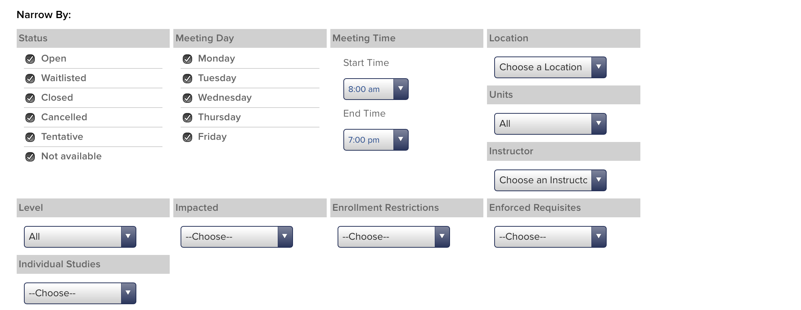
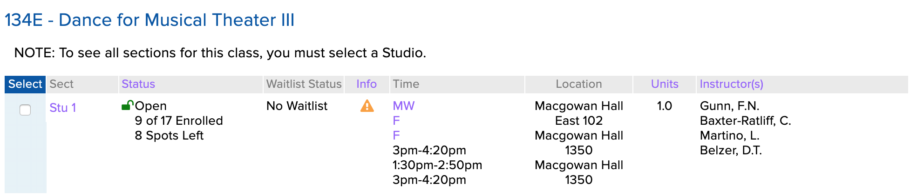
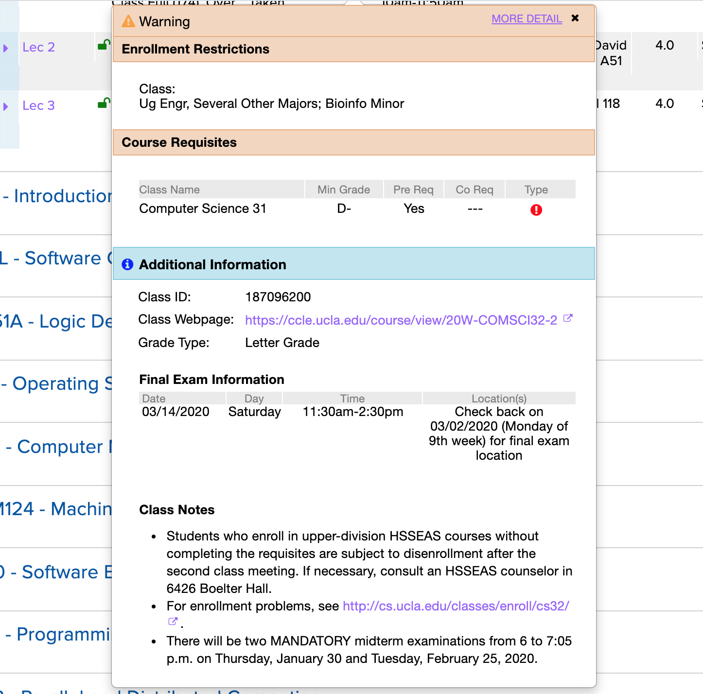

After taking the first 9 months of 2019 off from school to do internships, I was excited to come back to UCLA and once again learn in a formal academic setting. I had a great fall schedule planned. I’d take Compiler Construction, Introduction to Digital Humanities, [the probability class taught entirely through Texas Hold’ Em examples](http://www.stat.ucla.edu/~frederic/100a/F19/100asyllabusF19.html), and a computer science class taught by [Appfolio](https://www.appfolio.com/) engineers, [Scalable Internet Services](https://www.scalableinternetservices.com/).

I grabbed Digital Humanities and Compilers on my first pass, and planned on enrolling in Stats and Scalable Internet Services on my second pass. But by the time my second pass was active, Scalable Internet Services had filled up.

This is hardly a unique problem; UCLA students have been complaining about a [lack of course offerings](https://dailybruin.com/2019/02/26/enrollment-system-creates-crisis-for-students-unable-to-take-necessary-classes/) and the [black market of enrollment](https://dailybruin.com/2020/01/20/facebook-buy-and-sell-groups-cannot-cover-for-class-overenrollment-issues/) for a while. Surprisingly, that’s also a lack of data surrounding how quickly classes fill up – and whether one should use their some of their precious first pass units on it or wait until their second pass. The best solutions I know of is to ask friends or post on a major’s Facebook page, which while generally useful, tend to be highly subjective.

So I did what probably absolutely no one else except me would do: I decided I'd scrape the UCLA Registrar's online schedule of classes to find out which classes fill up the quickest and ensure that I’d never miss a class again. I’ve been working on this scraper in my spare time for the past six months, and I’m ecstatic that it’s finally in a state that I feel is ready to share on the internet.

This post is documentation of my journey of creating this scraper. If you’re interested in the data from this project, don’t worry that’ll be coming in the next few weeks! I’m currently doing a Digital Humanities independent study project with [Professor Ashley Sanders Garcia](https://dh.ucla.edu/person/ashley-sanders-garcia/) that will culminate in a digital exploration of that data I’ve scraped. However, I think there’s also that can be learned from the development of the scraper itself. In the past six months of this project, I’ve reverse engineered numerous API endpoints, taught myself SQL, devised a lot of regular expressions, rewritten the scraper in three different languages, deployed it as a set scheduled AWS Lambda functions, and set up alert monitoring via Datadog on my functions. While this post isn’t necessarily intended to be a tutorial on writing your own UCLA registrar scraper – think of it more as a lab report or exercise in [learning in public](https://www.swyx.io/writing/learn-in-public/) – it’s my hope that you’ll find my journey into web scraping both compelling and informative.

## The data source

In order to start web scraping, there needs to be a website to scrape. In our case, it’s the UCLA Registrar's [publicly available list of all classes offered for the most recent quarters](https://sa.ucla.edu/ro/public/soc), which is updated hourly.[^1] The most common way to search for classes is by a "Subject Area", a logical grouping of classes. In most cases, like Computer Science, the subject area of Computer Science maps directly to courses offered by the [Computer Science department](https://www.cs.ucla.edu) of UCLA. However, some departments, like the [Department of Asian Languages and Cultures](https://www.alc.ucla.edu), offer many subject areas – one for each language[^2], in the case of ALC. A full [department/subject area mapping](https://www.registrar.ucla.edu/Faculty-Staff/Courses-and-Programs/Department-and-Subject-Area-Codes) is provided by the registrar.

Selecting a subject area in the “Schedule of Classes” takes you to a results page, which lists all courses offered for a given subject area and selected term. Clicking on a given course expands a dropdown that lists all the sections offered for that course in the given quarter.


Each section has information about the enrollment/waitlist status, enrollment/waitlist counts, day and time, a location, units, and the instructor of that respective section.


Perfect! This table had all the enrollment info I was interested in and more. We’d just need to fetch every subject area’s course listings and scrape every table on each page. It was time to start writing the scraper.

## Choosing a programming language

### Attempt 1: Python and Beautiful Soup

I’d had never written a web scraper before this project, but I had heard [Python](https://www.python.org/) and [Beautiful Soup](https://www.crummy.com/software/BeautifulSoup/) were the go-to tools for web scraping projects, so I decided to start there. After referring to the [very helpful slides](https://github.com/uclaacm/learn.py-s19/tree/master/session-8-web-scraping) that [UCLA ACM](http://www.uclaacm.com/) made last spring about BeautifulSoup, I had a very basic scraper.

```python
from bs4 import BeautifulSoup
import requests

response = requests.get(
    "https://sa.ucla.edu/ro/Public/SOC/Results?t=19F&sBy=subject&sName=Computer+Science+%28COM+SCI%29&subj=COM+SCI&crsCatlg=Enter+a+Catalog+Number+or+Class+Title+%28Optional%29&catlg=&cls_no=&btnIsInIndex=btn_inIndex"
)

soup = BeautifulSoup(response.content, "html.parser")

print(soup.prettify())
```

The [URL I used](https://sa.ucla.edu/ro/Public/SOC/Results?t=19F&sBy=subject&sName=Computer+Science+%28COM+SCI%29&subj=COM+SCI&crsCatlg=Enter+a+Catalog+Number+or+Class+Title+%28Optional%29&catlg=&cls_no=&btnIsInIndex=btn_inIndex) specifically links to computer science classes, since I was primarily interested but each subject area has a similar URL. Note that the actual fetching of the page is done by [Requests](http://python-requests.org/), a popular Python HTTP library.

I was hoping this would give us the HTML markup of every class and its info. Instead, I got something like:

```html
<!-- ... -->
<div id="divClassNames">
  <div class="results">
    <div id="resultsTitle">
      <div class="row-fluid class-title" id="COMSCI0001">
        <h3 class="head">
          <a href="javascript:void(0)" id="COMSCI0001-title">
            1 - Freshman Computer Science Seminar
          </a>
        </h3>
      </div>
      <script type="text/javascript">
        Iwe_ClassSearch_SearchResults.AddToCourseData('COMSCI0001', {
          Term: '19F',
          SubjectAreaCode: 'COM SCI',
          CatalogNumber: '0001    ',
          IsRoot: true,
          SessionGroup: '%',
          ClassNumber: '%',
          SequenceNumber: null,
          Path: 'COMSCI0001',
          MultiListedClassFlag: 'n',
          Token: 'MDAwMSAgICBDT01TQ0kwMDAx',
        })
      </script>
      <div class="row-fluid class-title" id="COMSCI0019001">
        <h3 class="head">
          <a href="javascript:void(0)" id="COMSCI0019001-title">
            19 - From Impossible to I'm Possible: Analysis of Impostor
            Phenomenon
          </a>
          <!-- ... -->
        </h3>
      </div>
    </div>
  </div>
</div>
```

Huh. It seemed like the page was more dynamic than I thought. This is the result of some nifty design on the UCLA Registrar’s part. When you get the list of courses for a subject area, the page actually doesn’t load all the information about each section. Instead there’s some JavaScript network trickery going on when you interact with the page. When you click on a header, it triggers the `Iwe_ClassSearch_SearchResults.AddToCourseData` function, which fires off a network request to an endpoint that returns the data, which is then appended to the page.

### Attempt 2: JavaScript and Puppeteer

All this dynamic content made me start to second-guess the BeautifulSoup approach, so I decided to try something different.

The last person I knew who did some scraping of the registrar was [Rishub](http://rishub.com), who used to the data for the now defunct [BruinScan](https://www.facebook.com/bruinscan/), as well as a [Stack article](https://stack.dailybruin.com/2018/11/08/how-long-are-lectures/). He was a [Selenium](https://docs.seleniumhq.org/) wizard, and used it to scrape the registrar. So I figured I’d try Selenium.

Shortly into my Selenium research, I realized that [Puppeteer](https://pptr.dev/) solved the same browser automation problem Selenium did. I actually had a small amount of Puppeteer experience from my internship at [Datadog](https://www.datadoghq.com/), where all our frontend acceptance tests used Puppeteer.

And Puppeteer used JavaScript! Perfect, since my JavaScript is better than my Python anyways.

My first approach at a Puppeteer-based scraper looked like:

```javascript
const puppeteer = require('puppeteer')

;(async () => {
  const browser = await puppeteer.launch()
  const page = await browser.newPage()
  await page.goto(
    'https://sa.ucla.edu/ro/Public/SOC/Results?t=19F&sBy=subject&sName=Computer+Science+%28COM+SCI%29&subj=COM+SCI&crsCatlg=Enter+a+Catalog+Number+or+Class+Title+%28Optional%29&catlg=&cls_no=&btnIsInIndex=btn_inIndex'
  )

  await page.click('#expandAll')
  await page.waitFor(5000)

  const data = await page.evaluate(() => {
    const rawEnrollmentStatuses = document.querySelectorAll('.statusColumn[id]')
    return Array.from(rawEnrollmentStatuses).map(rawStatus => {
      const id = rawStatus.getAttribute('id')
      const course = id.match(/COMSCI\d{4}/)

      return {
        course,
      }
    })
  })

  console.table(data)

  await browser.close()
})()
```

This was getting somewhere!

A couple of selected notes of interest on the above code:

- Every course page on the “Schedule of Classes” website has an “Expand All Classes” button, which triggers the sections dropdown for all the courses on the page. Being able to click this button and then parse the dynamically added content added after the button was clicked was the main reason I needed a headless browser.
- [document.querySelectorAll()](https://developer.mozilla.org/en-US/docs/Web/API/Document/querySelector) does not return an array like I expected, but [NodeList](https://developer.mozilla.org/en-US/docs/Web/API/NodeList), which must be [Array.from()](https://developer.mozilla.org/en-US/docs/Web/JavaScript/Reference/Global_Objects/Array/from)ed in order to map through it.
- I found out pretty quickly that regular expression capturing groups would be the most concise and easiest way to both match and extract data from the scraped input. The regular expression in this code, `COMSCI\d{4}`, matches the id of the container `<div>` for each course. Example id: `COMSCI0032`.
- [ console.log()](https://developer.mozilla.org/en-US/docs/Web/API/Console/log) actually has a limit on how many rows of an array it'll show you, hence why I moved to [console.table()](https://developer.mozilla.org/en-US/docs/Web/API/Console/table).

#### There's more to UCLA than just CS Classes

Now that my scraper was fetching data from one page, I figured it was time to try fetching data from all subject area pages. In order to do this, I needed a list of subject areas. There was the page above that I mentioned that listed all departments and subject areas, but what I really needed was the query parameters for each subject area to make a request like:

```
https://sa.ucla.edu/ro/Public/SOC/Results?t=19F&sBy=subject&sName=Computer+Science+%28COM+SCI%29&subj=COM+SCI&crsCatlg=Enter+a+Catalog+Number+or+Class+Title+%28Optional%29&catlg=&cls_no=&btnIsInIndex=btn_inIndex
```

Chrome DevTools has a [very nice feature](https://developers.google.com/web/tools/chrome-devtools/network/reference) where it'll actually decode the URL encoded parameters and display them to you. The above decoded parameters are:

```
t: 19F
sBy: subject
sName: Computer Science (COM SCI)
subj: COM SCI
crsCatlg: Enter a Catalog Number or Class Title (Optional)
catlg:
cls_no:
btnIsInIndex: btn_inIndex
```

Of these 8 parameters, only `sName` and `subj` vary by subject area. Upon further exploration, it seemed that most of these parameters could even just be ignored – the only necessary ones were `t`, `sBy`, and `subj`.

On the main “Schedule of Classes” page, there's a dropdown of all subject areas. They're formatted the same as the `sName` parameter, so I figured if a list existed, it'd be there.


Sure enough, in the HTML, there was:

```html
<script type="text/javascript">
  $(document).ready(function() {
    AdjustGoButton()
    var subjects =
      '[{&quot;label&quot;:&quot;Aerospace Studies (AERO ST)&quot;,&quot;value&quot;:&quot;AERO ST&quot;},{&quot;label&quot;:&quot;African American /* ... */ &quot;Yiddish (YIDDSH)&quot;,&quot;value&quot;:&quot;YIDDSH&quot;}]'
    subjects = subjects.replace(/&quot;/g, '"')
    GlobalFunctions.CreateAutocomplete(
      'select_filter_subject',
      $.parseJSON(subjects.replace(/&amp;/g, '&')),
      'Enter Subject Area (Required)',
      '_Select_Subject'
    )
  })
</script>
```

If we extract that monster string out and convert the `&quot;` to `"`, then now we have a JSON representation of all subject areas. I actually just pasted that into a JavaScript object to iterate through, because I figured that subject areas didn’t really change[^3] and it’d save the scraper from having to make a network request.

Now we had our array of `label`s and `value`s which correspond to what the Registrar calls a subject area’s “name” and “code”, respectively. Perfect. Now we had were able to construct URLs for each of the subject areas.

```javascript
function getUrlsForSubjects(subjects) {
  return subjects.map(subject => {
    // Spaces are encoded in the url with `+` instead of `%20`
    const formattedCode = encodeURIComponent(subject.value).replace('%20', '+')
    const link = `https://sa.ucla.edu/ro/Public/SOC/Results?t=19F&sBy=subject&subj=${subj}`
    return link
  })
}
```

#### Pagination

The next issue to face was that of pagination: most subject areas offer more that 25 courses per quarter, meaning that the course results would be broken up into multiple pages. Weirdly enough, subsequent pages for a given subject area didn’t have distinct URLs – instead, the schedule of classes site made a network request and then just dynamically updated the content of the current page.

No matter, though. I’d just have Puppeteer click the next button, scrape the new content, and repeat until it ran out of pages. Making this task a little easier was the hidden `pageCount` element on the page, which contains the number of pages that there were.

```javascript
async function scrapeDepartment(page, link) {
  await page.goto(link, { timeout: 0 })

  const pageCount = await page.$eval('#pageCount', count =>
    parseInt(count.getAttribute('value'))
  )

  for (let i = 0; i < pageCount; i++) {
    await scrapePage(page)
    if (i !== pageCount - 1) {
      const nextLink = await page.$('#divPagination .jPag-snext-img')
      nextLink.click()
    }
  }
}
```

#### Fetching Sections

Courses are cool, but the data that’s really interesting is data for a section. This is where info about the location, the instructor, and enrollment is.

As I mentioned earlier, each course was wrapped in a containing div with the id of that course. Within this div, there’s a wrapper for the table of sections displayed, which is neatly wrapped in a `primarySection` class. Within that, each section row was within a div with a `{course id}-children` id. And in each row, each data column had a helpfully named class detailing which piece of data it contained.

We could then just parse away!

```javascript
const data = await page.evaluate(() => {
  const courses = document.querySelectorAll('.primarySection')
  return Array.from(courses).map(course => {
    const id = rawSection.getAttribute('id')
    const [course] = id.match(/[A-Z]+\d+[A-Z]*\d*/)

    const container = document.querySelector(`[id$='${course}-children']`)
    const rows = container.querySelectorAll('.data_row')

    return Array.from(rows).map(section => {
      // Lecture Number
      const lectureNumber = section.querySelector('.sectionColumn p').innerText

      // Enrollment
      const enrollmentText = section.querySelector('.statusColumn p').innerText
      const enrollmentLines = enrollmentText.split('\n')
      let status = enrollmentLines[0]
      if (status.startsWith('Closed by Dept')) {
        status = 'Closed by Dept'
      }

      let currentCapacity
      let maximumCapacity

      switch (status) {
        case 'Open':
          ;[currentCapacity, maximumCapacity] = enrollmentLines[1]
            .match(/\d+/g)
            .map(digits => parseInt(digits))
          break
        case 'Closed by Dept':
        case 'Cancelled':
          currentCapacity = 0
          maximumCapacity = 0
          break
        default:
          if (enrollmentLines.length > 1) {
            maximumCapacity = parseInt(enrollmentLines[1].match(/\d+/)[0])
            currentCapacity = maximumCapacity
          }
      }

      // Waitlist
      const waitlistText = section.querySelector('.waitlistColumn p').innerText
      let maxWaitlistCapacity = 0
      let currentWaitlistCapacity = 0
      if (waitlistText.startsWith('Waitlist Full')) {
        maxWaitlistCapacity = parseInt(waitlistText.match(/\d+/)[0])
        currentWaitlistCapacity = maxWaitlistCapacity
      } else if (status === 'Waitlist') {
        ;[currentWaitlistCapacity, maxWaitlistCapacity] = waitlistText
          .match(/\d+/g)
          .map(match => parseInt(match))
      }

      // Day Info
      const days = section.querySelector('.dayColumn p').innerText

      // Time info
      const time = section.querySelector('.timeColumn > p').innerText

      // Location
      const location = section.querySelector('.locationColumn p').innerText

      // Units
      const units = section.querySelector('.unitsColumn p').innerText

      // Instructor
      const instructor = section.querySelector('.instructorColumn p').innerText

      return {
        course,
        lectureNumber,
        status,
        currentCapacity,
        maximumCapacity,
        maxWaitlistCapacity,
        currentWaitlistCapacity,
        days,
        time,
        location,
        units,
        instructor,
      }
    })
  })
})
```

Now it was time to run it! So I did. We started off without a hitch: Aerospace Studies, African-American Studies, African Studies, .... It seemed like this scraping was going to take a while so I took a shower and came back to find that the script had failed somewhere around Geography after 30 minutes of scraping. I tried again, this time failing in the Is. I tried again, running Puppeteer with [launch({headless: false})](https://pptr.dev/#?product=Puppeteer&version=v2.0.0&show=api-puppeteerlaunchoptions) to see what Chrome was doing. It turned out the sometimes button would be clicked too quickly and not trigger a page change or load the section info. After some more tries, I decided that the DOM was just too unpredictable to accurately and quickly scrape. I began to see why everyone at Datadog hated running the acceptance tests – they were just too darn flakey.

I started to look at different approaches.

### Attempt 3: Go

If I couldn’t scrape the schedule of classes with a headless browser, I’d have to go back to fetching a parsing HTML, à la my original Beautiful Soup approach. Through my foray into Puppeteer, I had learned about the following endpoints that provided content I was interested in:

1. `https://sa.ucla.edu/ro/Public/SOC/Results/GetCourseSummary`, the endpoint that returns information about sections for a particular course.
2. `https://sa.ucla.edu/ro/Public/SOC/Results/CourseTitlesView`, the endpoint that returns subsequent pages for a given subject area.

My emerging algorithm for fetching all subject areas and course was starting to look like:

```
fetch page with all subject areas
parse all subject areas
for subject_area in subject_areas:
	fetch 1st courses page for subject_area
	parse courses from page
	fetch and parse additional course pages if needed (via /CourseTitlesView)
	for course in courses:
		fetch section data for course (via /GetCourseSummary)
		for section in sections:
			parse section
			print section (TODO: save section in csv or database)
```

With almost 200 subject areas and multiple courses offered for each subject area, it became apparent pretty quickly that my emergent algorithm was not going to be very fast. The bottleneck was the network requests – requesting and receiving the pages took about 1-2 seconds for a page on my local connection. Assuming that each subject area offered a single full page of courses – 25 – and each course had only a single section, then I roughly estimated the scraper would take 181 \* 25 \* 1 \* 1.5 = 6787.5 seconds, or 1.88 hours. Yikes! That wouldn’t work if I wanted to scrape the registrar hourly.

It was obvious that I’d need to make requests asynchronously. At first, I thought this wouldn’t be a problem in Python – Python has supported async operations for a while. But then I started running into issues.

The popular and previously mentioned HTTP library, [Requests](https://python-requests.org/), doesn’t support async/await[^4], so I had to convert my earlier code to use [AIOHTTP](https://docs.aiohttp.org/) which is a bit trickier to use. My early attempts to do this didn’t result in much of a speed increase which was probably due to both a inexperience of asynchronous Python writing on my part and lacking AIOHTTP/async documentation.

I had recently started writing [Go](https://golang.org), a language I knew had great concurrency and parallelism support, for my internship at [Keybase](https://keybase.io/) so I figured in the spirit of polyglotism, I’d try mocking out a version of the scraper in Go. [Goroutines](https://gobyexample.com/goroutines) were a refreshing break from the mess of AIOHTTP and it was nice to know that my program could scrape courses in parallel, unburdened by a [global interpreter lock](https://en.wikipedia.org/wiki/Global_interpreter_lock).

What I gave up in Go, however, was the nice HTML parsing that BeautifulSoup provided. The best replacement I found was a library called [goquery](https://github.com/PuerkitoBio/goquery), which bills itself as “A little like that [j-thing](https://jquery.com/), only in Go.”

#### Scraping subject areas

In JavaScript, the subject areas were represented as a literal array of objects with `label` and `value` properties. In Go, the corresponding data structure for an object would be a [struct](https://gobyexample.com/structs).

Doing the same literal declaration as we did in JavaScript would be a little more unergonomic, so I decided to go ahead and write a function to just fetch the data from the “Schedule of Classes” page, find the relevant line via a regular expression, and unmarshal the the JSON representation into a Go array of structs. From there, we’d return it for now (and eventually save it to a database).

```go
type SubjectArea struct {
	ID    string `json:"id"`
	Label string `json:"label"`
	Value string `json:"value"`
}

func ScrapeSubjectAreas() []SubjectArea {
	// Make request
	const url = "https://sa.ucla.edu/ro/public/soc"
	response, err := http.Get(url)
	if err != nil {
		log.Fatal(err)
	}
	defer response.Body.Close()

	// Convert response into parsable formate
	content, err := ioutil.ReadAll(response.Body)
	if err != nil {
		log.Fatal(err)
	}
	// Find the subjects line in response HTML
	prefix := "var subjects = "
	re := regexp.MustCompile(prefix + ".*")
	match := re.Find(content)
	// Convert it into a valid json string
	replacer := strings.NewReplacer(prefix, "", "&quot;", "\"", "'", "", ";", "")
	jsonString := replacer.Replace(string(match))
	// Convert the json string into a Go struct
	var subjectAreas []SubjectArea
	err = json.Unmarshal([]byte(jsonString), &subjectAreas)
	if err != nil {
		log.Fatal(err)
	}

	// TODO: save subjectAreas
	return subjectAreas
}
```

#### Scraping courses

Courses, unfortunately, would be a little trickier to scrape that subject areas. I’d first need to fetch and parse the first page, then use the `/CourseTitlesView` to extract the subsequent pages. And, we’d need to make it parallel. I started with parallelism code.

```go
var subjectAreas = ScrapeSubjectAreas()

type Course struct {
	ID              string
	SubjectAreaID   string
	Title           string
	Number          string
	Model           string
}

func ScrapeCourses() {
	var wg sync.WaitGroup
	maxConnections, err := strconv.Atoi(os.Getenv("MAX_CONNECTIONS"))
	if err != nil {
		log.Fatal(err)
	}
	sem := make(chan struct{}, maxConnections)

		for _, subjectArea := range subjectAreas {
		wg.Add(1)
		go func(subjectArea registrar.SubjectArea) {
			sem <- struct{}{}
			defer func() { <-sem }()
			defer wg.Done()
			courses, err := FetchAndParseCourses(subjectArea)
			if err != nil {
				return
			}
			// TODO: save courses
		}(subjectArea)
	}

	wg.Wait()
}
```

The parallelism was accomplished via goroutines. In order to ensure the all subject areas are fetched before the program exits, I used a [WaitGroup](https://golang.org/pkg/sync/#WaitGroup). I also ran into issues with the number of maximum concurrent connections that could be made at a time as a result of a limited amount of file descriptors on my computer; I fixed this with a [simple semaphore](http://www.golangpatterns.info/concurrency/semaphores), which in Go is implemented as a [channel](https://tour.golang.org/concurrency/2).

If you've been paying close attention the the code, you may have noticed some references in the `SubjectArea` and `Course` structs to ids. Those will be relevant once we get to adding a database! For now, just know that it'll be important to know which course belongs to which subject area and the ids help us track that.

##### Fetching the first page

Now it was time to write the code to scrape the first page of a course. The general format of this web scraping was going to be fetch, parse, and return (and then save). Fetching seemed like the logical place to start.

`FetchFirstPage` does exactly what the name implies: it makes a request for a subject area search result page, and returns a pointer to a goquery [Document](https://godoc.org/github.com/PuerkitoBio/goquery#Document), which will be used later to parse the page. The function is longer than the simple GET in `FetchSubjectAreas`, due to the fact that we add parameters to the URL. Other than that, though, it’s a fairly standard Go HTTP request.

```go
func FetchFirstPage(subjectArea registrar.SubjectArea, term string) (*goquery.Document, error) {
	const url = "https://sa.ucla.edu/ro/Public/SOC/Results"

	req, err := http.NewRequest("GET", url, nil)
	if err != nil {
		log.Error(err)
		return nil, err
	}

	// Encode query parameters
	query := req.URL.Query()
	query.Add("t", term)
	query.Add("sBy", "subject")
	query.Add("subj", subjectArea.Value)
	req.URL.RawQuery = query.Encode()

	// Make request
	response, err := client.Do(req)
	if err != nil {
		log.Error(err)
		return nil, err
	}
	defer response.Body.Close()

	doc, err := goquery.NewDocumentFromReader(response.Body)
	if err != nil {
		log.Error(err)
		return nil, err
	}

	return doc, nil
}
```

##### Parsing the first page

When scraping the subject areas, I was able to get by with a regex due to the simple nature of the data that needed to extracted – it was a single line with a known prefix. With courses, though, I needed to parse through HTML tags, requiring goquery.

I ended up making heavy use of goquery’s [Find()](https://godoc.org/github.com/PuerkitoBio/goquery#Selection.Find) function, as well as the old tried and true regular expressions in order to extract relevant parts of the HTML.

```go
func ParseCourses(subjectAreaID string, doc *goquery.Document) []registrar.Course {
	results := doc.Find("#resultsTitle")
	titles := results.Find(".class-title")
	links := results.Find("h3 > a")
	scripts := results.Find("script")

	headerRegex := regexp.MustCompile(`(\S*) - (.*)`)
	modelRegex := regexp.MustCompile(`\{(.*?)\}`)

	for i := range links.Nodes {
		link := links.Eq(i).Text()
		script := scripts.Eq(i).Text()

		header := headerRegex.FindStringSubmatch(link)
		model := modelRegex.FindString(script)

		number := header[1]
		title := header[2]

		course := Course{
			Title:          title,
			Number:         number,
			Model:          modelStr,
		}
		courses = append(courses, course)
	}

	return courses
}
```

You may notice that in addition to a course’s title and number, we also store its model – the little JSON blob used by `Iwe_ClassSearch_SearchResults.AddToCourseData` to make a network request to fetch section info. This is because I later realized I’d need it to fetch sections! Expect details about that in a bit.

##### Tying it together

The `ScrapeCourses` function calls a function called `FetchAndParseCourses`, not `FetchCourses` or `ParseCourses` directly. `FetchAndParseCourses` is essentially a wrapper around these two functions, with some additional error and pagination handling.

```go
func FetchAndParseCourses(subjectArea registrar.SubjectArea) (courses []Course, err error) {

	doc, err := FetchFirstPage(subjectArea, term)
	if err != nil {
		return courses, err
	}

	// Check that there are results
	noSearchResults := doc.Find("#spanNoSearchResults")
	if len(noSearchResults.Nodes) > 0 {
		return courses, errors.New("No search results found")
	}

	// Extract courses into array
	courses := ParseCourses(subjectArea.ID, doc)

	pageCountStr, exists := doc.Find("#pageCount").Attr("value")
	if !exists {
		return courses, errors.New("Page count couldn't be found")
	}
	pageCount, err := strconv.Atoi(pageCountStr)
	if err != nil {
		return courses, err
	}

	if pageCount > 1 {
		// TODO: scrape next pages
	}

	return courses, nil
}
```

##### Handling pagination with /CourseTitlesView

Now that the single page course scraping was working, it was time to move on to scraping additional pages with `/CoursesTitlesView`[^5]

The response of the endpoint looks something like this:

```html
<div class="results">
  <div id="resultsTitle">
    <div class="row-fluid class-title" id="COMSCI0192">
      <h3 class="head">
        <a href="javascript:void(0)" id="COMSCI0192-title"
          >192 - Methods and Application of Collaborative Learning Theory in
          Life Sciences</a
        >
      </h3>
    </div>
    <script type="text/javascript">
      Iwe_ClassSearch_SearchResults.AddToCourseData('COMSCI0192', {
        Term: '20W',
        SubjectAreaCode: 'COM SCI',
        CatalogNumber: '0192    ',
        IsRoot: true,
        SessionGroup: '%',
        ClassNumber: '%',
        SequenceNumber: null,
        Path: 'COMSCI0192',
        MultiListedClassFlag: 'n',
        Token: 'MDE5MiAgICBDT01TQ0kwMTky',
      })
    </script>
    <div class="row-fluid class-title" id="COMSCI0192A">
      <h3 class="head">
        <a href="javascript:void(0)" id="COMSCI0192A-title"
          >192A - Introduction to Collaborative Learning Theory and Practice</a
        >
      </h3>
    </div>
    <script type="text/javascript">
      Iwe_ClassSearch_SearchResults.AddToCourseData('COMSCI0192A', {
        Term: '20W',
        SubjectAreaCode: 'COM SCI',
        CatalogNumber: '0192A   ',
        IsRoot: true,
        SessionGroup: '%',
        ClassNumber: '%',
        SequenceNumber: null,
        Path: 'COMSCI0192A',
        MultiListedClassFlag: 'n',
        Token: 'MDE5MkEgICBDT01TQ0kwMTkyQQ==',
      })
    </script>
    <!-- ... -->
  </div>
</div>
```

There's our data! But instead of being nicely formatted into JSON, it’s in raw HTML, which looked to be exactly what was then inserted into the DOM and displayed on the page. Since these responses were just HTML fragments, we could parse them! The tricky part would be constructing the URLs.

Using Chrome’s URL decoding from earlier, I found that the parameters were:

```
search_by: subject
model: {"subj_area_cd":"COM SCI","search_by":"Subject","term_cd":"20W","SubjectAreaName":"Computer Science (COM SCI)","CrsCatlgName":"Enter a Catalog Number or Class Title (Optional)","ActiveEnrollmentFlag":"n","HasData":"True"}
pageNumber: 2
filterFlags: {"enrollment_status":"O,W,C,X,T,S","advanced":"y","meet_days":"M,T,W,R,F","start_time":"8:00 am","end_time":"7:00 pm","meet_locations":null,"meet_units":null,"instructor":null,"class_career":null,"impacted":null,"enrollment_restrictions":null,"enforced_requisites":null,"individual_studies":null,"summer_session":null}
_: 1579218266770
```

The `filterFlags` object looked to be similar among all requests and a way for searchers to filter classes by time, units, instructor, etc. It’s modifiable by the filter search portion of the course listing page.



The `_` parameter didn’t seem to do anything; I could omit it and the request would be the same. `search_by: subject` didn’t seem to change in my experimenting but was required, so I left it as is. `pageNumber` was pretty self-explanatory, and would need to change depending the page requested.

`model` is where things got interesting. All of the keys in the JSON object correspond to keys in the search results page. Interestingly, not all keys of the object seem to be required – the same keys that can be omitted in requests to `https://sa.ucla.edu/ro/Public/SOC/Results` can be omitted in the model. I figured the model had to be generated somewhere on the frontend, so I grepped for it in the results HTML page. And sure enough:

```html
<script type="text/javascript">
  SearchPanel.SearchData = JSON.stringify({
    subj_area_cd: 'COM SCI',
    search_by: 'Subject',
    term_cd: '20W',
    SubjectAreaName: 'Computer Science (COM SCI)',
    CrsCatlgName: 'Enter a Catalog Number or Class Title (Optional)',
    ActiveEnrollmentFlag: 'n',
    HasData: 'True',
  })
  SearchPanel.SearchBy = 'subject'
  currentActiveTerm = '20W'
  if ($('#btn_enrollmentAction_Enable').length != 0) {
    $('#btn_enrollmentAction_Enable').attr('disabled', 'disabled')
  }
</script>
```

I could just extract `model` from the first page, and then use it to fetch all subsequent pages!

Armed with my knowledge of `/CoursesTitlesView`, I attempted to recreate a request from Chrome DevTools via [cURL](https://curl.haxx.se/).

```bash
curl 'https://sa.ucla.edu/ro/Public/SOC/Results/CourseTitlesView?search_by=subject&model=%7B%22subj_area_cd%22%3A%22COM+SCI%22%2C%22search_by%22%3A%22Subject%22%2C%22term_cd%22%3A%2220W%22%2C%22SubjectAreaName%22%3A%22Computer+Science+(COM+SCI)%22%2C%22CrsCatlgName%22%3A%22Enter+a+Catalog+Number+or+Class+Title+(Optional)%22%2C%22ActiveEnrollmentFlag%22%3A%22n%22%2C%22HasData%22%3A%22True%22%7D&pageNumber=2&filterFlags=%7B%22enrollment_status%22%3A%22O%2CW%2CC%2CX%2CT%2CS%22%2C%22advanced%22%3A%22y%22%2C%22meet_days%22%3A%22M%2CT%2CW%2CR%2CF%22%2C%22start_time%22%3A%228%3A00+am%22%2C%22end_time%22%3A%227%3A00+pm%22%2C%22meet_locations%22%3Anull%2C%22meet_units%22%3Anull%2C%22instructor%22%3Anull%2C%22class_career%22%3Anull%2C%22impacted%22%3Anull%2C%22enrollment_restrictions%22%3Anull%2C%22enforced_requisites%22%3Anull%2C%22individual_studies%22%3Anull%2C%22summer_session%22%3Anull%7D'
```

And I got back a 404 error. Interesting. I thought perhaps there was some cookie data that was required to make the request, so I tried again via my browser. Same thing.

Then I tried Chrome’s [Copy as cURL feature](https://developers.google.com/web/updates/2015/05/replay-a-network-request-in-curl), to see if a header of some kind was required. And it worked! From there, I began removing headers to see what the required header was.

The answer? `X-Requested-With: XMLHttpRequest`. I actually wasn’t familiar with `X-Requested-With` before I encountered it here. Apparently, it’s a header added by a lot of JavaScript libraries to denote an AJAX request. Why the registrar blocks non-AJAX requests, I don’t know. But at least my requests to the endpoint worked!

The fetching code in Go turned out to be pretty similar to `FetchFirstPage`.

```go
const FilterFlags = `{"enrollment_status":"O,W,C,X,T,S","advanced":"y","meet_days":"M,T,W,R,F,S,U","start_time":"2:00 am","end_time":"11:00 pm","meet_locations":null,"meet_units":null,"instructor":null,"class_career":null,"impacted":null,"enrollment_restrictions":null,"enforced_requisites":null,"individual_studies":null,"summer_session":null}`

func FetchAdditionalPage(model string, pageNumber int) *goquery.Document {
	const url = "https://sa.ucla.edu/ro/Public/SOC/Results/CourseTitlesView"
	req, err := http.NewRequest("GET", url, nil)
	if err != nil {
		log.Error(err)
	}

	// This header is required, otherwise we get a 404
	req.Header.Add("X-Requested-With", "XMLHttpRequest")
	query := req.URL.Query()
	query.Add("model", model)
	query.Add("search_by", "subject")
	query.Add("filterFlags", FilterFlags)
	query.Add("pageNumber", strconv.Itoa(pageNumber))
	req.URL.RawQuery = query.Encode()

	pageRes, err := client.Do(req)
	if err != nil {
		log.Error(err)
	}
	defer pageRes.Body.Close()

	pageDoc, err := goquery.NewDocumentFromReader(pageRes.Body)
	if err != nil {
		log.Error(err)
	}

	return pageDoc
}
```

The `TODO` code in `FetchAndParseCourses` became:

```go
if pageCount > 1 {
	coursesMux := &sync.Mutex{}
	var wg sync.WaitGroup

	body, err := goquery.OuterHtml(doc.Selection)
	if err != nil {
		log.Error(err)
	}

	// Extract the model to fetch additional pages
	modelRegex := regexp.MustCompile(`(SearchPanel\.SearchData = JSON\.stringify\()({.*})`)
	matches := modelRegex.FindStringSubmatch(body)
	model := matches[2]


	for page := 2; page <= pageCount; page++ {
		wg.Add(1)
		go func(page int) {
			defer wg.Done()

			pageDoc := FetchAdditionalPage(model, page)
			if pageDoc == nil {
				return
			}

			newCourses, err := FetchAndParseCourses(pageDoc)
			if err != nil {
				log.Error(err)
			}
			coursesMux.Lock()
			courses = courses.append(courses, newCourses...)
			coursesMux.Unlock()
		}(page)
	}
}

```

Since the final order of courses doesn’t really matter, I figured I could also parallelize the fetching of additional pages after the first page. The only real difference from the top level `ScrapeCourses` would be the addition of a [mutex](https://golang.org/pkg/sync/#Mutex) to ensure only one goroutine could modify the slice at a time.

#### Scraping sections

Now it came down to the big function: scraping sections. To do this, I’d be creating URLs for the other endpoint, `/GetCourseSummary`.

Similar to the last endpoint, I started by examining the output response.

```html
<div id="COMSCI0111-container" class="primarySection">
  <div class="info light message hideOrShow">
    The number of open seats (status) for a section is updated once per hour.
    Status as of 10/23/2019 3:29:24 PM.
  </div>

  <div id="COMSCI0111-children">
    <div
      class="row-fluid data_row primary-row class-info class-not-checked"
      id="187336200_COMSCI0111"
    >
      <div class="enrollColumn" id="187336200_COMSCI0111-enroll">
        <input id="187336200_COMSCI0111-checkbox" type="checkbox" />
        <div class="toggle" id="187336200_COMSCI0111-expando">
          <a href="javascript:void(0)"><span class="icon-caret-right"/></a>
        </div>
      </div>
      <div class="sectionColumn">
        <div class="cls-section click_info" id="187336200_COMSCI0111-section">
          <p class="hide-small">
            <a
              href="/ro/Public/SOC/Results/ClassDetail?term_cd=19F&amp;subj_area_cd=COM%20SCI&amp;crs_catlg_no=0111%20%20%20%20&amp;class_id=187336200&amp;class_no=%20001%20%20"
              target="_blank"
              title="Class Detail for 187336200"
              >Lec 1</a
            >
          </p>
          <div
            tabindex="0"
            class="hide-above-small"
            data-poload="term_cd=19F&amp;subj_area_cd=COM+SCI&amp;crs_catlg_no=0111    &amp;class_id=187336200&amp;class_no= 001  "
          >
            Lec 1 <span class="icon-warning-sign icon-position"></span>
          </div>
        </div>
      </div>
      <div class="statusColumn" id="187336200_COMSCI0111-status_data">
        <p>
          <i
            class="icon-unlock"
            style="color:green; display:block; float:left; height:3em;"
          ></i
          >Open<br />126 of 138 Enrolled<br />12 Spots Left
        </p>
      </div>
      <div class="waitlistColumn" id="187336200_COMSCI0111-waitlist_data">
        <p>0 of 15 Taken</p>
      </div>
      <div
        class="infoColumn hide-small click_info"
        id="187336200_COMSCI0111-info_data"
      >
        <a href="javascript:void(0)"> </a>
        <div
          tabindex="0"
          class="icon-warning-sign icon-position"
          data-poload="term_cd=19F&amp;subj_area_cd=COM+SCI&amp;crs_catlg_no=0111    &amp;class_id=187336200&amp;class_no= 001  "
        ></div>
      </div>
      <div class="dayColumn hide-small beforeCollapseHide">
        <div id="187336200_COMSCI0111-days_data">
          <p>
            <a
              class="popover-bottom"
              data-content="Tuesday, Thursday"
              href="javascript:void(0)"
              >TR</a
            >
          </p>
        </div>
      </div>
      <div class="timeColumn" id="187336200_COMSCI0111-time_data">
        <div id="187336200_COMSCI0111-days_data">
          <p class="hide-above-small beforeCollapseShow">
            <a
              class="popover-bottom"
              data-content="Tuesday, Thursday"
              href="javascript:void(0)"
              >TR</a
            >
          </p>
        </div>
        <p>4pm<wbr />-5:50pm</p>
      </div>
      <div
        class="locationColumn hide-small"
        id="187336200_COMSCI0111-location_data"
      >
        <p>
          Haines Hall A2
        </p>
      </div>
      <div class="unitsColumn" id="187336200_COMSCI0111-units_data">
        <p>5.0</p>
      </div>
      <div
        class="instructorColumn hide-small"
        id="187336200_COMSCI0111-instructor_data"
      >
        <p>Eggert, P.R.</p>
      </div>

      <script type="text/javascript">
        Iwe_ClassSearch_SearchResults.AddToCourseData('187336200_COMSCI0111', {
          Term: '19F',
          SubjectAreaCode: 'COM SCI',
          CatalogNumber: '0111    ',
          IsRoot: false,
          SessionGroup: null,
          ClassNumber: ' 001  ',
          SequenceNumber: '1',
          Path: '187336200_COMSCI0111',
          MultiListedClassFlag: 'n',
          Token: 'MDExMSAgICAxODczMzYyMDBfQ09NU0NJMDExMQ==',
        })
      </script>
    </div>
  </div>
</div>
```

Using Chrome’s URL decoding, I found that the parameters were:

```
model: {"Term":"19F","SubjectAreaCode":"COM SCI","CatalogNumber":"0111    ","IsRoot":true,"SessionGroup":"%","ClassNumber":"%","SequenceNumber":null,"Path":"COMSCI0111","MultiListedClassFlag":"n","Token":"MDExMSAgICBDT01TQ0kwMTEx"}
FilterFlags: {"enrollment_status":"O,W,C,X,T,S","advanced":"y","meet_days":"M,T,W,R,F","start_time":"8:00 am","end_time":"8:00 pm","meet_locations":null,"meet_units":null,"instructor":null,"class_career":null,"impacted":null,"enrollment_restrictions":null,"enforced_requisites":null,"individual_studies":null,"summer_session":null}
_: 1571869764769
```

Like before, `_` could be omitted and `FilterFlags` was constant. Also like before, `model`, was embedded into the HTML. In fact, I had even seen this script tag earlier, when I first noticed the dynamic nature of the courses page.

```html
<div class="row-fluid class-title" id="COMSCI0001">
  <h3 class="head">
    <a href="javascript:void(0)" id="COMSCI0001-title">
      1 - Freshman Computer Science Seminar
    </a>
  </h3>
</div>
<script type="text/javascript">
  Iwe_ClassSearch_SearchResults.AddToCourseData('COMSCI0001', {
    Term: '19F',
    SubjectAreaCode: 'COM SCI',
    CatalogNumber: '0001    ',
    IsRoot: true,
    SessionGroup: '%',
    ClassNumber: '%',
    SequenceNumber: null,
    Path: 'COMSCI0001',
    MultiListedClassFlag: 'n',
    Token: 'MDAwMSAgICBDT01TQ0kwMDAx',
  })
</script>
```

However, unlike `/CourseTitlesView` where we could extract this model out into a local variable and use it immediately, we’d need to store each course’s model somewhere when running `ScrapeCourses` then extract it in order to scrape the sections for that given course. The logical place to do this would be in the database, so I figured I’d finally get around to storing the data I was scraping.

## Storing the data and designing the schema

Now was the time to put this data into a database. I had heard a lot of great things about Postgres, so I decided to try it.

Although I was initially only interested in the data of individual sections, I realized from the above architecture that it’d make sense to have three tables: one for subject areas, one for courses, and one for sections. This way, I could use the information from one table in scraping the data for another, reducing the number of network requests to the site I’d have to make.

My initial stab at writing the schema looked like this:

```sql
CREATE TABLE subject_areas (
  id SERIAL PRIMARY KEY,
  label TEXT,
  value TEXT,
  created_at TIMESTAMPTZ NOT NULL DEFAULT NOW(),
  updated_at TIMESTAMPTZ NOT NULL DEFAULT NOW()
);

CREATE TABLE courses (
  id SERIAL PRIMARY KEY,
  subject_area_id INTEGER REFERENCES subject_areas(id),
  title TEXT,
  number TEXT,
  model TEXT UNIQUE,
  created_at TIMESTAMPTZ NOT NULL DEFAULT NOW(),
  updated_at TIMESTAMPTZ NOT NULL DEFAULT NOW()
);

CREATE TABLE sections (
  id SERIAL PRIMARY KEY,
  -- section_id a unique id assigned by the registrar
  section_id TEXT UNIQUE,
  course_id INTEGER REFERENCES courses(id),
  days TEXT,
  time TEXT,
  location TEXT,
  units TEXT,
  instructor TEXT,
  enrollment_status TEXT,
  enrollment_count INT,
  enrollment_capacity INT,
  waitlist_status TEXT,
  waitlist_count INT,
  waitlist_capacity INT,
  created_at TIMESTAMPTZ NOT NULL DEFAULT NOW()
);
```

An early issue I ran into was the size of the `sections` table: because I was be scraping sections every hour, I had millions of rows in the table after a couple weeks. On the advice of [Alex](https://alexgessner.com/), a coworker at Keybase and SQL wizard, I ended up splitting the `sections` table into two tables: one of section information (titled `sections`) and one of just enrollment data (titled `enrollment_data`). `sections` would contain information about a section’s time, location, instructor, etc. – things that don’t change frequently – while `enrollment_data` would track the ever changing enrollment data. The final schema ended up looking like this.

```sql
CREATE TABLE subject_areas (
  id SERIAL PRIMARY KEY,
  label TEXT UNIQUE,
  value TEXT,
  created_at TIMESTAMPTZ NOT NULL DEFAULT NOW(),
  updated_at TIMESTAMPTZ NOT NULL DEFAULT NOW()
);

CREATE TABLE courses (
  id SERIAL PRIMARY KEY,
  subject_area_id INTEGER REFERENCES subject_areas(id),
  title TEXT,
  number TEXT,
  model TEXT UNIQUE,
  created_at TIMESTAMPTZ NOT NULL DEFAULT NOW(),
  updated_at TIMESTAMPTZ NOT NULL DEFAULT NOW()
);

CREATE TABLE sections (
  id SERIAL PRIMARY KEY,
  -- section_id is unique per term
  section_id TEXT UNIQUE,
  course_id INTEGER REFERENCES courses(id),
  days TEXT,
  time TEXT,
  location TEXT,
  units TEXT,
  instructor TEXT,
  created_at TIMESTAMPTZ NOT NULL DEFAULT NOW(),
  updated_at TIMESTAMPTZ NOT NULL DEFAULT NOW()
);

CREATE TABLE enrollment_data (
  id SERIAL PRIMARY KEY,
  section_id TEXT REFERENCES sections(section_id),
  enrollment_status TEXT,
  enrollment_count INT,
  enrollment_capacity INT,
  waitlist_status TEXT,
  waitlist_count INT,
  waitlist_capacity INT,
  created_at TIMESTAMPTZ NOT NULL DEFAULT NOW()
);
```

Actually using Postgres with Go turned out to be very simple; you simple use the [pq driver](https://github.com/lib/pq) Go’s builtin [sql package](https://golang.org/pkg/database/sql/). Jon Calhoun has a [great tutorial series](https://www.calhoun.io/using-postgresql-with-go/) on how to get it set up.

Most of my database logic is encapsulated in a couple of functions. The `ConnectToDatabase` function is shared across the various scraping functions.

```go
func ConnectToDatabase() (*sql.DB, error) {
	host := os.Getenv("DB_HOST")
	port := 5432
	user := os.Getenv("DB_USER")
	password := os.Getenv("DB_PASS")
	dbname := os.Getenv("DB_NAME")

	var psqlInfo string

	if password != "" {
		psqlInfo = fmt.Sprintf("host=%s port=%d user=%s password=%s dbname=%s sslmode=disable",
			host, port, user, password, dbname)
	} else {
		psqlInfo = fmt.Sprintf("host=%s port=%d user=%s dbname=%s sslmode=disable",
			host, port, user, dbname)
	}
	db, err := sql.Open("postgres", psqlInfo)
	if err != nil {
		return nil, err
	}

	err = db.Ping()
	if err != nil {
		return nil, err
	}

	return db, nil
}

```

### Saving subject areas and courses

Armed with a way to persistently save data, I went back to `ScrapeSubjectAreas` and `ScrapeCourses` to save their data.

The result was two new functions, `SaveSubjectAreas` and `SaveCourses` which are called where the previous `TODO` blocks in the above code was.

```go
func SaveSubjectAreas(db *sql.DB, subjectAreas []SubjectArea) {
	insert := `
	INSERT INTO subject_areas (name, code)
	VALUES ($1, $2)
	ON CONFLICT (code)
	DO UPDATE
	SET name = EXCLUDED.name, updated_at = NOW()`

	for _, subjectArea := range subjectAreas {
		_, err := db.Exec(insert, subjectArea.Label, subjectArea.Value)
		if err != nil {
			log.Error(err)
		}
	}
}
```

```go
func SaveCourses(db *sql.DB, courses []Courses) {
	insertCourse := `
	INSERT INTO courses (subject_area_id, title, number)
	VALUES ($1, $2, $3)
	ON CONFLICT (subject_area_id, title, number)
	DO UPDATE
	SET updated_at = NOW()
	RETURNING id
	`

				for _, course := range courses {
				var id int
				err := db.QueryRow(insertCourse, course.SubjectAreaID, course.Title, course.Number).Scan(&id)
				if err != nil {
					log.Error(err)
				}

				_, err = db.Exec(insertTerm, id, term)
				if err != nil {
					log.Error(err)
				}
			}
}
```

### Retrieving subject areas

I could now also go back and replace the `ScrapeCourses` line

```go
var subjectAreas = ScrapeSubjectAreas()
```

with a `SELECT` of the subject areas from the database.

```go
func RetrieveSubjectAreas(db *sql.DB) (subjectAreas []SubjectArea, err error) {

	rows, err := db.Query("SELECT id, name, code FROM subject_areas")
	if err != nil {
		log.Error(err)
		return subjectAreas, err
	}
	defer rows.Close()

	for rows.Next() {
		var id string
		var name string
		var code string
		err = rows.Scan(&id, &name, &code)
		if err != nil {
			log.Error(err)
		}
		subjectAreas = append(subjectAreas, SubjectArea{
			ID:    id,
			Label: name,
			Value: code,
		})
	}
	err = rows.Err()
	if err != nil {
		log.Error(err)
		return subjectAreas, err
	}

	return subjectAreas, nil
}

```

Note that we read out the unique ID that Postgres creates for each subject area, which we can then use to relate courses and subject areas!

## Scraping sections, part 2

### Retrieving courses

Now that courses were being saved by `ScrapeCourses`, we could retrieve them in `ScrapeSections`, similar to `RetrieveSubjectAreas`. Most of the code ended up being to extract all of the courses and convert them into a Go slice. The final chunk of code in the function establishes the same parallel scraping that was in `ScrapeCourses`.

```go
func ScrapeSections() {
	// SELECT courses from DB
	rows, err := db.Query(`
		SELECT courses.id, courses.model FROM courses
	`)
	if err != nil {
		log.Fatal(err)
	}
	defer rows.Close()

	// Convert courses into array of Go structs
	courses := make([]Course, 0)
	for rows.Next() {
		var ID string
		var model string
		err = rows.Scan(&ID, &model)
		if err != nil {
			log.Error(err)
		}
		course := Course{
			ID: ID,
			Model: model,
		}
		courses = append(courses, course)
	}

	// Fetch sections
	for _, course := range courses {
		wg.Add(1)
		go func(course Course) {
			sem <- struct{}{}
			defer func() { <-sem }()
			defer wg.Done()
			err := FetchAndSaveSections(course, db)
			if err != nil {
				log.Error(err)
			}
		}(course)
	}

	wg.Wait()
}
```

Then it was time to write `FetchAndSaveSections`.

```go
func FetchAndSaveSections(course Course, db *sql.DB) error {
	{
		const queryURL = "https://sa.ucla.edu/ro/Public/SOC/Results/GetCourseSummary"
		req, err := http.NewRequest("GET", queryURL, nil)
		if err != nil {
			return err
		}
		params := req.URL.Query()
		params.Add("model", course.Model)
		params.Add("FilterFlags", FilterFlags)
		req.URL.RawQuery = params.Encode()
		response, err := client.Do(req)
		if err != nil {
			return err
		}
		defer response.Body.Close()

		doc, err := goquery.NewDocumentFromReader(response.Body)
		if err != nil {
			return err
		}

		table := doc.Find("div[id$=-children]")
		rows := table.ChildrenFiltered("div")

		for i := range rows.Nodes {
			row := rows.Eq(i)

			rowID, exists := row.Attr("id")
			if !exists {
				return errors.New("could not find row id")
			}
			idRegex := regexp.MustCompile(`([0-9]+)_`)
			matches := idRegex.FindStringSubmatch(rowID)
			sectionID := matches[1]

			enrollmentData := strings.TrimSpace(row.Find("div[id$=-status_data]").Text())
			waitlistData := strings.TrimSpace(row.Find("div[id$=-waitlist_data]").Text())
			enrollmentStatus, enrollmentCount, enrollmentCapacity := ParseEnrollmentData(sectionID, enrollmentData)
			waitlistStatus, waitlistCount, waitlistCapacity := ParseWaitlistData(sectionID, waitlistData)

			days := strings.TrimSpace(row.Find("div[id$=-days_data]").First().Text())
			time := strings.TrimSpace(row.Find("div[id$=-time_data] > p").Text())
			location := strings.TrimSpace(row.Find("div[id$=-location_data]").Text())
			units := strings.TrimSpace(row.Find("div[id$=-units_data]").Text())
			instructor := strings.TrimSpace(row.Find("div[id$=-instructor_data]").Text())

			section := registrar.Section{
				SectionID:          sectionID,
				Term:               term,
				CourseID:           course.ID,
				EnrollmentStatus:   enrollmentStatus,
				EnrollmentCount:    enrollmentCount,
				EnrollmentCapacity: enrollmentCapacity,
				WaitlistStatus:     waitlistStatus,
				WaitlistCount:      waitlistCount,
				WaitlistCapacity:   waitlistCapacity,
				Days:               days,
				Time:              time,
				Location:          location,
				Units:              units,
				Instructor:        instructor,
			}

			SaveSection(section, db)
		}

	return nil
}

```

`ParseEnrollmentData` and `ParseWaitlistData` employ a lot of conditional logic and regexes to properly parse the numbers and status of a class. I’ll get to those in a bit, but just pretend they work for now.

The final bit was to define `SaveSection`, which both [upsert](https://wiki.postgresql.org/wiki/UPSERT)s a row in the `sections` table as well as creates a new `enrollment_data` row.

```go
func SaveSection(section registrar.Section, db *sql.DB) error {
	insertSection := `
	INSERT INTO sections (
		section_id,
		course_id,
		days,
		times,
		locations,
		units,
		instructors
	)
	VALUES ($1, $2, $3, $4, $5, $6, $7, $8)
	ON CONFLICT (section_id)
	DO UPDATE SET
	updated_at = NOW(),
	days = EXCLUDED.days,
	time = EXCLUDED.time,
	location = EXCLUDED.location,
	units = EXCLUDED.units,
	instructor = EXCLUDED.instructor
	RETURNING id
	`

insertEnrollmentData := `
INSERT INTO enrollment_data (
		section_id,
		enrollment_status,
		enrollment_count,
		enrollment_capacity,
		waitlist_status,
		waitlist_count,
		waitlist_capacity
	)
	VALUES ($1, $2, $3, $4, $5, $6, $7)
	`


	var id int
	err := db.QueryRow(insertSection,
		section.SectionID,
		section.Term,
		section.CourseID,
		section.Days,
		section.Time,
		section.Location,
		section.Units,
		section.Instructor,
	).Scan(&id)
	if err != nil {
		log.Error(err)
		return err
	}

	_, err = db.Exec(insertEnrollmentData,
		id,
		section.EnrollmentStatus,
		section.EnrollmentCount,
		section.EnrollmentCapacity,
		section.WaitlistStatus,
		section.WaitlistCount,
		section.WaitlistCapacity,
	)
	if err != nil {
		log.Error(err)
		return err
	}

	return nil
}
```

And with that, the scraper was complete! It locally could scrape subjects, courses, and sections and save them all in a local Postgres database. It just now needed to be deployed and run every hour.

## Going Serverless

Running the scraper every hour meant I’d need to do some kind of job scheduling. My initial thought was to use [cron](https://en.wikipedia.org/wiki/Cron) on a Digital Ocean droplet or similar, but I didn’t like the idea of paying for a server to run 24/7 just so it could execute a ~5 minute script every hour. People on Twitter love to talk about the magic of running semi-occasional jobs in a serverless manner, so I decided to look into it as a cheaper and simpler option.

There are a lot of different “Functions as a Service” providers out there, but I figured I’d go with AWS Lambda since they had a generous free plan, supported Go, and seemed to be pretty popular. The AWS console is a daunting webpage, so I was also looking for a tool that could allow me to write my infrastructure as code. There are a ton of different options in this space: [Serverless](https://serverless.com/), [Terraform](https://www.terraform.io/), and [CloudFormation](https://aws.amazon.com/cloudformation/) were just some of the options I looked at.

Ultimately, I went with [AWS SAM](https://aws.amazon.com/serverless/sam/) because it came with good examples, was easy to set up, was highly integrated with AWS services, and had support for offline testing. This was my first foray into working with AWS and I found it immensely helpful to use a simpler tool that shared all its terminology with AWS. The biggest con of SAM I found was that it’s less popular than some of the bigger tools, and it was tough to figure out how to utilize some of its lesser know features.

Setting up a lambda function is pretty easy, once you have a solid grasp on various components of AWS. In Go, you have to call `lambda.Start` in your `main` function with a handler function. The handler function can take in a `struct` of data. Here’s an example for `ScrapeSubjectAreas`:

```go
import "github.com/aws/aws-lambda-go/lambda"

func HandleRequest() error {
	log.Info("Starting request")

	db, err := ConnectToDatabase()
	if err != nil {
		return err
	}

	subjectAreas := ScrapeSubjectAreas(content)
	SaveSubjectAreas(db, subjectAreas)

	return nil
}

func main() {
	lambda.Start(HandleRequest)
}


```

Once your code is lambda-ized, you create a `template.yaml` file that defines your function. Here’s what it looks like for `ScrapeSections`:

```yaml
AWSTemplateFormatVersion: '2010-09-09'
Transform: AWS::Serverless-2016-10-31
Description: >
  ScrapeSections

  A lambda function to scrape all course sections from the UCLA registrar.

Globals:
  Function:
    Timeout: 360
Resources:
  ScrapeSectionsFunction:
    Type: AWS::Serverless::Function
    Properties:
      CodeUri: s3://ucla-registrar-scraper/5338dd93d471ce67be27b01475911bd2
      Handler: scrape-sections
      Runtime: go1.x
      Tracing: Active
      Events:
        ScrapeWebsiteHourly:
          Type: Schedule
          Properties:
            Schedule: cron(0 * * * ? *)
            Name: Houly
            Description: Top of every hour
            Enabled: True
      Environment:
        Variables:
          DB_MAX_CONNECTIONS: 75
          DB_USER:
          DB_PASS:
          DB_HOST:
          DB_NAME:
Outputs:
  ScrapeSectionsFunction:
    Description: 'ScrapeSections ARN'
    Value: !GetAtt ScrapeSectionsFunction.Arn
  ScrapeSectionsFunctionIamRole:
    Description: 'Implicit IAM Role created for ScrapeSections function'
    Value: !GetAtt ScrapeSectionsFunctionRole.Arn
```

A lot of this is boilerplate that I generated from the AWS Go [example template.yaml](https://github.com/awslabs/aws-sam-cli-app-templates/blob/master/go1.x/cookiecutter-aws-sam-hello-golang/%7B%7Bcookiecutter.project_name%7D%7D/template.yaml). The interesting bits are:

- I set environment variables via the `Environment.Variables` property on the resource. Environment variables include the max connection limit and DB login info.
- The `Events` section is where I schedule the scraping, which happens hourly for sections.[^6] AWS [supports cron syntax](https://docs.aws.amazon.com/lambda/latest/dg/tutorial-scheduled-events-schedule-expressions.html)!

From that, I was ready to test locally (and then deploy!) To locally test your code, SAM provides a command, `sam local invoke`. For Go, you also need to compile your changes before you can `invoke` them. I found myself using `go build` and `sam local invoke` a lot, so I started a simple makefile.

```makefile
build:
	GOOS=linux GOARCH=amd64 go build -o scrape-sections ./main.go

local: build
	sam local invoke --event event.json
```

Now I could just type `make local` and run the scraper locally!

The makefile also ended up being useful for deployment, where you have to first package the build, then deploy it.

```makefile
S3_BUCKET=my-s3-bucket-url

package: build
	sam package \
		--output-template-file packaged.yaml \
		--s3-bucket $(S3_BUCKET)

deploy: package
	sam deploy \
		--template-file packaged.yaml \
		--stack-name fetch-sections \
		--capabilities CAPABILITY_IAM \
		--region us-west-1

```

I chose `us-west-1` as my availability zone, as it was the closest to the UCLA servers which are in Southern California.

## Deploying the database

If my scrapers would be running every hour, I needed to have a database that would always be available. [Amazon RDS for PostgreSQL](https://aws.amazon.com/rds/postgresql/) was perfect for my needs. The database runs `db.t2.micro` instance because it’s free and works well enough.

## Logging and Error Detection

After deploying the functions and letting them run for a couple of days, I soon realized that there was no error detection the functions.

Since I’m pretty familiar with Datadog and they offer a great [free student plan](https://www.datadoghq.com/blog/datadog-github-student-developer-pack/), it was a no-brainer that I’d use Datadog. For Go logging, they [recommend](https://www.datadoghq.com/blog/go-logging/) [Logrus](https://github.com/Sirupsen/logrus), which was super easy to set up.

An interesting quirk I found is that Logrus seems to only be initializable in Go’s [init](https://golang.org/doc/effective_go.html#init) function, not `main`. So every function has an `init` that looks like:

```go
func init() {
	InitializeLogging()
}

```

`InitializeLogging` is pretty straightforward.

```go
import (
	"os"

	log "github.com/sirupsen/logrus"
)


func InitializeLogging() {
	if os.Getenv("LOGGING") == "json" {
		log.SetFormatter(&log.JSONFormatter{})
	}

	log.SetOutput(os.Stdout)

	if os.Getenv("LOGGING") == "json" {
		log.SetLevel(log.WarnLevel)
	} else {
		log.SetLevel(log.InfoLevel)
	}

	log.Info("Logging Initialized")
}

```

## Fine tuning the Regular Expressions

Over the first few months of scraping the registrar, I ran into some edge cases that my original regular expressions couldn’t handle. For example: a class that is closed by a department but has enrolled students.


After many tweaks, I’ve settled on the following for enrollment statuses:

```go
var tenativeRegex = regexp.MustCompile(`^Tenative`)
var canceledRegex = regexp.MustCompile(`^Cancelled`)
var closedByDeptRegex = regexp.MustCompile(`^Closed by Dept[a-zA-Z,/ ]*(\((?P<Capacity>\d+) capacity, (?P<EnrolledCount>\d+) enrolled, (?P<WaitlistedCount>\d+) waitlisted\))?`)
var classFullRegex = regexp.MustCompile(`ClosedClass Full \((?P<Capacity>\d+)\)(, Over Enrolled By (?P<OverenrolledCount>\d+))?`)
var classOpenRegex = regexp.MustCompile(`Open(\d+) of (\d+) Enrolled(\d+) Spots? Left`)
var waitlistOnlyRegex = regexp.MustCompile(`^Waitlist$`)
var waitlistFullRegex = regexp.MustCompile(`^WaitlistClass Full \((?P<Capacity>\d+)\)(, Over Enrolled By (?P<OverenrolledCount>\d+))?`)

```

Like most regular expressions, these can seem daunting at first but actually don’t use many regular expression features.

- Beginning of line `^` and end of line `$`.
- Character ranges `[]`
- Match 0 or 1 `?`
- Match 1 or more `*`
- Match digits `\d`
- Capturing groups `()`, and named capturing groups

Note that the waitlist options are a little easier to parse.

```go
// Waitlist Regexes
var waitlistOpenRegex = regexp.MustCompile(`(\d+) of (\d+) Taken`)
var noWaitlistRegex = regexp.MustCompile(`No Waitlist`)
var waitlistClosedRegex = regexp.MustCompile(`Waitlist Full \((\d+)\)`)
```

Most regexes make use of capturing groups in order to extract relevant strings/integers. Some of them even make use of capturing groups in capturing groups, which I found to become unwieldy. Now, all groups that need to be captured are named, using Go’s named capturing groups.

### Handling Multiple Locations/Times/Professors

I initially assumed that a section could only have one location, time, or professor. Not true! For example, take Theater 134E: Dance for Musical Theater III.


Yikes! How would the scraper handle that?

It turns out each new line was created by a `<br>` tag in the HTML. So, if we [split](https://golang.org/pkg/strings/#Split) on `<br>`, then we’d get an array of the times/locations/days/instructors. Since the same logic is reused in four places, I ended up extracting it into a function.

```go
func ParseEntryToArray(rawText string) []string {
	tagMatcher := regexp.MustCompile(`<wbr/>|<(/)?p>|<(/)?a[^>]*>`)
	text := tagMatcher.ReplaceAllString(rawText, "")
	text = strings.TrimSpace(text)
	text = html.UnescapeString(text)
	arr := strings.Split(text, "<br/>")
	log.WithFields(log.Fields{"array": arr, "length": len(arr)}).Info("Parsed array")
	return arr
}
```

The first few lines clean up the text by stripping extraneous HTML tags, removing whitespace, and unescaping any raw HTML characters. Then the array is created and returned.

Postgres has [support for arrays](https://www.postgresql.org/docs/current/arrays.html), so all I needed to do then was update the database schema and wrap the arrays in [pq.Array()](https://godoc.org/github.com/lib/pq#Array) when inserting them.

The database migration ended up looking like this; it uses Postgres’ [string_to_array](https://www.postgresql.org/docs/current/functions-array.html) function.

```sql
BEGIN;
  ALTER TABLE sections
  RENAME COLUMN time TO times;

  ALTER TABLE sections
  RENAME COLUMN location TO locations;

  ALTER TABLE sections
  ALTER COLUMN times TYPE TEXT[] USING string_to_array(times, '');

  ALTER TABLE sections
  ALTER COLUMN locations TYPE TEXT[] USING string_to_array(locations, '');

  ALTER TABLE sections
  ALTER COLUMN days TYPE TEXT[] USING string_to_array(days, '');
END;

```

The corresponding code change was simple after the migration.

```go
err := db.QueryRow(insertSection,
	section.SectionID,
	section.Term,
	section.CourseID,
	pq.Array(section.Days),
	pq.Array(section.Times),
	pq.Array(section.Locations),
	section.Units,
	pq.Array(section.Instructors),
)
```

## Scraping Multiple Terms

I originally wrote the scraper last summer, to scrape Fall 2019 classes at UCLA. As winter rolled around, I realized I needed to update the scraper and database to accommodate multiple terms.

My initial approach to multiple terms was to create a new database for each term. My original database was named to `fall2019` and the new database was renamed to `winter2020`. However, this didn’t seem like a sustainable option, especially if I wanted to compare data across terms.

Around this time, my friend [Richard](http://ryang72.com/) also pointed out an interesting tidbit to me: even though they weren’t listed on the main “Schedule of Classes” page, one could create course search page urls for any term back to 1999 by modifying the `t` variable. The webpages were all in the same format as the current page, so I could scrape 20 years of course enrollment data. This was exciting.

### Subject Area Changes

I set out to think about how multiple terms would affect my current data, and how the schema could grow to handle more courses/sections. I figured the easiest place to start would be with subject areas, which should be constant throughout terms.

Remember that very first footnote where I hint at that not being the case?
It turns out, not all of the subject areas were the same – some subject areas offered in fall, like African Studies, were not offered in winter. Furthermore, I had no idea how to get subject areas for previous terms, which proved to be a problem as subject area names can change over time:a good example of this is the Electrical Engineering department [changing their name](https://dailybruin.com/2017/08/13/ucla-to-offer-new-undergrad-degree-in-computer-engineering-in-the-fall/) to Electrical and Computer Engineering.

I was pretty stumped on this, so I sent an email over to the registrar asking if they had a list of subject areas. I got a very nice response from them and they sent me an Excel spreadsheet of all the subject areas UCLA has ever offered.


After converting the spreadsheet into a csv and writing a quick script to parse the csv and insert it into the database[^7], I was ready to scrape courses.

### Course changes

I figured it made sense to have courses be independent of terms, as course titles, numbers, and curriculum don’t change that often. Each section row would point to the correct course via the `course_id` column, similar to how multiple sections were handled now, except now sections could be across terms.

However, I quickly ran into an issue: `model`s were term dependent. Let’s look at the example from earlier, for CS 111.

```json
{
  "Term": "19F",
  "SubjectAreaCode": "COM SCI",
  "CatalogNumber": "0111    ",
  "IsRoot": true,
  "SessionGroup": "%",
  "ClassNumber": "%",
  "SequenceNumber": null,
  "Path": "COMSCI0111",
  "MultiListedClassFlag": "n",
  "Token": "MDExMSAgICBDT01TQ0kwMTEx"
}
```

We’d need to generate this blob dynamically to fetch across sections and relate them all to the same course. For the most part, this didn’t seem too bad. `Term` would obviously change, and I knew what the possible values would be. `SubjectAreaCode`, `CatalogNumber`, and `Path` were just strings that needed to be formatted from a subject area/course number. `IsRoot` seemed to always be true across the requests I tested; similarly, `SequenceNumber` was always null and `SessionGroup` was always `%`. `MultiListedClassFlag` just limited the result to being a multi-listed class, but multi-listed classes were still listed when it was `"n"`, so I could always keep it at `"n"`.

The tricky properties would be `model` and `ClassNumber`.

For `model`, the challenge was that every value was unique among the requests I tested and I had no idea how it was created. It took me a lot of time playing with strings and formatting before I discovered that the token was just a [Base64](https://en.wikipedia.org/wiki/Base64) encoding of the course subject area and number. (`MDExMSAgICBDT01TQ0kwMTEx` decodes to `0111 COMSCI0111`.)

For `ClassNumber`, there was a more subtle issue. There are some courses in UCLA that have variable topics. In the computer science department, these courses are usually numbered 188; the number varies by department. In the management department, I found something interesting:


There were multiple sections of the same course, listed as if they were different courses! The two sections of "Applying Science of Happiness to Life Desgin" had ever so slightly different models:

```json
{
  "Term": "20W",
  "SubjectAreaCode": "MGMT   ",
  "CatalogNumber": "0298D   ",
  "IsRoot": true,
  "SessionGroup": "%",
  "ClassNumber": " 010  ",
  "SequenceNumber": null,
  "Path": "MGMT0298D010",
  "MultiListedClassFlag": "n",
  "Token": "MDI5OEQgICBNR01UMDI5OEQwMTA="
}
```

```json
{
  "Term": "20W",
  "SubjectAreaCode": "MGMT   ",
  "CatalogNumber": "0298D   ",
  "IsRoot": true,
  "SessionGroup": "%",
  "ClassNumber": " 009  ",
  "SequenceNumber": null,
  "Path": "MGMT0298D009",
  "MultiListedClassFlag": "n",
  "Token": "MDI5OEQgICBNR01UMDI5OEQwMDk="
}
```

I wondered what would happen if I set `ClassNumber` to `%` instead of a number. Initially, I got a 404 error, but with some updating of `Path` and `Token` to so that they didn’t refer to a specific section number, I got a response. It was the markup for all sections of MGMT 298D! Unfortunately, however, there was no title or distinguishing features for each row, just the section’s number. When scraping courses, I’d need to associate each course title listed with a section number, then, when scraping sections, recall these numbers to parse out which section belongs to which course.

So I made a new table in the database, `course_section_indicies`, specifically for this. It keeps track of which courses are offered under which section number for a term. Note that only courses with variable titles, like MGMT 298D, end up in this table.

```sql
CREATE TABLE course_section_indices (
  id SERIAL PRIMARY KEY,
  course_id INTEGER REFERENCES courses(id) NOT NULL,
  term TEXT NOT NULL,
  indices TEXT[] NOT NULL,
  created_at TIMESTAMPTZ NOT NULL DEFAULT NOW(),
  updated_at TIMESTAMPTZ NOT NULL DEFAULT NOW(),
  UNIQUE (course_id, term)
);
```

### Section changes

After all of these course changes, updating the section scraping was pretty easy. Since sections are concrete offerings of a course, it made sense to add a `term` column. The `section_id`, the id that’s given to the section by the registrar is unique only for a term, so the uniqueness constraint on `sections` had to be updated.

```sql
ALTER TABLE sections DROP CONSTRAINT sections_section_id_key;
ALTER TABLE sections ADD UNIQUE (section_id, term);
```

### Scraping 20 years of data

Even though my scraper was pretty fast compared to the other solutions I knew of, it took me just over an hour to scrape all of the courses from 1999 to present. I ended up scraping all the sections in batches over the period of a few days. But, then I was done!

## What are you doing with this data?

That’s a good question. As I mentioned in the beginning, I’m currently doing a digital humanities project exploring enrollments trends over the past 20 years. I’ll be publishing my dataset (this data) as part of that project.

I’ve also heard from my friends who run services such as [Bruinwalk](https://bruinwalk.com/) or [Radius](https://tinyurl.com/radius-app) that they’d be interested in using this data to integrate more accurate section offerings into a given quarter. I’m exploring creating an API service so that they and other UCLA student developers can create awesome new things.

My original plan with this data was to create a course alert notification service, so that one is notified if a spot in a course or waitlist opens up. Stay tuned for updates on that.

## Future improvements

There are still a lot of interesting work that could be done to improve the scraper. Here are some ideas for what I’ll work on next.

### More data

Even though I’m currently scraping a lot of data from the registrar, there’s still more that could be obtained!

For instance, there’s an endpoint, `/ClassDetailTooltip`, that’s triggered every time a detail tooltip is opened on a course. This tooltip provides info about prerequisites, enrollment restrictions, grading type, the class webpage, and final exam time.



I also would love to have more professor information than just the provided `LastName, FirstInitial.` that the registrar provides. I briefly looked into converting this format into the format of `FirstInitial* LastName` – a format that one could then put into the [UCLA Directory](http://www.directory.ucla.edu/) to search and retrieve a full name – but the following privacy notice on the directory gave me pause:

> To protect the privacy of the individuals listed herein, in accordance with the State of California Information Practices Act, this directory may not be used, rented, distributed or sold for commercial purposes. … Compilation or redistribution of information from this directory is strictly forbidden.

While I understand how information such as one’s name is considered personal information, I’m not sure if I buy that argument for UCLA professors who are employees of the state. The same information is publicly available on every UCLA department’s individual web page, usually with images of each professor, or through pay databases maintained by organizations such as the [UC Office of the President](https://ucannualwage.ucop.edu/wage/) and [The Sacramento Bee](https://www.sacbee.com/news/databases/state-pay/article229468549.html).

I’m currently working on some improvements to scrape data about departments, divisions, schools, buildings, and classrooms. Stay tuned – there may be another blog post about that.

### Summer Courses

Another source of data that the registrar scraper doesn’t collect is data on summer courses at UCLA. This is mainly because Summer courses vary in length and duration, which makes it hard to classify what a summer term is. Is it all the same term? Are A and C session different terms? What about 6 vs. 8 vs. 10 week courses?

I’m also skeptical of the usefulness of summer courses, since most departments offer a reduced course offering and graduate students are generally the instructors for these courses.

That being said, it’s definitely something that I’d be interested in scraping in the future.

### Multi-listed courses

The same section at UCLA can be listed under two different departments. Right now, we can discern this only by the fact that multi-listed courses share the same name and have a course number prefixed with an “M”. It’d be nice to have a better way to denote which multi-listed courses are related in the database.

### Better storage of values

There are also probably better ways the current data could be stored in the database! Days are stored as an array of string, although since there are only seven days (and a couple of other values, such as “Varies”, “Tentative”, “Not Scheduled”, etc.), I’ve wondered if this could become an [enum](https://www.postgresql.org/docs/current/datatype-enum.html). The tricky part about converting it to an enum would be handling courses that have multiple days/times.

I also wonder if course times could be better stored – as an array of [ranges](https://www.postgresql.org/docs/current/rangetypes.html) of [times](https://www.postgresql.org/docs/current/datatype-datetime.html), perhaps, instead of as a string array.

## Conclusion

Overall, this has been one of my favorite technical projects I’ve worked on. I’m super excited to continue developing it and I hope you found this writeup of it interesting and that it inspires you to go out and scrape a dataset of your own.

[^1]: There’s also a private list of classes available at [my.ucla.edu](http://my.ucla.edu/) that’s updated more frequently, but I figured that an hour resolution on enrollment data was a good place to start.
[^2]: The Department of Asian Languages and Culturses [offers](https://www.alc.ucla.edu/undergraduate/languages-offered/) courses in Chinese, Japanese, Korean, Filipino, Hindi-Urdu, Indonesian, Thai and Vietnamese, if you were curious.
[^3]: This later turned out to be a false assumption, but we’ll get there.
[^4]: Although this is apparently changing in Requests 3, which I haven’t tried at all and is still experimental as of writing this.
[^5]: You may be wondering why I didn't fetch the first page with `CoursesTitleView`. The main reason is that the endpoint doesn’t provide a page count, which meant I wouldn’t know how many additional pages to request.
[^6]: Courses are scraped daily, subject areas are scraped on a pretty ad-hoc basis.
[^7]: I realize there’s probably a better way to get a CSV into a Postgres table, but it was the first way that occurred to me.
