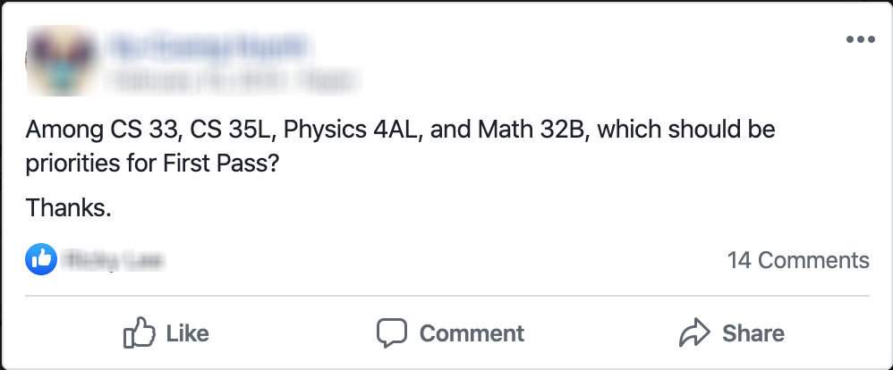
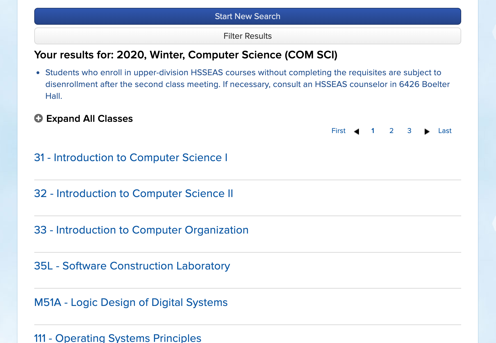
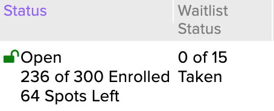
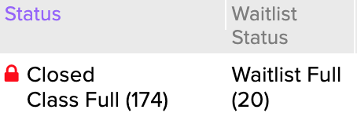
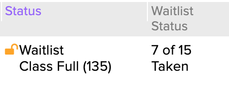
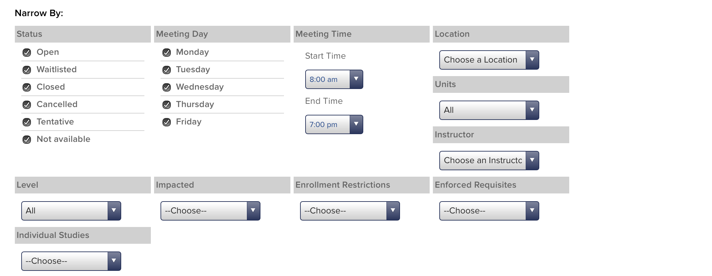
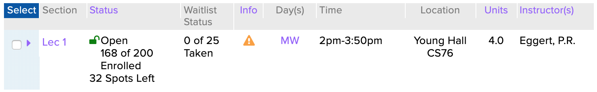

<span class="dropcap">A</span>fter taking the first nine months of 2019 off from school to intern at several companies, I was excited to come back to UCLA and once again learn in a formal academic setting. I had a great fall schedule planned. I'd take Compiler Construction, Introduction to Digital Humanities, [the probability class taught entirely through Texas Hold' Em examples](http://www.stat.ucla.edu/~frederic/100a/F19/100asyllabusF19.html), and a computer science class taught by [Appfolio](https://www.appfolio.com/) engineers, [Scalable Internet Services](https://www.scalableinternetservices.com/).

I grabbed Digital Humanities and Compilers on my first pass, and planned on enrolling in Stats and Scalable Internet Services on my second pass. But by the time my second pass was active, Scalable Internet Services had filled up.

This is hardly a unique problem; UCLA students have been complaining about a [lack of course offerings](https://dailybruin.com/2019/02/26/enrollment-system-creates-crisis-for-students-unable-to-take-necessary-classes/) and the [black market of enrollment](https://dailybruin.com/2020/01/20/facebook-buy-and-sell-groups-cannot-cover-for-class-overenrollment-issues/) for a while. Surprisingly, that's also a lack of data[^1][^2] surrounding how quickly classes fill up – and whether one should use some of their precious first pass units on it or wait until their second pass. The best solutions I know of are to ask friends or post on a major's Facebook page, which while generally useful, tend to be unreliable.



So I did what I'm sure no one else would do: I decided to scrape the UCLA Registrar's online schedule to find out which classes fill up the quickest and ensure that I'd never miss a class again. I've been working on this scraper in my spare time for the past seven months, and I'm ecstatic that it's finally in a state that I feel is ready to share on the internet.

This post is part one of my journey into creating this scraper, in which I reverse engineer the various endpoints on the Registrar's website and choose a language for the web scraper to extract data from these endpoints. In part two, I'll discuss designing the database schema to store all of the data I collect, how I deployed it as a set of lambda functions on AWS that run every hour, and how I monitor any scraping issues using Datadog[^3].

If you're interested in the actual data from this project, don't worry that'll be coming in the next couple of weeks! I'm currently doing a Digital Humanities independent study project with [Professor Ashley Sanders Garcia](https://dh.ucla.edu/person/ashley-sanders-garcia/) that will culminate in a digital exploration of that data I've scraped.

While this post isn't necessarily intended to be a tutorial on writing your own UCLA course scraper – think of it more as a lab report or exercise in [learning in public](https://www.swyx.io/writing/learn-in-public/) – it's my hope that you'll find my journey into web scraping both compelling and informative.

## The data source

In order to start web scraping, there needs to be a website to scrape. In our case, it's the UCLA Registrar's [publicly available list of all classes offered for the most recent quarters](https://sa.ucla.edu/ro/public/soc), which is updated hourly.[^4] The most common way to search for classes is by a "Subject Area", a logical grouping of classes. In most cases, like "Computer Science", the subject area maps directly to courses offered by UCLA's [Computer Science department](https://www.cs.ucla.edu). However, some departments, like the [Department of Asian Languages and Cultures](https://www.alc.ucla.edu), offer many subject areas – one for each language[^5], in the case of ALC. A full [department/subject area mapping](https://www.registrar.ucla.edu/Faculty-Staff/Courses-and-Programs/Department-and-Subject-Area-Codes) is provided by the Registrar.

Selecting a subject area in the "Schedule of Classes" takes you to a results page, which lists all courses offered for a given subject area and selected term. Clicking on a given course expands a dropdown that lists all the sections offered for that course in the given quarter.



Each section has information about the enrollment/waitlist status, enrollment/waitlist counts, day and time, a location, units, and the instructor of that respective section.


Perfect! This table had all the enrollment info I was interested in and more. I'd just need to fetch every subject area's course listings and scrape every table on each page. It was time to start writing the scraper.

## Attempt 1: Python and Beautiful Soup

I had never written a web scraper before this project, but I had heard [Python](https://www.python.org/) and [Beautiful Soup](https://www.crummy.com/software/BeautifulSoup/) were the go-to tools for web scraping projects, so I decided to start there. After referring to the [very helpful slides](https://github.com/uclaacm/learn.py-s19/tree/master/session-8-web-scraping) that [UCLA ACM](http://www.uclaacm.com/) made last spring about Beautiful Soup, I had a very basic scraper.

```python
from bs4 import BeautifulSoup
import requests

response = requests.get(
    "https://sa.ucla.edu/ro/Public/SOC/Results?t=19F&sBy=subject&sName=Computer+Science+%28COM+SCI%29&subj=COM+SCI&crsCatlg=Enter+a+Catalog+Number+or+Class+Title+%28Optional%29&catlg=&cls_no=&btnIsInIndex=btn_inIndex"
)

soup = BeautifulSoup(response.content, "html.parser")

print(soup.prettify())
```

The [URL I used](https://sa.ucla.edu/ro/Public/SOC/Results?t=19F&sBy=subject&sName=Computer+Science+%28COM+SCI%29&subj=COM+SCI&crsCatlg=Enter+a+Catalog+Number+or+Class+Title+%28Optional%29&catlg=&cls_no=&btnIsInIndex=btn_inIndex) specifically links to computer science classes, but each subject area has a similar URL. Note that the actual fetching of the page is done by [Requests](http://python-requests.org/), a popular Python HTTP library.

I was hoping this would give us the HTML markup of every class and its info. Instead, I got something like:

```html
<!-- ... boring header stuff ... -->
<div id="divClassNames">
  <div class="results">
    <div id="resultsTitle">
      <div class="row-fluid class-title" id="COMSCI0001">
        <h3 class="head">
          <a href="javascript:void(0)" id="COMSCI0001-title">
            1 - Freshman Computer Science Seminar
          </a>
        </h3>
      </div>
      <script type="text/javascript">
        Iwe_ClassSearch_SearchResults.AddToCourseData('COMSCI0001', {
          Term: '19F',
          SubjectAreaCode: 'COM SCI',
          CatalogNumber: '0001    ',
          IsRoot: true,
          SessionGroup: '%',
          ClassNumber: '%',
          SequenceNumber: null,
          Path: 'COMSCI0001',
          MultiListedClassFlag: 'n',
          Token: 'MDAwMSAgICBDT01TQ0kwMDAx',
        })
      </script>
      <!-- ... more row entries for other courses ...  -->
    </div>
  </div>
</div>
```

Huh. It seemed like the page was more dynamic than I thought. This is the result of some nifty design on the Registrar's part. When you get the list of courses for a subject area, the page actually doesn't load all the information about each section. Instead there's some JavaScript network trickery going on when you interact with the page. When you click on a header, it triggers the `Iwe_ClassSearch_SearchResults.AddToCourseData` function, which fires off a network request to an endpoint that returns the data, which is then appended to the page.

## Attempt 2: JavaScript and Puppeteer

All this dynamic content made me start to second-guess the Beautiful Soup approach, so I decided to try something different.

The last person I knew who did some scraping of the registrar was [Rishub](http://rishub.com), who used to the data for the now defunct [BruinScan](https://www.facebook.com/bruinscan/), as well as a [Stack article](https://stack.dailybruin.com/2018/11/08/how-long-are-lectures/)[^6]. He was a [Selenium](https://docs.seleniumhq.org/) wizard, and used it to scrape the registrar. So I figured I'd try Selenium.

Shortly into my Selenium research, I realized that [Puppeteer](https://pptr.dev/) solved the same browser automation problem Selenium did. I actually had a small amount of Puppeteer experience from my internship at [Datadog](https://www.datadoghq.com/), where all our frontend acceptance tests used Puppeteer.

And Puppeteer used JavaScript! Perfect, since my JavaScript is better than my Python anyways.

My first approach at a Puppeteer-based scraper looked like:

```javascript
const puppeteer = require('puppeteer')

;(async () => {
  const browser = await puppeteer.launch()
  const page = await browser.newPage()
  await page.goto(
    'https://sa.ucla.edu/ro/Public/SOC/Results?t=19F&sBy=subject&sName=Computer+Science+%28COM+SCI%29&subj=COM+SCI&crsCatlg=Enter+a+Catalog+Number+or+Class+Title+%28Optional%29&catlg=&cls_no=&btnIsInIndex=btn_inIndex'
  )

  await page.click('#expandAll')
  await page.waitFor(5000)

  const data = await page.evaluate(() => {
    const rawEnrollmentStatuses = document.querySelectorAll('.statusColumn[id]')
    return Array.from(rawEnrollmentStatuses).map(rawStatus => {
      const id = rawStatus.getAttribute('id')
      const course = id.match(/COMSCI\d{4}/) // e.g., COMSCI0032
      return { course }
    })
  })

  console.table(data)

  await browser.close()
})()
```

This was getting somewhere!

A couple of selected notes of interest on the above code:

- Every course page on the "Schedule of Classes" website has an "Expand All Classes" button, which triggers the sections dropdown for all the courses on the page. Being able to click this button and then parse the dynamically added content added after the button was clicked was the main reason I needed a headless browser.
- [document.querySelectorAll()](https://developer.mozilla.org/en-US/docs/Web/API/Document/querySelector) does not return an array like I expected, but [NodeList](https://developer.mozilla.org/en-US/docs/Web/API/NodeList), which must be [Array.from()](https://developer.mozilla.org/en-US/docs/Web/JavaScript/Reference/Global_Objects/Array/from)ed in order to map through it.
- I found out pretty quickly that regular expression capturing groups would be the most concise and easiest way to both match and extract data from the scraped input. The regular expression in this code, `COMSCI\d{4}`, matches the id of the container `<div>` for each course. Example id: `COMSCI0032`.
- [ console.log()](https://developer.mozilla.org/en-US/docs/Web/API/Console/log) actually has a limit on how many rows of an array it'll show you, hence why I moved to [console.table()](https://developer.mozilla.org/en-US/docs/Web/API/Console/table).

### There's more to UCLA than just CS Classes

Now that my scraper was fetching data from one page, I figured it was time to try fetching data from all subject area pages. In order to do this, I needed a list of subject areas. There was the page above that I mentioned that listed all departments and subject areas, but what I really needed was the query parameters for each subject area to make a request like:

```
https://sa.ucla.edu/ro/Public/SOC/Results?t=19F&sBy=subject&sName=Computer+Science+%28COM+SCI%29&subj=COM+SCI&crsCatlg=Enter+a+Catalog+Number+or+Class+Title+%28Optional%29&catlg=&cls_no=&btnIsInIndex=btn_inIndex
```

Chrome DevTools has a [very nice feature](https://developers.google.com/web/tools/chrome-devtools/network/reference) where it'll actually decode the URL encoded parameters and display them to you. The above decoded parameters are:

```
t: 19F
sBy: subject
sName: Computer Science (COM SCI)
subj: COM SCI
crsCatlg: Enter a Catalog Number or Class Title (Optional)
catlg:
cls_no:
btnIsInIndex: btn_inIndex
```

Of these 8 parameters, only `sName` and `subj` vary by subject area. Upon further exploration, it seemed that most of these parameters could even just be ignored – the only necessary ones were `t`, `sBy`, and `subj`.

On the main "Schedule of Classes" page, there's a dropdown of all subject areas. They're formatted the same as the `sName` parameter, so I figured if a list existed, it'd be there.


Sure enough, in the HTML, there was:

```html
<script type="text/javascript">
  $(document).ready(function() {
    AdjustGoButton()
    var subjects =
      '[{&quot;label&quot;:&quot;Aerospace Studies (AERO ST)&quot;,&quot;value&quot;:&quot;AERO ST&quot;},{&quot;label&quot;:&quot;African American /* ... */ &quot;Yiddish (YIDDSH)&quot;,&quot;value&quot;:&quot;YIDDSH&quot;}]'
    subjects = subjects.replace(/&quot;/g, '"')
    GlobalFunctions.CreateAutocomplete(
      'select_filter_subject',
      $.parseJSON(subjects.replace(/&amp;/g, '&')),
      'Enter Subject Area (Required)',
      '_Select_Subject'
    )
  })
</script>
```

Extracting that monster string out of the HTML and converting the `&quot;`s to `"`s gave me a JSON representation of all subject areas. I actually just pasted that into a JavaScript object to iterate through, because I figured that subject areas didn't really change[^7] and it'd save the scraper from having to make a network request.

Now that I had our array of `label`s and `value`s which correspond to what the Registrar calls a subject area's "name" and "code", respectively. Perfect. I quickly coded up a function able to construct URLs for each of the subject areas.

```javascript
function getUrlsForSubjects(subjects) {
  return subjects.map(subject => {
    // Spaces are encoded in the url with `+` instead of `%20`
    const formattedCode = encodeURIComponent(subject.value).replace('%20', '+')
    const link = `https://sa.ucla.edu/ro/Public/SOC/Results?t=19F&sBy=subject&subj=${subj}`
    return link
  })
}
```

### Pagination

The next issue to face was that of pagination: most subject areas offer more that 25 courses per quarter, meaning that the course results would be broken up into multiple pages. Weirdly enough, subsequent pages for a given subject area didn't have distinct URLs – instead, the schedule of classes site made a network request and then just dynamically updated the content of the current page.

No matter, though. I'd just have Puppeteer click the "next" button, scrape the new content, and repeat until it ran out of pages. Making this task a little easier was the hidden `pageCount` element on the page, which contains the number of pages that there were.

```javascript
async function scrapeDepartment(page, link) {
  await page.goto(link, { timeout: 0 })
  const pageCount = await page.$eval('#pageCount', count =>
    parseInt(count.getAttribute('value'))
  )
  for (let i = 0; i < pageCount; i++) {
    await scrapePage(page)
    if (i !== pageCount - 1) {
      const nextLink = await page.$('#divPagination .jPag-snext-img')
      nextLink.click()
    }
  }
}
```

### Fetching Sections

Courses are cool, but the data that's really interesting is data for a section. This is where info about the location, the instructor, and enrollment is.

As I mentioned earlier, each course was wrapped in a containing div with the id of that course. Within this div, there's a wrapper for the table of sections displayed, which is neatly wrapped in a `primarySection` class. Within that, each section row was within a div with a `{course id}-children` id. And in each row, each data column had a helpfully named class of the format `xColumn` detailing which piece of data it contained.

It was then just a matter of parsing away!

```javascript
const data = await page.evaluate(() => {
  const courses = document.querySelectorAll('.primarySection')
  return Array.from(courses).map(course => {
    const id = rawSection.getAttribute('id')
    const [course] = id.match(/[A-Z]+\d+[A-Z]*\d*/)
    const container = document.querySelector(`[id$='${course}-children']`)
    const rows = container.querySelectorAll('.data_row')
    return Array.from(rows).map(section => {
      const lectureNumber = section.querySelector('.sectionColumn p').innerText
      // TODO: parse enrollment numbers
      const days = section.querySelector('.dayColumn p').innerText
      const time = section.querySelector('.timeColumn > p').innerText
      const location = section.querySelector('.locationColumn p').innerText
      const instructor = section.querySelector('.instructorColumn p').innerText
      return {
        course,
        lectureNumber,
        days,
        time,
        location,
        instructor,
      }
    })
  })
})
```

Columns such as day, location, time, and instructor were easy to extract: I planned on just storing them as strings so I could just direcly get the [innerText](https://developer.mozilla.org/en-US/docs/Web/API/HTMLElement/innerText) and return it. However, extracting the enrollment and waitlist numbers would be a little trickier as the registrar lists the enrollment numbers in text.







I figured the best way to handle this was to just check the first line of the status column, then attempt to parse the numbers based on the that status. There ended up being more than just the three "Open", "Closed", and "Waitlist" statuses, but I'll go over that in part two. The code that replaced the above `TODO` became:

```javascript
const enrollmentText = section.querySelector('.statusColumn p').innerText
const enrollmentLines = enrollmentText.split('\n')
let status = enrollmentLines[0]

let enrollmentCount = 0
let enrollmentCapacity = 0

switch (status) {
  case 'Open':
    ;[enrollmentCount, enrollmentCapacity] = enrollmentLines[1]
      .match(/\d+/g)
      .map(digits => parseInt(digits))
    break
  case 'Closed':
  case 'Waitlist':
    enrollmentCapacity = parseInt(enrollmentLines[1].match(/\d+/)[0])
    enrollmentCount = enrollmentCapacity
  default:
    console.error('Unrecognized Status!', status)
}

// Waitlist
const waitlistText = section.querySelector('.waitlistColumn p').innerText
let waitlistCapacity = 0
let waitlistCount = 0
if (waitlistText.startsWith('Waitlist Full')) {
  waitlistCapacity = parseInt(waitlistText.match(/\d+/)[0])
  waitlistCount = waitlistCapacity
} else if (status === 'Waitlist') {
  ;[waitlistCount, waitlistCapacity] = waitlistText
    .match(/\d+/g)
    .map(match => parseInt(match))
}
```

I then added `enrollmentCount`, `enrollmentCapacity`, `waitlistCount`, and `waitlistCapacity` to the final object to be returned.

Now it was time to run my scraper! It started off without a hitch: Aerospace Studies, African-American Studies, African Studies, on and on. It seemed like this scraping was going to take a while so I took a shower and came back to find that the script had failed somewhere around Geography after 30 minutes of scraping. I tried again, this time failing in the Is. I tried again, running Puppeteer with [launch({headless: false})](https://pptr.dev/#?product=Puppeteer&version=v2.0.0&show=api-puppeteerlaunchoptions) to see what Chrome was doing. It turned out that the "next" button would sometimes be clicked too quickly and not trigger a page change or load the section info. After some more tries, I decided that the DOM was just too unpredictable to accurately and quickly scrape. I began to see why everyone at Datadog hated running the acceptance tests – they were just too darn flakey.

I started to look at different approaches.

## Attempt 3: Go

If I couldn't scrape the schedule of classes with a headless browser, I'd have to go back to fetching and parsing HTML, à la my original Beautiful Soup approach. Through my foray into Puppeteer, I had learned about the following endpoints that provided content I was interested in:

1. `https://sa.ucla.edu/ro/Public/SOC/Results/GetCourseSummary`, the endpoint that returns information about sections for a particular course.
2. `https://sa.ucla.edu/ro/Public/SOC/Results/CourseTitlesView`, the endpoint that returns subsequent pages for a given subject area.

My emerging algorithm for fetching all subject areas and course was starting to look like:

```
fetch page with all subject areas
parse all subject areas
for subject_area in subject_areas:
	fetch 1st courses page for subject_area
	parse courses from page
	fetch and parse additional course pages if needed (via /CourseTitlesView)
	for course in courses:
		fetch section data for course (via /GetCourseSummary)
		for section in sections:
			parse section
			print section (TODO: save section in csv or database)
```

With almost 200 subject areas and multiple courses offered for each subject area, it became apparent pretty quickly that my emergent algorithm was not going to be very fast. The bottleneck was the network requests – requesting and receiving the pages took about 1-2 seconds for a page on my local connection. Assuming that each subject area offered a single full page of courses – 25 – and each course had only a single section, then I roughly estimated the scraper would take $181 \times 25 \times 1 \times 1.5 = 6787.5 \  \text{seconds}$, or 1.88 hours. Yikes! That wouldn't work if I wanted to scrape the registrar hourly.

It was obvious that I'd need to make requests asynchronously. At first, I thought this wouldn't be a problem in Python – Python has supported async operations for a while. But then I started running into issues.

The popular and previously mentioned HTTP library, [Requests](https://python-requests.org/), doesn't support async/await[^8], so I had to convert my earlier code to use [AIOHTTP](https://docs.aiohttp.org/) which is a bit trickier to use. My early attempts to do this didn't result in much of a speed increase which was probably due to both my inexperience writing asynchronous Python code and the sparse AIOHTTP/async documentation.[^9]

I had recently started writing [Go](https://golang.org), a language I knew had great concurrency support, for my internship at [Keybase](https://keybase.io/) so I figured in the spirit of polyglotism, I'd try mocking out a version of the scraper in Go. [Goroutines](https://gobyexample.com/goroutines) were a refreshing break from the mess of AIOHTTP and it was nice to know that my program could scrape courses in parallel, unburdened by a [global interpreter lock](https://en.wikipedia.org/wiki/Global_interpreter_lock).

What I gave up in Go, however, was the nice HTML parsing that Beautiful Soup provided. The best replacement I found was a library called [goquery](https://github.com/PuerkitoBio/goquery), which bills itself as "A little like that [j-thing](https://jquery.com/), only in Go."

### Scraping subject areas

In JavaScript, the subject areas were represented as a literal array of objects with `label` and `value` properties. In Go, the corresponding data structure for an object would be a [struct](https://gobyexample.com/structs).

Doing the same literal declaration as I did in JavaScript would be a little more unergonomic, so I decided to go ahead and write a function to just fetch the data from the "Schedule of Classes" page, find the relevant line via a regular expression, and unmarshal the JSON representation into a Go array of structs. From there, I'd return it for now (and eventually save it to a database).

```go
type SubjectArea struct {
	ID    string `json:"id"`
	Label string `json:"label"`
	Value string `json:"value"`
}

func ScrapeSubjectAreas() []SubjectArea {
	// Make request
	const url = "https://sa.ucla.edu/ro/public/soc"
	response, err := http.Get(url)
	if err != nil {
		log.Fatal(err)
	}
	defer response.Body.Close()

	// Convert response into parsable formate
	content, err := ioutil.ReadAll(response.Body)
	if err != nil {
		log.Fatal(err)
	}
	// Find the subjects line in response HTML
	prefix := "var subjects = "
	re := regexp.MustCompile(prefix + ".*")
	match := re.Find(content)
	// Convert it into a valid json string
	replacer := strings.NewReplacer(prefix, "", "&quot;", "\"", "'", "", ";", "")
	jsonString := replacer.Replace(string(match))
	// Convert the json string into a Go struct
	var subjectAreas []SubjectArea
	err = json.Unmarshal([]byte(jsonString), &subjectAreas)
	if err != nil {
		log.Fatal(err)
	}

	// TODO: save subjectAreas
	return subjectAreas
}
```

### Scraping courses

Courses, unfortunately, would be a little trickier to scrape than subject areas. I'd first need to fetch and parse the first page, then use the `/CourseTitlesView` to extract the subsequent pages. And, I wanted to make it parallel. I started with parallelism code.

```go
var subjectAreas = ScrapeSubjectAreas()

type Course struct {
	ID              string
	SubjectAreaID   string
	Title           string
	Number          string
	Model           string
}

func ScrapeCourses() {
	var wg sync.WaitGroup
	maxConnections, err := strconv.Atoi(os.Getenv("MAX_CONNECTIONS"))
	if err != nil {
		log.Fatal(err)
	}
	sem := make(chan struct{}, maxConnections)

	for _, subjectArea := range subjectAreas {
		wg.Add(1)
		go func(subjectArea registrar.SubjectArea) {
			sem <- struct{}{}
			defer func() { <-sem }()
			defer wg.Done()
			courses, err := FetchAndParseCourses(subjectArea)
			if err != nil {
				return
			}
			// TODO: save courses
		}(subjectArea)
	}

	wg.Wait()
}
```

The parallelism was accomplished via goroutines. In order to ensure the all subject areas are fetched before the program exits, I used a [WaitGroup](https://golang.org/pkg/sync/#WaitGroup). I also ran into issues with the number of maximum concurrent connections that could be made at a time as a result of a limited amount of file descriptors on my computer; I fixed this with a [simple semaphore](http://www.golangpatterns.info/concurrency/semaphores), which in Go is implemented as a [channel](https://tour.golang.org/concurrency/2).

If you've been paying close attention the the code, you may have noticed some references in the `SubjectArea` and `Course` structs to ids. Those will be relevant once I get to adding a database! For now, just know that it'll be important to know which course belongs to which subject area and the ids help us track that.

#### Fetching the first page

Now it was time to write the code to scrape the first page of a course. The general format of this web scraping was going to be fetch, parse, and return (and then save). Fetching seemed like the logical place to start.

`FetchFirstPage` does exactly what the name implies: it makes a request for a subject area search result page, and returns a pointer to a goquery [Document](https://godoc.org/github.com/PuerkitoBio/goquery#Document), which will be used later to parse the page. The function is longer than the simple GET in `FetchSubjectAreas` because of the need to add parameters to the URL. Other than that, though, it's a fairly standard Go HTTP request.

```go
func FetchFirstPage(subjectArea registrar.SubjectArea, term string) (*goquery.Document, error) {
	const url = "https://sa.ucla.edu/ro/Public/SOC/Results"

	req, err := http.NewRequest("GET", url, nil)
	if err != nil {
		log.Error(err)
		return nil, err
	}

	// Encode query parameters
	query := req.URL.Query()
	query.Add("t", term)
	query.Add("sBy", "subject")
	query.Add("subj", subjectArea.Value)
	req.URL.RawQuery = query.Encode()

	// Make request
	response, err := client.Do(req)
	if err != nil {
		log.Error(err)
		return nil, err
	}
	defer response.Body.Close()

	doc, err := goquery.NewDocumentFromReader(response.Body)
	if err != nil {
		log.Error(err)
		return nil, err
	}

	return doc, nil
}
```

#### Parsing the first page

When scraping the subject areas, I was able to get by with a regex due to the simple nature of the data that needed to extracted – it was a single line with a known prefix. With courses, though, I needed to parse through HTML tags, requiring goquery.

I ended up making heavy use of goquery's [Find()](https://godoc.org/github.com/PuerkitoBio/goquery#Selection.Find) function, as well as the old tried and true regular expressions in order to extract relevant parts of the HTML.

```go
func ParseCourses(subjectAreaID string, doc *goquery.Document) []Course {
	results := doc.Find("#resultsTitle")
	titles := results.Find(".class-title")
	links := results.Find("h3 > a")
	scripts := results.Find("script")

	headerRegex := regexp.MustCompile(`(\S*) - (.*)`)
	modelRegex := regexp.MustCompile(`\{(.*?)\}`)

	for i := range links.Nodes {
		link := links.Eq(i).Text()
		script := scripts.Eq(i).Text()

		header := headerRegex.FindStringSubmatch(link)
		model := modelRegex.FindString(script)

		number := header[1]
		title := header[2]

		course := Course{
			Title:          title,
			Number:         number,
			Model:          modelStr,
		}
		courses = append(courses, course)
	}

	return courses
}
```

You may notice that in addition to a course's title and number, I also store its model – the little JSON blob used by `Iwe_ClassSearch_SearchResults.AddToCourseData` to make a network request to fetch section info. This is because I later realized I'd need it to fetch sections. Expect details about that in a bit.

#### Tying it together

The `ScrapeCourses` function calls a function called `FetchAndParseCourses`, not `FetchCourses` or `ParseCourses` directly. `FetchAndParseCourses` is essentially a wrapper around these two functions, with some additional error and pagination handling.

```go
func FetchAndParseCourses(subjectArea registrar.SubjectArea) (courses []Course, err error) {

	doc, err := FetchFirstPage(subjectArea, term)
	if err != nil {
		return courses, err
	}

	// Check that there are results
	noSearchResults := doc.Find("#spanNoSearchResults")
	if len(noSearchResults.Nodes) > 0 {
		return courses, errors.New("No search results found")
	}

	// Extract courses into array
	courses := ParseCourses(subjectArea.ID, doc)

	pageCountStr, exists := doc.Find("#pageCount").Attr("value")
	if !exists {
		return courses, errors.New("Page count couldn't be found")
	}
	pageCount, err := strconv.Atoi(pageCountStr)
	if err != nil {
		return courses, err
	}

	if pageCount > 1 {
		// TODO: scrape next pages
	}

	return courses, nil
}
```

#### Handling pagination with /CourseTitlesView

Now that the single page course scraping was working, it was time to move on to scraping additional pages with `/CoursesTitlesView`[^10]

The response of the endpoint looks something like this:

```html
<div class="results">
  <div id="resultsTitle">
    <div class="row-fluid class-title" id="COMSCI0192">
      <h3 class="head">
        <a href="javascript:void(0)" id="COMSCI0192-title"
          >192 - Methods and Application of Collaborative Learning Theory in
          Life Sciences</a
        >
      </h3>
    </div>
    <script type="text/javascript">
      Iwe_ClassSearch_SearchResults.AddToCourseData('COMSCI0192', {
        Term: '20W',
        SubjectAreaCode: 'COM SCI',
        CatalogNumber: '0192    ',
        IsRoot: true,
        SessionGroup: '%',
        ClassNumber: '%',
        SequenceNumber: null,
        Path: 'COMSCI0192',
        MultiListedClassFlag: 'n',
        Token: 'MDE5MiAgICBDT01TQ0kwMTky',
      })
    </script>
    <div class="row-fluid class-title" id="COMSCI0192A">
      <h3 class="head">
        <a href="javascript:void(0)" id="COMSCI0192A-title"
          >192A - Introduction to Collaborative Learning Theory and Practice</a
        >
      </h3>
    </div>
    <script type="text/javascript">
      Iwe_ClassSearch_SearchResults.AddToCourseData('COMSCI0192A', {
        Term: '20W',
        SubjectAreaCode: 'COM SCI',
        CatalogNumber: '0192A   ',
        IsRoot: true,
        SessionGroup: '%',
        ClassNumber: '%',
        SequenceNumber: null,
        Path: 'COMSCI0192A',
        MultiListedClassFlag: 'n',
        Token: 'MDE5MkEgICBDT01TQ0kwMTkyQQ==',
      })
    </script>
    <!-- ... -->
  </div>
</div>
```

There's our data! But instead of being nicely formatted into JSON, it's in raw HTML, which looked to be exactly what was then inserted into the DOM and displayed on the page. Since these responses were just HTML fragments, the scraper could parse them. The tricky part would be constructing the URLs.

Using Chrome's URL decoding from earlier, I found that the parameters were:

```
search_by: subject
model: {"subj_area_cd":"COM SCI","search_by":"Subject","term_cd":"20W","SubjectAreaName":"Computer Science (COM SCI)","CrsCatlgName":"Enter a Catalog Number or Class Title (Optional)","ActiveEnrollmentFlag":"n","HasData":"True"}
pageNumber: 2
filterFlags: {"enrollment_status":"O,W,C,X,T,S","advanced":"y","meet_days":"M,T,W,R,F","start_time":"8:00 am","end_time":"7:00 pm","meet_locations":null,"meet_units":null,"instructor":null,"class_career":null,"impacted":null,"enrollment_restrictions":null,"enforced_requisites":null,"individual_studies":null,"summer_session":null}
_: 1579218266770
```

The `filterFlags` object looked to be similar among all requests and a way for searchers to filter classes by time, units, instructor, etc. It's modifiable by the filter search portion of the course listing page.



The `_` parameter didn't seem to do anything; I could omit it and the request would be the same. `search_by: subject` didn't seem to change in my experimenting but was required, so I left it as is. `pageNumber` was pretty self-explanatory, and would need to change depending on the page requested.

`model` is where things got interesting. All of the keys in the JSON object correspond to keys in the search results page. Interestingly, not all keys of the object seem to be required – the same keys that can be omitted in requests to `https://sa.ucla.edu/ro/Public/SOC/Results` can be omitted in the model. I figured the model had to be generated somewhere on the frontend, so I grepped for it in the results HTML page. And sure enough:

```html
<script type="text/javascript">
  SearchPanel.SearchData = JSON.stringify({
    subj_area_cd: 'COM SCI',
    search_by: 'Subject',
    term_cd: '20W',
    SubjectAreaName: 'Computer Science (COM SCI)',
    CrsCatlgName: 'Enter a Catalog Number or Class Title (Optional)',
    ActiveEnrollmentFlag: 'n',
    HasData: 'True',
  })
  SearchPanel.SearchBy = 'subject'
  currentActiveTerm = '20W'
  if ($('#btn_enrollmentAction_Enable').length != 0) {
    $('#btn_enrollmentAction_Enable').attr('disabled', 'disabled')
  }
</script>
```

I could just extract `model` from the first page, and then use it to fetch all subsequent pages!

Armed with my knowledge of `/CoursesTitlesView`, I attempted to recreate a request from Chrome DevTools via [cURL](https://curl.haxx.se/).

```bash
curl 'https://sa.ucla.edu/ro/Public/SOC/Results/CourseTitlesView?search_by=subject&model=%7B%22subj_area_cd%22%3A%22COM+SCI%22%2C%22search_by%22%3A%22Subject%22%2C%22term_cd%22%3A%2220W%22%2C%22SubjectAreaName%22%3A%22Computer+Science+(COM+SCI)%22%2C%22CrsCatlgName%22%3A%22Enter+a+Catalog+Number+or+Class+Title+(Optional)%22%2C%22ActiveEnrollmentFlag%22%3A%22n%22%2C%22HasData%22%3A%22True%22%7D&pageNumber=2&filterFlags=%7B%22enrollment_status%22%3A%22O%2CW%2CC%2CX%2CT%2CS%22%2C%22advanced%22%3A%22y%22%2C%22meet_days%22%3A%22M%2CT%2CW%2CR%2CF%22%2C%22start_time%22%3A%228%3A00+am%22%2C%22end_time%22%3A%227%3A00+pm%22%2C%22meet_locations%22%3Anull%2C%22meet_units%22%3Anull%2C%22instructor%22%3Anull%2C%22class_career%22%3Anull%2C%22impacted%22%3Anull%2C%22enrollment_restrictions%22%3Anull%2C%22enforced_requisites%22%3Anull%2C%22individual_studies%22%3Anull%2C%22summer_session%22%3Anull%7D'
```

And I got back a 404 error. Interesting. I thought perhaps there was some cookie data that was required to make the request, so I tried again via my browser. Same thing.

Then I tried Chrome's [Copy as cURL feature](https://developers.google.com/web/updates/2015/05/replay-a-network-request-in-curl), to see if a header of some kind was required. And it worked! From there, I began removing headers to see what the required header was.

The answer? `X-Requested-With: XMLHttpRequest`. I actually wasn't familiar with `X-Requested-With` before I encountered it here. [Apparently](https://stackoverflow.com/questions/17478731/whats-the-point-of-the-x-requested-with-header), it's a header added by a lot of JavaScript libraries to denote an AJAX request. Why the registrar blocks non-AJAX requests, I don't know. But at least my requests to the endpoint worked.

The fetching code in Go turned out to be pretty similar to `FetchFirstPage`.

```go
const FilterFlags = `{"enrollment_status":"O,W,C,X,T,S","advanced":"y","meet_days":"M,T,W,R,F,S,U","start_time":"2:00 am","end_time":"11:00 pm","meet_locations":null,"meet_units":null,"instructor":null,"class_career":null,"impacted":null,"enrollment_restrictions":null,"enforced_requisites":null,"individual_studies":null,"summer_session":null}`

func FetchAdditionalPage(model string, pageNumber int) *goquery.Document {
	const url = "https://sa.ucla.edu/ro/Public/SOC/Results/CourseTitlesView"
	req, err := http.NewRequest("GET", url, nil)
	if err != nil {
		log.Error(err)
	}

	// This header is required, otherwise we get a 404
	req.Header.Add("X-Requested-With", "XMLHttpRequest")
	query := req.URL.Query()
	query.Add("model", model)
	query.Add("search_by", "subject")
	query.Add("filterFlags", FilterFlags)
	query.Add("pageNumber", strconv.Itoa(pageNumber))
	req.URL.RawQuery = query.Encode()

	pageRes, err := client.Do(req)
	if err != nil {
		log.Error(err)
	}
	defer pageRes.Body.Close()

	pageDoc, err := goquery.NewDocumentFromReader(pageRes.Body)
	if err != nil {
		log.Error(err)
	}

	return pageDoc
}
```

The `TODO` code in `FetchAndParseCourses` became:

```go
if pageCount > 1 {
	coursesMux := &sync.Mutex{}
	var wg sync.WaitGroup

	body, err := goquery.OuterHtml(doc.Selection)
	if err != nil {
		log.Error(err)
	}

	// Extract the model to fetch additional pages
	modelRegex := regexp.MustCompile(`(SearchPanel\.SearchData = JSON\.stringify\()({.*})`)
	matches := modelRegex.FindStringSubmatch(body)
	model := matches[2]


	for page := 2; page <= pageCount; page++ {
		wg.Add(1)
		go func(page int) {
			defer wg.Done()

			pageDoc := FetchAdditionalPage(model, page)
			if pageDoc == nil {
				return
			}

			newCourses, err := FetchAndParseCourses(pageDoc)
			if err != nil {
				log.Error(err)
			}
			coursesMux.Lock()
			courses = courses.append(courses, newCourses...)
			coursesMux.Unlock()
		}(page)
	}
}

```

Since the final order of courses doesn't really matter, I figured I could also parallelize the fetching of additional pages after the first page. The only real difference from the top level `ScrapeCourses` would be the addition of a [mutex](https://golang.org/pkg/sync/#Mutex) to ensure only one goroutine could modify the slice at a time.

### Scraping sections

Now it came down to the big function: scraping sections. To do this, I'd be creating URLs for the other endpoint, `/GetCourseSummary`.

Similar to the last endpoint, I started by examining the output response.

```html
<div id="COMSCI0111-container" class="primarySection">
  <div id="COMSCI0111-children">
    <div
      class="row-fluid data_row primary-row class-info class-not-checked"
      id="187336200_COMSCI0111"
    >
      <div class="enrollColumn" id="187336200_COMSCI0111-enroll">
        <input id="187336200_COMSCI0111-checkbox" type="checkbox" />
        <div class="toggle" id="187336200_COMSCI0111-expando">
          <a href="javascript:void(0)"><span class="icon-caret-right"/></a>
        </div>
      </div>
      <div class="sectionColumn">
        <div
          class="cls-section click_info"
          id="187336200_COMSCI0111-section"
        ></div>
      </div>
      <div class="statusColumn" id="187336200_COMSCI0111-status_data">
        <p>
          <i
            class="icon-unlock"
            style="color:green; display:block; float:left; height:3em;"
          ></i
          >Open<br />126 of 138 Enrolled<br />12 Spots Left
        </p>
      </div>
      <div class="waitlistColumn" id="187336200_COMSCI0111-waitlist_data">
        <p>0 of 15 Taken</p>
      </div>
      <div
        class="infoColumn hide-small click_info"
        id="187336200_COMSCI0111-info_data"
      >
        <a href="javascript:void(0)"> </a>
        <div
          tabindex="0"
          class="icon-warning-sign icon-position"
          data-poload="term_cd=19F&amp;subj_area_cd=COM+SCI&amp;crs_catlg_no=0111    &amp;class_id=187336200&amp;class_no= 001  "
        ></div>
      </div>
      <div class="dayColumn hide-small beforeCollapseHide">
        <div id="187336200_COMSCI0111-days_data">
          <p>
            <a
              class="popover-bottom"
              data-content="Tuesday, Thursday"
              href="javascript:void(0)"
              >TR</a
            >
          </p>
        </div>
      </div>
      <div class="timeColumn" id="187336200_COMSCI0111-time_data">
        <p>4pm<wbr />-5:50pm</p>
      </div>
      <div
        class="locationColumn hide-small"
        id="187336200_COMSCI0111-location_data"
      >
        <p>
          Haines Hall A2
        </p>
      </div>
      <div class="unitsColumn" id="187336200_COMSCI0111-units_data">
        <p>5.0</p>
      </div>
      <div
        class="instructorColumn hide-small"
        id="187336200_COMSCI0111-instructor_data"
      >
        <p>Eggert, P.R.</p>
      </div>

      <script type="text/javascript">
        Iwe_ClassSearch_SearchResults.AddToCourseData('187336200_COMSCI0111', {
          Term: '19F',
          SubjectAreaCode: 'COM SCI',
          CatalogNumber: '0111    ',
          IsRoot: false,
          SessionGroup: null,
          ClassNumber: ' 001  ',
          SequenceNumber: '1',
          Path: '187336200_COMSCI0111',
          MultiListedClassFlag: 'n',
          Token: 'MDExMSAgICAxODczMzYyMDBfQ09NU0NJMDExMQ==',
        })
      </script>
    </div>
  </div>
</div>
```

It was a lot of HTML, so I don't blame you if you skimmed over it! The main thing to note is that this is the HTML that creates a table of sections! In fact, the rendered HTML looks very familiar:



I had already scraped this table with Puppeteer, so rewriting it in Go would be pretty straightforward.

Using Chrome's URL decoding, I found that the parameters were:

```
model: {"Term":"19F","SubjectAreaCode":"COM SCI","CatalogNumber":"0111    ","IsRoot":true,"SessionGroup":"%","ClassNumber":"%","SequenceNumber":null,"Path":"COMSCI0111","MultiListedClassFlag":"n","Token":"MDExMSAgICBDT01TQ0kwMTEx"}
FilterFlags: {"enrollment_status":"O,W,C,X,T,S","advanced":"y","meet_days":"M,T,W,R,F","start_time":"8:00 am","end_time":"8:00 pm","meet_locations":null,"meet_units":null,"instructor":null,"class_career":null,"impacted":null,"enrollment_restrictions":null,"enforced_requisites":null,"individual_studies":null,"summer_session":null}
_: 1571869764769
```

Like before, `_` could be omitted and `FilterFlags` was constant. Also like before, `model`, was embedded into the HTML. In fact, I had even seen this script tag earlier, when I first noticed the dynamic nature of the courses page.

```html
<div class="row-fluid class-title" id="COMSCI0001">
  <h3 class="head">
    <a href="javascript:void(0)" id="COMSCI0001-title">
      1 - Freshman Computer Science Seminar
    </a>
  </h3>
</div>
<script type="text/javascript">
  Iwe_ClassSearch_SearchResults.AddToCourseData('COMSCI0001', {
    Term: '19F',
    SubjectAreaCode: 'COM SCI',
    CatalogNumber: '0001    ',
    IsRoot: true,
    SessionGroup: '%',
    ClassNumber: '%',
    SequenceNumber: null,
    Path: 'COMSCI0001',
    MultiListedClassFlag: 'n',
    Token: 'MDAwMSAgICBDT01TQ0kwMDAx',
  })
</script>
```

However, unlike `/CourseTitlesView` where I could extract this model out into a local variable and use it immediately, I needed to store each course's model somewhere when running `ScrapeCourses` then extract it in order to scrape the sections for that given course. The logical place to do this would be in the database, so I figured it was time to finally get around to storing the data I was scraping.

## Conclusion

Sorry to leave you on a bit of a cliffhanger with the database schema, but I figured it was best to leave designing the database to its own post!

I found this experiment into choosing a programming language to be a great way to improve my knowledge about each of the languages I explored. Python, when coupled with Requests and Beautiful Soup, is by far the easiest language to start scraping webpages with and is where I'd reccomend anyone interested in scraping start. Using a headless browser and library such as Selenium or Puppeteer sounds like a good alternative for dynamic content scraping, but is often too slow or unreliable to consistently use. In practice, any dynamic content you need to scrape is likely better received by just manually invoking the endpoint than attempting to render it on the page. Although the task of teasing apart URL request parameters can seem daunting, programs like your browser's developer tools and cURL make the task much more managable. Web scraping in Go is definitely a more verbose option, but promises greater control and performance.

Now that I have seven months of hindsight on this project, I think that choosing Go was the correct choice for me at the time.[^11] As an added bonus, choosing Go for this project gave me experience with language features and libraries I wouldn't have otherwise had reason to use.

As you start your next project, I'd encourage you to take a similar approach to the one I did here. You might find that a couple days of prototyping and refining your requirements lead to a much clearer vision of what to build and how to build it.

<p className="text-gray-600 text-sm italic">Thanks to Mackenzie Possee, Timothy Gu, and Ashley Sanders-Garcia for reviewing drafts of this post.</p>

[^1]: Funnily enough, as I was working on this project, the Daily Bruin's Data Blog did a [similar scraping project](https://stack.dailybruin.com/2020/02/05/class-fill-ups/). However, I think my data is better for a few reasons: it differentiates courses by time and professor, tracks graduate level classes, and has been scraping for a longer period of time.
[^2]: I asked the Registrar's Office if they keep any enrollment trend statistics. They snapshot enrollment changes at the end of weeks 3 and 8 of the quarter, but don't do any tracking of how many/which classes fill up during first vs. second enrollment passes.
[^3]: Full disclosure, I previously interned at Datadog.
[^4]: There's also a private list of classes available at [my.ucla.edu](http://my.ucla.edu/) that's updated more frequently, but I figured that an hour resolution on enrollment data was a good place to start and would make my job easier.
[^5]: The Department of Asian Languages and Culturses [offers](https://www.alc.ucla.edu/undergraduate/languages-offered/) courses in Chinese, Japanese, Korean, Filipino, Hindi-Urdu, Indonesian, Thai and Vietnamese, if you were curious.
[^6]: The Stack article mentioned previously, "How Quickly Do Classes Fill Up?", also used Selenium to scrape their data. One of the authors, Andrew, later told me it took them about 30 minutes to completely scrape all of the courses from start to finish.
[^7]: This later turned out to be a false assumption, but we'll get there in part two.
[^8]: Although this is apparently changing in Requests 3, which I haven't tried at all and is still experimental as of writing this.
[^9]: My only experience writing async Python code before this project when I had to [develop a proxy herd for my programming languages class](http://web.cs.ucla.edu/classes/winter18/cs131/hw/pr.html). Funnily enough, in the [project report](/cs131-async-python-report.pdf), I wrote: "I see the async module in Python as a very good step forward, but think that as of now, the ecosystem needs a little longer to grow and stabilize before writing code with it can become enjoyable." Although the statement is two years old now, I think it still holds true.
[^10]: You may be wondering why I didn't fetch the first page with `CoursesTitleView`. The main reason is that the endpoint doesn't provide a page count, which meant I wouldn't know how many additional pages to request.
[^11]: Once I decided to deploy my scraper as Lambda functions, I think much of the appeal of Go's concurrency features becomes moot as multiple functions can run simultaneously, removing the need for concurrency from the language. I'll talk about this more in part two.
