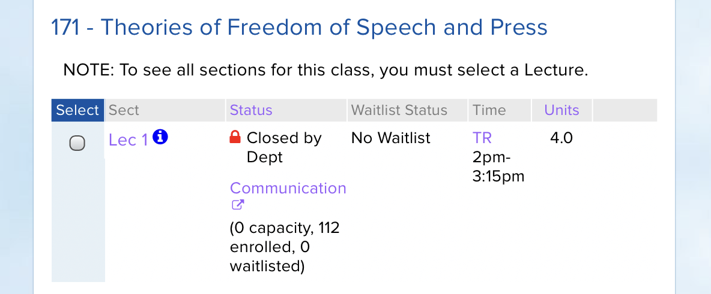
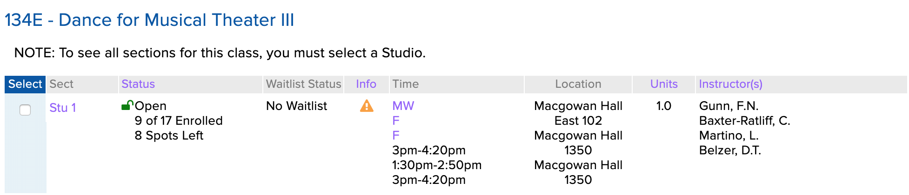
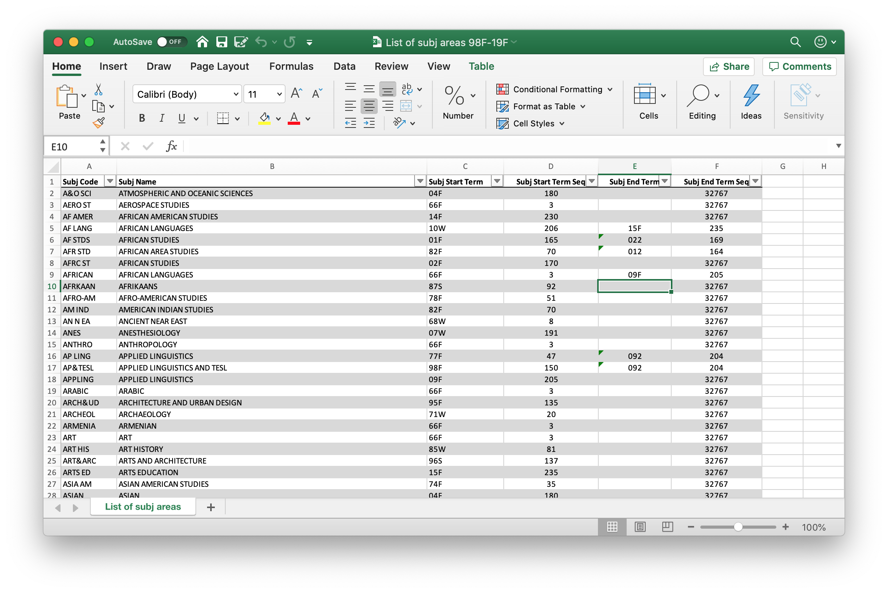
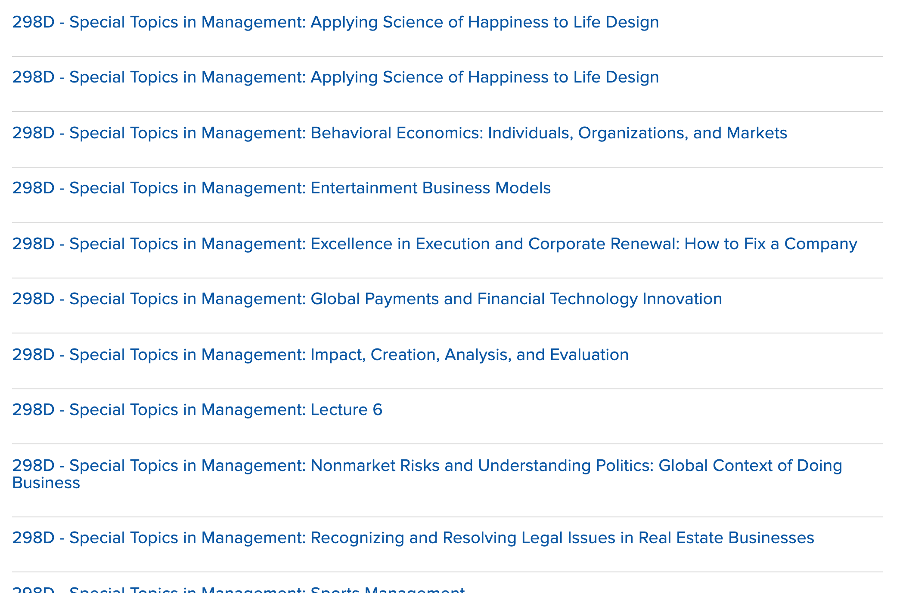

In [part one](/posts/scraping-enrollment-data-from-the-ucla-registrar-part-one) of this post, I discussed my initial exploration into scraping the various pages and APIs of the UCLA Registrar's online "[Schedule of Classes](https://sa.ucla.edu/ro/public/soc)" in order to extract enrollment data on classes at UCLA. I originally attempted to write the scraper in Python, using Beautiful Soup. After realizing

## Storing the data and designing the schema

Now was the time to put this data into a database. I had heard a lot of great things about Postgres, so I decided to try it.

Although I was initially only interested in the data of individual sections, I realized from the above architecture that it’d make sense to have three tables: one for subject areas, one for courses, and one for sections. This way, I could use the information from one table in scraping the data for another, reducing the number of network requests to the site I’d have to make.

My initial stab at writing the schema looked like this:

```sql
CREATE TABLE subject_areas (
  id SERIAL PRIMARY KEY,
  label TEXT,
  value TEXT,
  created_at TIMESTAMPTZ NOT NULL DEFAULT NOW(),
  updated_at TIMESTAMPTZ NOT NULL DEFAULT NOW()
);

CREATE TABLE courses (
  id SERIAL PRIMARY KEY,
  subject_area_id INTEGER REFERENCES subject_areas(id),
  title TEXT,
  number TEXT,
  model TEXT UNIQUE,
  created_at TIMESTAMPTZ NOT NULL DEFAULT NOW(),
  updated_at TIMESTAMPTZ NOT NULL DEFAULT NOW()
);

CREATE TABLE sections (
  id SERIAL PRIMARY KEY,
  -- section_id a unique id assigned by the registrar
  section_id TEXT UNIQUE,
  course_id INTEGER REFERENCES courses(id),
  days TEXT,
  time TEXT,
  location TEXT,
  units TEXT,
  instructor TEXT,
  enrollment_status TEXT,
  enrollment_count INT,
  enrollment_capacity INT,
  waitlist_status TEXT,
  waitlist_count INT,
  waitlist_capacity INT,
  created_at TIMESTAMPTZ NOT NULL DEFAULT NOW()
);
```

An early issue I ran into was the size of the `sections` table: because I was be scraping sections every hour, I had millions of rows in the table after a couple weeks. On the advice of [Alex](https://alexgessner.com/), a coworker at Keybase and SQL wizard, I ended up splitting the `sections` table into two tables: one of section information (titled `sections`) and one of just enrollment data (titled `enrollment_data`). `sections` would contain information about a section’s time, location, instructor, etc. – things that don’t change frequently – while `enrollment_data` would track the ever changing enrollment data. The final schema ended up looking like this.

```sql
CREATE TABLE subject_areas (
  id SERIAL PRIMARY KEY,
  label TEXT UNIQUE,
  value TEXT,
  created_at TIMESTAMPTZ NOT NULL DEFAULT NOW(),
  updated_at TIMESTAMPTZ NOT NULL DEFAULT NOW()
);

CREATE TABLE courses (
  id SERIAL PRIMARY KEY,
  subject_area_id INTEGER REFERENCES subject_areas(id),
  title TEXT,
  number TEXT,
  model TEXT UNIQUE,
  created_at TIMESTAMPTZ NOT NULL DEFAULT NOW(),
  updated_at TIMESTAMPTZ NOT NULL DEFAULT NOW()
);

CREATE TABLE sections (
  id SERIAL PRIMARY KEY,
  -- section_id is unique per term
  section_id TEXT UNIQUE,
  course_id INTEGER REFERENCES courses(id),
  days TEXT,
  time TEXT,
  location TEXT,
  units TEXT,
  instructor TEXT,
  created_at TIMESTAMPTZ NOT NULL DEFAULT NOW(),
  updated_at TIMESTAMPTZ NOT NULL DEFAULT NOW()
);

CREATE TABLE enrollment_data (
  id SERIAL PRIMARY KEY,
  section_id TEXT REFERENCES sections(section_id),
  enrollment_status TEXT,
  enrollment_count INT,
  enrollment_capacity INT,
  waitlist_status TEXT,
  waitlist_count INT,
  waitlist_capacity INT,
  created_at TIMESTAMPTZ NOT NULL DEFAULT NOW()
);
```

Actually using Postgres with Go turned out to be very simple; you simple use the [pq driver](https://github.com/lib/pq) Go’s builtin [sql package](https://golang.org/pkg/database/sql/). Jon Calhoun has a [great tutorial series](https://www.calhoun.io/using-postgresql-with-go/) on how to get it set up.

Most of my database logic is encapsulated in a couple of functions. The `ConnectToDatabase` function is shared across the various scraping functions.

```go
func ConnectToDatabase() (*sql.DB, error) {
	host := os.Getenv("DB_HOST")
	port := 5432
	user := os.Getenv("DB_USER")
	password := os.Getenv("DB_PASS")
	dbname := os.Getenv("DB_NAME")

	var psqlInfo string

	if password != "" {
		psqlInfo = fmt.Sprintf("host=%s port=%d user=%s password=%s dbname=%s sslmode=disable",
			host, port, user, password, dbname)
	} else {
		psqlInfo = fmt.Sprintf("host=%s port=%d user=%s dbname=%s sslmode=disable",
			host, port, user, dbname)
	}
	db, err := sql.Open("postgres", psqlInfo)
	if err != nil {
		return nil, err
	}

	err = db.Ping()
	if err != nil {
		return nil, err
	}

	return db, nil
}

```

### Saving subject areas and courses

Armed with a way to persistently save data, I went back to `ScrapeSubjectAreas` and `ScrapeCourses` to save their data.

The result was two new functions, `SaveSubjectAreas` and `SaveCourses` which are called where the previous `TODO` blocks in the above code was.

```go
func SaveSubjectAreas(db *sql.DB, subjectAreas []SubjectArea) {
	insert := `
	INSERT INTO subject_areas (name, code)
	VALUES ($1, $2)
	ON CONFLICT (code)
	DO UPDATE
	SET name = EXCLUDED.name, updated_at = NOW()`

	for _, subjectArea := range subjectAreas {
		_, err := db.Exec(insert, subjectArea.Label, subjectArea.Value)
		if err != nil {
			log.Error(err)
		}
	}
}
```

```go
func SaveCourses(db *sql.DB, courses []Courses) {
	insertCourse := `
	INSERT INTO courses (subject_area_id, title, number)
	VALUES ($1, $2, $3)
	ON CONFLICT (subject_area_id, title, number)
	DO UPDATE
	SET updated_at = NOW()
	RETURNING id
	`

	for _, course := range courses {
	var id int
	err := db.QueryRow(insertCourse, course.SubjectAreaID, course.Title, course.Number).Scan(&id)
	if err != nil {
		log.Error(err)
	}

	_, err = db.Exec(insertTerm, id, term)
	if err != nil {
		log.Error(err)
	}
}
}
```

### Retrieving subject areas

I could now also go back and replace the `ScrapeCourses` line

```go
var subjectAreas = ScrapeSubjectAreas()
```

with a `SELECT` of the subject areas from the database.

```go
func RetrieveSubjectAreas(db *sql.DB) (subjectAreas []SubjectArea, err error) {

	rows, err := db.Query("SELECT id, name, code FROM subject_areas")
	if err != nil {
		log.Error(err)
		return subjectAreas, err
	}
	defer rows.Close()

	for rows.Next() {
		var id string
		var name string
		var code string
		err = rows.Scan(&id, &name, &code)
		if err != nil {
			log.Error(err)
		}
		subjectAreas = append(subjectAreas, SubjectArea{
			ID:    id,
			Label: name,
			Value: code,
		})
	}
	err = rows.Err()
	if err != nil {
		log.Error(err)
		return subjectAreas, err
	}

	return subjectAreas, nil
}

```

Note that we read out the unique ID that Postgres creates for each subject area, which we can then use to relate courses and subject areas!

## Scraping sections, part 2

### Retrieving courses

Now that courses were being saved by `ScrapeCourses`, we could retrieve them in `ScrapeSections`, similar to `RetrieveSubjectAreas`. Most of the code ended up being to extract all of the courses and convert them into a Go slice. The final chunk of code in the function establishes the same parallel scraping that was in `ScrapeCourses`.

```go
func ScrapeSections() {
	// SELECT courses from DB
	rows, err := db.Query(`
		SELECT courses.id, courses.model FROM courses
	`)
	if err != nil {
		log.Fatal(err)
	}
	defer rows.Close()

	// Convert courses into array of Go structs
	courses := make([]Course, 0)
	for rows.Next() {
		var ID string
		var model string
		err = rows.Scan(&ID, &model)
		if err != nil {
			log.Error(err)
		}
		course := Course{
			ID: ID,
			Model: model,
		}
		courses = append(courses, course)
	}

	// Fetch sections
	for _, course := range courses {
		wg.Add(1)
		go func(course Course) {
			sem <- struct{}{}
			defer func() { <-sem }()
			defer wg.Done()
			err := FetchAndSaveSections(course, db)
			if err != nil {
				log.Error(err)
			}
		}(course)
	}

	wg.Wait()
}
```

Then it was time to write `FetchAndSaveSections`.

```go
func FetchAndSaveSections(course Course, db *sql.DB) error {
	{
		const queryURL = "https://sa.ucla.edu/ro/Public/SOC/Results/GetCourseSummary"
		req, err := http.NewRequest("GET", queryURL, nil)
		if err != nil {
			return err
		}
		params := req.URL.Query()
		params.Add("model", course.Model)
		params.Add("FilterFlags", FilterFlags)
		req.URL.RawQuery = params.Encode()
		response, err := client.Do(req)
		if err != nil {
			return err
		}
		defer response.Body.Close()

		doc, err := goquery.NewDocumentFromReader(response.Body)
		if err != nil {
			return err
		}

		table := doc.Find("div[id$=-children]")
		rows := table.ChildrenFiltered("div")

		for i := range rows.Nodes {
			row := rows.Eq(i)

			rowID, exists := row.Attr("id")
			if !exists {
				return errors.New("could not find row id")
			}
			idRegex := regexp.MustCompile(`([0-9]+)_`)
			matches := idRegex.FindStringSubmatch(rowID)
			sectionID := matches[1]

			enrollmentData := strings.TrimSpace(row.Find("div[id$=-status_data]").Text())
			waitlistData := strings.TrimSpace(row.Find("div[id$=-waitlist_data]").Text())
			enrollmentStatus, enrollmentCount, enrollmentCapacity := ParseEnrollmentData(sectionID, enrollmentData)
			waitlistStatus, waitlistCount, waitlistCapacity := ParseWaitlistData(sectionID, waitlistData)

			days := strings.TrimSpace(row.Find("div[id$=-days_data]").First().Text())
			time := strings.TrimSpace(row.Find("div[id$=-time_data] > p").Text())
			location := strings.TrimSpace(row.Find("div[id$=-location_data]").Text())
			units := strings.TrimSpace(row.Find("div[id$=-units_data]").Text())
			instructor := strings.TrimSpace(row.Find("div[id$=-instructor_data]").Text())

			section := registrar.Section{
				SectionID:          sectionID,
				Term:               term,
				CourseID:           course.ID,
				EnrollmentStatus:   enrollmentStatus,
				EnrollmentCount:    enrollmentCount,
				EnrollmentCapacity: enrollmentCapacity,
				WaitlistStatus:     waitlistStatus,
				WaitlistCount:      waitlistCount,
				WaitlistCapacity:   waitlistCapacity,
				Days:               days,
				Time:              time,
				Location:          location,
				Units:              units,
				Instructor:        instructor,
			}

			SaveSection(section, db)
		}

	return nil
}

```

`ParseEnrollmentData` and `ParseWaitlistData` employ a lot of conditional logic and regexes to properly parse the numbers and status of a class. I’ll get to those in a bit, but just pretend they work for now.

The final bit was to define `SaveSection`, which both [upsert](https://wiki.postgresql.org/wiki/UPSERT)s a row in the `sections` table as well as creates a new `enrollment_data` row.

```go
func SaveSection(section registrar.Section, db *sql.DB) error {
	insertSection := `
	INSERT INTO sections (
		section_id,
		course_id,
		days,
		times,
		locations,
		units,
		instructors
	)
	VALUES ($1, $2, $3, $4, $5, $6, $7, $8)
	ON CONFLICT (section_id)
	DO UPDATE SET
	updated_at = NOW(),
	days = EXCLUDED.days,
	time = EXCLUDED.time,
	location = EXCLUDED.location,
	units = EXCLUDED.units,
	instructor = EXCLUDED.instructor
	RETURNING id
	`

insertEnrollmentData := `
INSERT INTO enrollment_data (
		section_id,
		enrollment_status,
		enrollment_count,
		enrollment_capacity,
		waitlist_status,
		waitlist_count,
		waitlist_capacity
	)
	VALUES ($1, $2, $3, $4, $5, $6, $7)
	`


	var id int
	err := db.QueryRow(insertSection,
		section.SectionID,
		section.Term,
		section.CourseID,
		section.Days,
		section.Time,
		section.Location,
		section.Units,
		section.Instructor,
	).Scan(&id)
	if err != nil {
		log.Error(err)
		return err
	}

	_, err = db.Exec(insertEnrollmentData,
		id,
		section.EnrollmentStatus,
		section.EnrollmentCount,
		section.EnrollmentCapacity,
		section.WaitlistStatus,
		section.WaitlistCount,
		section.WaitlistCapacity,
	)
	if err != nil {
		log.Error(err)
		return err
	}

	return nil
}
```

And with that, the scraper was complete! It locally could scrape subjects, courses, and sections and save them all in a local Postgres database. It just now needed to be deployed and run every hour.

## Going Serverless

Running the scraper every hour meant I’d need to do some kind of job scheduling. My initial thought was to use [cron](https://en.wikipedia.org/wiki/Cron) on a Digital Ocean droplet or similar, but I didn’t like the idea of paying for a server to run 24/7 just so it could execute a ~5 minute script every hour. People on Twitter love to talk about the magic of running semi-occasional jobs in a serverless manner, so I decided to look into it as a cheaper and simpler option.

There are a lot of different “Functions as a Service” providers out there, but I figured I’d go with AWS Lambda since they had a generous free plan, supported Go, and seemed to be pretty popular. The AWS console is a daunting webpage, so I was also looking for a tool that could allow me to write my infrastructure as code. There are a ton of different options in this space: [Serverless](https://serverless.com/), [Terraform](https://www.terraform.io/), and [CloudFormation](https://aws.amazon.com/cloudformation/) were just some of the options I looked at.

Ultimately, I went with [AWS SAM](https://aws.amazon.com/serverless/sam/) because it came with good examples, was easy to set up, was highly integrated with AWS services, and had support for offline testing. This was my first foray into working with AWS and I found it immensely helpful to use a simpler tool that shared all its terminology with AWS. The biggest con of SAM I found was that it’s less popular than some of the bigger tools, and it was tough to figure out how to utilize some of its lesser know features.

Setting up a lambda function is pretty easy, once you have a solid grasp on various components of AWS. In Go, you have to call `lambda.Start` in your `main` function with a handler function. The handler function can take in a `struct` of data. Here’s an example for `ScrapeSubjectAreas`:

```go
import "github.com/aws/aws-lambda-go/lambda"

func HandleRequest() error {
	log.Info("Starting request")

	db, err := ConnectToDatabase()
	if err != nil {
		return err
	}

	subjectAreas := ScrapeSubjectAreas(content)
	SaveSubjectAreas(db, subjectAreas)

	return nil
}

func main() {
	lambda.Start(HandleRequest)
}


```

Once your code is lambda-ized, you create a `template.yaml` file that defines your function. Here’s what it looks like for `ScrapeSections`:

```yaml
AWSTemplateFormatVersion: '2010-09-09'
Transform: AWS::Serverless-2016-10-31
Description: >
  ScrapeSections

  A lambda function to scrape all course sections from the UCLA registrar.

Globals:
  Function:
    Timeout: 360
Resources:
  ScrapeSectionsFunction:
    Type: AWS::Serverless::Function
    Properties:
      CodeUri: s3://ucla-registrar-scraper/5338dd93d471ce67be27b01475911bd2
      Handler: scrape-sections
      Runtime: go1.x
      Tracing: Active
      Events:
        ScrapeWebsiteHourly:
          Type: Schedule
          Properties:
            Schedule: cron(0 * * * ? *)
            Name: Houly
            Description: Top of every hour
            Enabled: True
      Environment:
        Variables:
          DB_MAX_CONNECTIONS: 75
          DB_USER:
          DB_PASS:
          DB_HOST:
          DB_NAME:
Outputs:
  ScrapeSectionsFunction:
    Description: 'ScrapeSections ARN'
    Value: !GetAtt ScrapeSectionsFunction.Arn
  ScrapeSectionsFunctionIamRole:
    Description: 'Implicit IAM Role created for ScrapeSections function'
    Value: !GetAtt ScrapeSectionsFunctionRole.Arn
```

A lot of this is boilerplate that I generated from the AWS Go [example template.yaml](https://github.com/awslabs/aws-sam-cli-app-templates/blob/master/go1.x/cookiecutter-aws-sam-hello-golang/%7B%7Bcookiecutter.project_name%7D%7D/template.yaml). The interesting bits are:

- I set environment variables via the `Environment.Variables` property on the resource. Environment variables include the max connection limit and DB login info.
- The `Events` section is where I schedule the scraping, which happens hourly for sections.[^6] AWS [supports cron syntax](https://docs.aws.amazon.com/lambda/latest/dg/tutorial-scheduled-events-schedule-expressions.html)!

From that, I was ready to test locally (and then deploy!) To locally test your code, SAM provides a command, `sam local invoke`. For Go, you also need to compile your changes before you can `invoke` them. I found myself using `go build` and `sam local invoke` a lot, so I started a simple makefile.

```makefile
build:
	GOOS=linux GOARCH=amd64 go build -o scrape-sections ./main.go

local: build
	sam local invoke --event event.json
```

Now I could just type `make local` and run the scraper locally!

The makefile also ended up being useful for deployment, where you have to first package the build, then deploy it.

```makefile
S3_BUCKET=my-s3-bucket-url

package: build
	sam package \
		--output-template-file packaged.yaml \
		--s3-bucket $(S3_BUCKET)

deploy: package
	sam deploy \
		--template-file packaged.yaml \
		--stack-name fetch-sections \
		--capabilities CAPABILITY_IAM \
		--region us-west-1

```

I chose `us-west-1` as my availability zone, as it was the closest to the UCLA servers which are in Southern California.

## Deploying the database

If my scrapers would be running every hour, I needed to have a database that would always be available. [Amazon RDS for PostgreSQL](https://aws.amazon.com/rds/postgresql/) was perfect for my needs. The database runs `db.t2.micro` instance because it’s free and works well enough.

## Logging and Error Detection

After deploying the functions and letting them run for a couple of days, I soon realized that there was no error detection the functions.

Since I’m pretty familiar with Datadog and they offer a great [free student plan](https://www.datadoghq.com/blog/datadog-github-student-developer-pack/), it was a no-brainer that I’d use Datadog. For Go logging, they [recommend](https://www.datadoghq.com/blog/go-logging/) [Logrus](https://github.com/Sirupsen/logrus), which was super easy to set up.

An interesting quirk I found is that Logrus seems to only be initializable in Go’s [init](https://golang.org/doc/effective_go.html#init) function, not `main`. So every function has an `init` that looks like:

```go
func init() {
	InitializeLogging()
}

```

`InitializeLogging` is pretty straightforward.

```go
import (
	"os"

	log "github.com/sirupsen/logrus"
)


func InitializeLogging() {
	if os.Getenv("LOGGING") == "json" {
		log.SetFormatter(&log.JSONFormatter{})
	}

	log.SetOutput(os.Stdout)

	if os.Getenv("LOGGING") == "json" {
		log.SetLevel(log.WarnLevel)
	} else {
		log.SetLevel(log.InfoLevel)
	}

	log.Info("Logging Initialized")
}

```

## Fine tuning the Regular Expressions

Over the first few months of scraping the registrar, I ran into some edge cases that my original regular expressions couldn’t handle. For example: a class that is closed by a department but has enrolled students.



After many tweaks, I’ve settled on the following for enrollment statuses:

```go
var tenativeRegex = regexp.MustCompile(`^Tenative`)
var canceledRegex = regexp.MustCompile(`^Cancelled`)
var closedByDeptRegex = regexp.MustCompile(`^Closed by Dept[a-zA-Z,/ ]*(\((?P<Capacity>\d+) capacity, (?P<EnrolledCount>\d+) enrolled, (?P<WaitlistedCount>\d+) waitlisted\))?`)
var classFullRegex = regexp.MustCompile(`ClosedClass Full \((?P<Capacity>\d+)\)(, Over Enrolled By (?P<OverenrolledCount>\d+))?`)
var classOpenRegex = regexp.MustCompile(`Open(\d+) of (\d+) Enrolled(\d+) Spots? Left`)
var waitlistOnlyRegex = regexp.MustCompile(`^Waitlist$`)
var waitlistFullRegex = regexp.MustCompile(`^WaitlistClass Full \((?P<Capacity>\d+)\)(, Over Enrolled By (?P<OverenrolledCount>\d+))?`)

```

Like most regular expressions, these can seem daunting at first but actually don’t use many regular expression features.

- Beginning of line `^` and end of line `$`.
- Character ranges `[]`
- Match 0 or 1 `?`
- Match 1 or more `*`
- Match digits `\d`
- Capturing groups `()`, and named capturing groups

Note that the waitlist options are a little easier to parse.

```go
// Waitlist Regexes
var waitlistOpenRegex = regexp.MustCompile(`(\d+) of (\d+) Taken`)
var noWaitlistRegex = regexp.MustCompile(`No Waitlist`)
var waitlistClosedRegex = regexp.MustCompile(`Waitlist Full \((\d+)\)`)
```

Most regexes make use of capturing groups in order to extract relevant strings/integers. Some of them even make use of capturing groups in capturing groups, which I found to become unwieldy. Now, all groups that need to be captured are named, using Go’s named capturing groups.

### Handling Multiple Locations/Times/Professors

I initially assumed that a section could only have one location, time, or professor. Not true! For example, take Theater 134E: Dance for Musical Theater III.


Yikes! How would the scraper handle that?

It turns out each new line was created by a `<br>` tag in the HTML. So, if we [split](https://golang.org/pkg/strings/#Split) on `<br>`, then we’d get an array of the times/locations/days/instructors. Since the same logic is reused in four places, I ended up extracting it into a function.

```go
func ParseEntryToArray(rawText string) []string {
	tagMatcher := regexp.MustCompile(`<wbr/>|<(/)?p>|<(/)?a[^>]*>`)
	text := tagMatcher.ReplaceAllString(rawText, "")
	text = strings.TrimSpace(text)
	text = html.UnescapeString(text)
	arr := strings.Split(text, "<br/>")
	log.WithFields(log.Fields{"array": arr, "length": len(arr)}).Info("Parsed array")
	return arr
}
```

The first few lines clean up the text by stripping extraneous HTML tags, removing whitespace, and unescaping any raw HTML characters. Then the array is created and returned.

Postgres has [support for arrays](https://www.postgresql.org/docs/current/arrays.html), so all I needed to do then was update the database schema and wrap the arrays in [pq.Array()](https://godoc.org/github.com/lib/pq#Array) when inserting them.

The database migration ended up looking like this; it uses Postgres’ [string_to_array](https://www.postgresql.org/docs/current/functions-array.html) function.

```sql
BEGIN;
  ALTER TABLE sections
  RENAME COLUMN time TO times;

  ALTER TABLE sections
  RENAME COLUMN location TO locations;

  ALTER TABLE sections
  ALTER COLUMN times TYPE TEXT[] USING string_to_array(times, '');

  ALTER TABLE sections
  ALTER COLUMN locations TYPE TEXT[] USING string_to_array(locations, '');

  ALTER TABLE sections
  ALTER COLUMN days TYPE TEXT[] USING string_to_array(days, '');
END;

```

The corresponding code change was simple after the migration.

```go
err := db.QueryRow(insertSection,
	section.SectionID,
	section.Term,
	section.CourseID,
	pq.Array(section.Days),
	pq.Array(section.Times),
	pq.Array(section.Locations),
	section.Units,
	pq.Array(section.Instructors),
)
```

## Scraping Multiple Terms

I originally wrote the scraper last summer, to scrape Fall 2019 classes at UCLA. As winter rolled around, I realized I needed to update the scraper and database to accommodate multiple terms.

My initial approach to multiple terms was to create a new database for each term. My original database was named to `fall2019` and the new database was renamed to `winter2020`. However, this didn’t seem like a sustainable option, especially if I wanted to compare data across terms.

Around this time, my friend [Richard](http://ryang72.com/) also pointed out an interesting tidbit to me: even though they weren’t listed on the main “Schedule of Classes” page, one could create course search page urls for any term back to 1999 by modifying the `t` variable. The webpages were all in the same format as the current page, so I could scrape 20 years of course enrollment data. This was exciting.

### Subject Area Changes

I set out to think about how multiple terms would affect my current data, and how the schema could grow to handle more courses/sections. I figured the easiest place to start would be with subject areas, which should be constant throughout terms.

Remember that very first footnote where I hint at that not being the case?
It turns out, not all of the subject areas were the same – some subject areas offered in fall, like African Studies, were not offered in winter. Furthermore, I had no idea how to get subject areas for previous terms, which proved to be a problem as subject area names can change over time: a good example of this is the Electrical Engineering department [changing their name](https://dailybruin.com/2017/08/13/ucla-to-offer-new-undergrad-degree-in-computer-engineering-in-the-fall/) to Electrical and Computer Engineering.

I was pretty stumped on this, so I sent an email over to the registrar asking if they had a list of subject areas. I got a very nice response from them and they sent me an Excel spreadsheet of all the subject areas UCLA has ever offered.



After converting the spreadsheet into a csv and writing a quick script to parse the csv and insert it into the database[^7], I was ready to scrape courses.

### Course changes

I figured it made sense to have courses be independent of terms, as course titles, numbers, and curriculum don’t change that often. Each section row would point to the correct course via the `course_id` column, similar to how multiple sections were handled now, except now sections could be across terms.

However, I quickly ran into an issue: `model`s were term dependent. Let’s look at the example from earlier, for CS 111.

```json
{
  "Term": "19F",
  "SubjectAreaCode": "COM SCI",
  "CatalogNumber": "0111    ",
  "IsRoot": true,
  "SessionGroup": "%",
  "ClassNumber": "%",
  "SequenceNumber": null,
  "Path": "COMSCI0111",
  "MultiListedClassFlag": "n",
  "Token": "MDExMSAgICBDT01TQ0kwMTEx"
}
```

We’d need to generate this blob dynamically to fetch across sections and relate them all to the same course. For the most part, this didn’t seem too bad. `Term` would obviously change, and I knew what the possible values would be. `SubjectAreaCode`, `CatalogNumber`, and `Path` were just strings that needed to be formatted from a subject area/course number. `IsRoot` seemed to always be true across the requests I tested; similarly, `SequenceNumber` was always null and `SessionGroup` was always `%`. `MultiListedClassFlag` just limited the result to being a multi-listed class, but multi-listed classes were still listed when it was `"n"`, so I could always keep it at `"n"`.

The tricky properties would be `model` and `ClassNumber`.

For `model`, the challenge was that every value was unique among the requests I tested and I had no idea how it was created. It took me a lot of time playing with strings and formatting before I discovered that the token was just a [Base64](https://en.wikipedia.org/wiki/Base64) encoding of the course subject area and number. (`MDExMSAgICBDT01TQ0kwMTEx` decodes to `0111 COMSCI0111`.)

For `ClassNumber`, there was a more subtle issue. There are some courses in UCLA that have variable topics. In the computer science department, these courses are usually numbered 188; the number varies by department. In the management department, I found something interesting:



There were multiple sections of the same course, listed as if they were different courses! The two sections of "Applying Science of Happiness to Life Desgin" had ever so slightly different models:

```json
{
  "Term": "20W",
  "SubjectAreaCode": "MGMT   ",
  "CatalogNumber": "0298D   ",
  "IsRoot": true,
  "SessionGroup": "%",
  "ClassNumber": " 010  ",
  "SequenceNumber": null,
  "Path": "MGMT0298D010",
  "MultiListedClassFlag": "n",
  "Token": "MDI5OEQgICBNR01UMDI5OEQwMTA="
}
```

```json
{
  "Term": "20W",
  "SubjectAreaCode": "MGMT   ",
  "CatalogNumber": "0298D   ",
  "IsRoot": true,
  "SessionGroup": "%",
  "ClassNumber": " 009  ",
  "SequenceNumber": null,
  "Path": "MGMT0298D009",
  "MultiListedClassFlag": "n",
  "Token": "MDI5OEQgICBNR01UMDI5OEQwMDk="
}
```

I wondered what would happen if I set `ClassNumber` to `%` instead of a number. Initially, I got a 404 error, but with some updating of `Path` and `Token` to so that they didn’t refer to a specific section number, I got a response. It was the markup for all sections of MGMT 298D! Unfortunately, however, there was no title or distinguishing features for each row, just the section’s number. When scraping courses, I’d need to associate each course title listed with a section number, then, when scraping sections, recall these numbers to parse out which section belongs to which course.

So I made a new table in the database, `course_section_indices`, specifically for this. It keeps track of which courses are offered under which section number for a term. Note that only courses with variable titles, like MGMT 298D, end up in this table.

```sql
CREATE TABLE course_section_indices (
  id SERIAL PRIMARY KEY,
  course_id INTEGER REFERENCES courses(id) NOT NULL,
  term TEXT NOT NULL,
  indices TEXT[] NOT NULL,
  created_at TIMESTAMPTZ NOT NULL DEFAULT NOW(),
  updated_at TIMESTAMPTZ NOT NULL DEFAULT NOW(),
  UNIQUE (course_id, term)
);
```

### Section changes

After all of these course changes, updating the section scraping was pretty easy. Since sections are concrete offerings of a course, it made sense to add a `term` column. The `section_id`, the id that’s given to the section by the registrar is unique only for a term, so the uniqueness constraint on `sections` had to be updated.

```sql
ALTER TABLE sections DROP CONSTRAINT sections_section_id_key;
ALTER TABLE sections ADD UNIQUE (section_id, term);
```

### Scraping 20 years of data

Even though my scraper was pretty fast compared to the other solutions I knew of, it took me just over an hour to scrape all of the courses from 1999 to present. I ended up scraping all the sections in batches over the period of a few days. But, then I was done!

## What are you doing with this data?

That’s a good question. As I mentioned in the beginning, I’m currently doing a digital humanities project exploring enrollments trends over the past 20 years. I’ll be publishing my dataset (this data) as part of that project.

I’ve also heard from my friends who run services such as [Bruinwalk](https://bruinwalk.com/) or [Radius](https://tinyurl.com/radius-app) that they’d be interested in using this data to integrate more accurate section offerings into a given quarter. I’m exploring creating an API service so that they and other UCLA student developers can create awesome new things.

My original plan with this data was to create a course alert notification service, so that one is notified if a spot in a course or waitlist opens up. Stay tuned for updates on that.

## Future improvements

There are still a lot of interesting work that could be done to improve the scraper. Here are some ideas for what I’ll work on next.

### More data

Even though I’m currently scraping a lot of data from the registrar, there’s still more that could be obtained!

For instance, there’s an endpoint, `/ClassDetailTooltip`, that’s triggered every time a detail tooltip is opened on a course. This tooltip provides info about prerequisites, enrollment restrictions, grading type, the class webpage, and final exam time.


I also would love to have more professor information than just the provided `LastName, FirstInitial` that the registrar provides. I briefly looked into converting this format into the format of `FirstInitial* LastName` – a format that one could then put into the [UCLA Directory](http://www.directory.ucla.edu/) to search and retrieve a full name – but the following privacy notice on the directory gave me pause:

> To protect the privacy of the individuals listed herein, in accordance with the State of California Information Practices Act, this directory may not be used, rented, distributed or sold for commercial purposes. … Compilation or redistribution of information from this directory is strictly forbidden.

While I understand how information such as one’s name is considered personal information, I’m not sure if I buy that argument for UCLA professors who are employees of the state. The same information is publicly available on every UCLA department’s individual web page, usually with images of each professor, or through pay databases maintained by organizations such as the [UC Office of the President](https://ucannualwage.ucop.edu/wage/) and [The Sacramento Bee](https://www.sacbee.com/news/databases/state-pay/article229468549.html).

I’m currently working on some improvements to scrape data about departments, divisions, schools, buildings, and classrooms. Stay tuned – there may be another blog post about that.

### Summer Courses

Another source of data that the registrar scraper doesn’t collect is data on summer courses at UCLA. This is mainly because Summer courses vary in length and duration, which makes it hard to classify what a summer term is. Is it all the same term? Are A and C session different terms? What about 6 vs. 8 vs. 10 week courses?

I’m also skeptical of the usefulness of summer courses, since most departments offer a reduced course offering and graduate students are generally the instructors for these courses.

That being said, it’s definitely something that I’d be interested in scraping in the future.

### Multi-listed courses

The same section at UCLA can be listed under two different departments. Right now, we can discern this only by the fact that multi-listed courses share the same name and have a course number prefixed with an “M”. It’d be nice to have a better way to denote which multi-listed courses are related in the database.

### Better storage of values

There are also probably better ways the current data could be stored in the database! Days are stored as an array of string, although since there are only seven days (and a couple of other values, such as “Varies”, “Tentative”, “Not Scheduled”, etc.), I’ve wondered if this could become an [enum](https://www.postgresql.org/docs/current/datatype-enum.html). The tricky part about converting it to an enum would be handling courses that have multiple days/times.

I also wonder if course times could be better stored – as an array of [ranges](https://www.postgresql.org/docs/current/rangetypes.html) of [times](https://www.postgresql.org/docs/current/datatype-datetime.html), perhaps, instead of as a string array.

## Conclusion

Overall, this has been one of my favorite technical projects I’ve worked on. I’m super excited to continue developing it and I hope you found this writeup of it interesting and that it inspires you to go out and scrape a dataset of your own.

[^6]: Courses are scraped daily, subject areas are scraped on a pretty ad-hoc basis.
[^7]: I realize there’s probably a better way to get a CSV into a Postgres table, but it was the first way that occurred to me.
